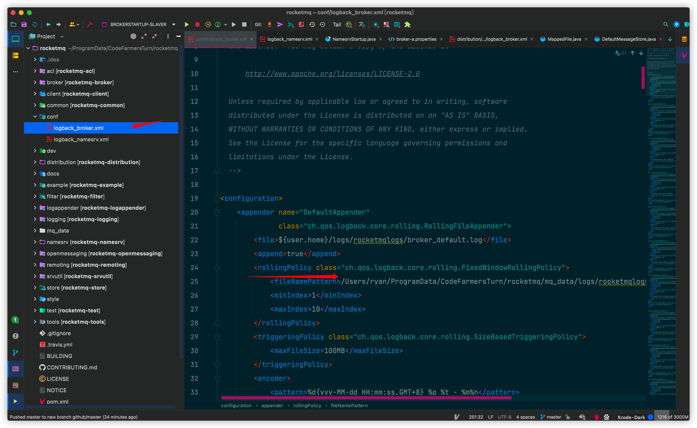

# 😆RocketMQ源码阅读环境搭建

# 1.教程开始

## 1.1 拉取代码

源码地址：https://github.com/apache/rocketmq

默认选择master分支

执行git命令

```git
git clone https://github.com/apache/rocketmq.git
```

使用IDEA导入项目


下载依赖，耐心等待即可


## 1.2准备配置文件

本步需要修改源码中日志配置文件指定路径，避免直接修改源文件，选择新建目录用于存放日志配置文件。


1） 在项目跟目录下面新建一个conf文件夹(用来存放日志配置文件)。将跟项目下的distribution模块的conf目录中的logback_broker.xml，logback_namesrv.xml拷贝到刚新建的conf目录下


修改后如下：


2）在项目根目录下新建mq_data文件夹，用于存放rocketMQ运行时产生的数据，否则产生的日志和消息队列会自动默认存放在home目录下


logs目录用于存放日志

store目录用于存放消息队列产生的数据


## 1.3 修改配置文件

我们既然想将上述新建的目录用于存放日志和数据，我们就需要修改源项目中默认的配置文件，以达到我们的诉求。

找到第一步在根目录下新建的conf目录 修改logback_broker.xml和logback_namesrv.xml



将文件目录修改为本机目录(存放进上一步我们新建的目录mq_data)

举其中一个例子

这是我本机存放日志目录


logback_broker.xml其中一行需要修改的配置信息

```xml
<fileNamePattern>/Users/ryan/ProgramData/CodeFarmersTurn/rocketmq/mq_data/logs/rocketmqlogs/broker_default.%i.log.gz</fileNamePattern>
```


注意logback_broker.xml和logback_namesrv.xml都需要修改指定在我们新建的目录下


## 1.4 配置IDEA环境变量 启动Namesrv

配置文件修改完成之后，我们可以启动程序了

1）配置IDEA环境变量 启动Namesrv


working directory修改为本地项目根目录即可

**启动NamesrvStartup**


至此namesrv启动成功

2）启动Broker

**配置IDEA的环境变量和JVM参数**


指定broker相关参数，指定配置文件在目录distribution/conf/2m-2s-sync/broker-a.properties下

```
-c
/Users/ryan/ProgramData/CodeFarmersTurn/rocketmq/distribution/conf/2m-2s-sync/broker-a.properties
-n
localhost:9876
```


为此我们需要在broker-a.properties配置文件中指定数据路径和端口


```
storePathRootDir=/Users/ryan/ProgramData/CodeFarmersTurn/rocketmq/mq_data/store/brocker-a
listenPort=20910
```

我们也可以已相同的方式配置Slaver


需要注意Slaver需要修改参数，修改配置文件 指向broker-a-s.properties

同理broker-a-s.properties也需要修改指定数据路径和端口


这里先踩一个坑，Master和Slaver的端口设置需要间隔大一些，否则会报错

可以看到Master我设置的是20910而Slaver我设置的是20920


## 1.5 启动Broker


可以看到Master和Slaver Broker都已经成功启动了

可以写个小Demo，跑一下Demo的例子，之后就可以愉快的进行源码阅读了

至此本文RocketMQ源码阅读环境搭建就结束了

***

最后附上作者搭建的RocketMQ源码阅读环境Gitee地址，便于大家clone下来翻看
[Gitee连接](https://gitee.com/M-Analysis/rocket-mq)

***

**本文已收录到CodeWars系列，欢迎各位Star，持续输出高质量技术文章**
[链接点我！](https://gitee.com/effective-java/CodeWars)


**更多技术文章，请关注公众号，让我们一起进步吧！**


