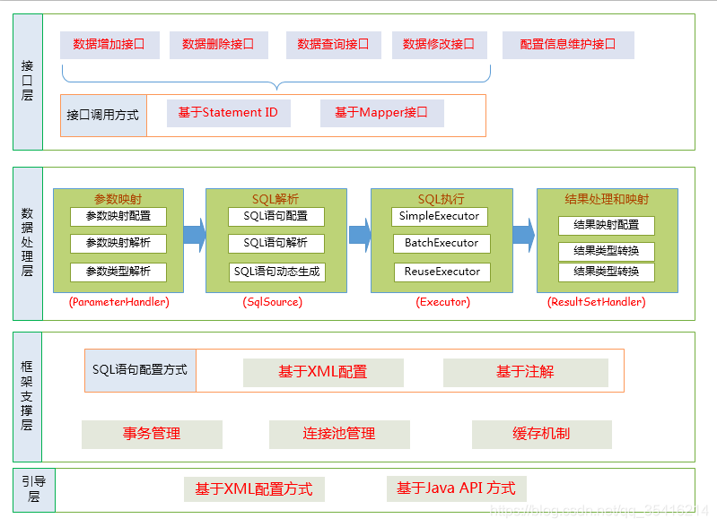
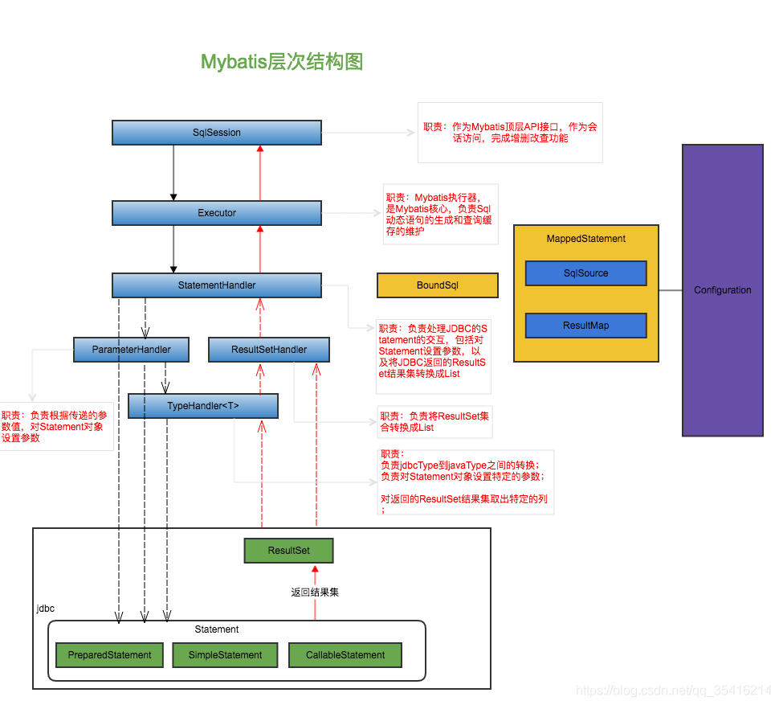

# 🏆浅析MyBatis执行SQL流程

本文主要通过浅析MyBatis如何执行一个SQL语句（流程）为引，引出MyBatis的整体框架设计。

作为MyBatis系列第一篇文章，必然先了解一下MyBatis的由来，所以在文章开始之前，我们来思考一个问题，MyBatis为什么诞生？

# 1. 诞生

一个轮子的诞生定是有其原因的，JDBC的诞生链接了程序和数据库，可以为多种关系数据库提供统一访问。 但是传统的JDBC方式存在很多缺点

例如：

- 数据库连接创建、释放频繁造成系统资源浪费，从⽽影响系统性能。
- Sql语句在代码中硬编码，造成代码不易维护，实际应用中sql变化的可能较⼤，sql变动需要改变 java代码。
- 使用preparedStatement向占有位符号传参数存在硬编码，因为sql语句的where条件不⼀定，可能多也可能少，修改sql还要修改代码，系统不易维护。
- 对结果集解析存在硬编码(查询列名)，sql变化导致解析代码变化，系统不易维护。

为解决以上的问题，MyBatis被创造出来了，那它究竟是怎么规避解决以上原生JDBC的缺点呢，请往下看，正文来喽。

***
# 2. 架构设计

上面有提到JDBC的问题

1. 数据库连接创建，释放频繁导致的资源浪费，为解决这类问题，我们能想到的解决方案：肯定是池化，利用使用数据库连接池加载并初始化连接资源，池化管理。
2. SQL语句在代码中的硬编码问题，为解决这类问题，我们能想到的解决方案：将SQL语句抽离到XML配置文件中，不需要改动代码，配置作为分离SQL及业务之间的桥梁。
3. 占位符传参硬编码问题，为解决这类问题，我们能想到的解决方案：利用反射，内省等技术，自动将实体与表进行属性和字段自动映射。

当然我不是说说而已，MyBatis其实也是这么做的，ps：（这里我们先简单提一嘴，后面的文章《手撸简易版MBatis》会详细介绍）

**重点来喽**，MyBatis架构师如何设计的



Mybatis的功能架构分为三层：

1. API接口层：提供给外部使用的接口 API，开发⼈员通过这些本地API来操纵数据库。接口层⼀接收 到调用请求就会调用数据处理层来完成具体的数据处理。

   MyBatis和数据库的交互有两种方式：

    - 使用传统的MyBatis提供的API

    - 使用Mapper代理的方式
2. 数据处理层：负责具体的SQL查找、SQL解析、SQL执行和执行结果映射处理等。它主要的目的是根据调用的请求完成⼀次数据库操作。
3. 基础⽀撑层：负责最基础的功能⽀撑，包括连接管理、事务管理、配置加载和缓存处理，这些都是共用的东西，将他们抽取出来作为最基础的组件。为上层的数据处理层提供最基础的支撑。

## 2.1 主要组件及其相互关系



上述层次图中涉及到的重要模块，下述详细说明：
```
SqlSession--》作为MyBatis⼯作的主要顶层API，表示和数据库交互的会话，完成必要数 据库增删改查功能。

Executor--》调度执行StatementHandler、ParameterHandler、ResultHandler执行相应的SQL语句

StatementHandler--》封装了JDBC Statement操作，负责对JDBC statement的操作，如设置参数、将Statement结果集转换成List集合。

ParameterHandler--》负责对用户传递的参数转换成JDBC Statement所需要的参数。处理SQL参数。

ResultSetHandler--》结果集ResultSet封装处理返回。

TypeHandler--》负责java数据类型和jdbc数据类型之间的映射和转换。

MappedStatement--》 MappedStatement维护了⼀条＜select | update | delete | insert＞节点的封装。

SqlSource--》负责根据用户传递的parameterObject，动态地生成SQL语句，将信息封装到BoundSql对象中，并返回。

BoundSql--》表示动态生成的SQL语句以及相应的参数信息。
```

# 3. 执行SQL语句大概流程

1. 加载配置，以XML为例，将主配置文件内容解析到Configuration中，将SQL配置信息加载成为多个MapperdStatement对象，存入内存中。
2. 接口层调用MyBatis提供的API 传入参数对象，将请求传递给下层的数据处理层进行处理。
3. 简单的来说数据处理层完成的任务如下：
    - Parameterhandler完成参数映射（参数映射配置，参数映射 类型解析）根据SQL的ID搜寻对应的MappedStatement对象，根绝传入的参数对象解析MappedStatement对象，SqlSource做SQL语句解析，动态SQL生成，获取需要执行的SQL语句和执行必要参数。
    - Executor执行SQL语句，获取数据库连接，根据得到的最终SQL语句和执行传入参数到数据库执行，并得到执行结果。
    - 根据MappedStatement对象中的结果映射配置对得到的执行结果ResultSetHandler进行转换处理，并得到最终的处理结果。释放连接资源。最终将ResultSet结果集逐层返回。

简单描述了一下大概流程，如此没有活力的文字肯定不适合理解，那接下来就是源码剖析验证以上观点

***
# 4. 源码剖析

就以单元测试执行数据库查询为例，对初始化到SQL的执行流程，进行剖析。

***
## 4.1 初始化

以标准的单元测试作为入口 开始分析

```java
     /*
        测试查询
     */
    @Test
    public void TEST_QUERY_ONE_TO_ONE() throws IOException {
        //1. 加载sqlMapConfig.xml配置文件，将其转换成输入流存入内存中
        InputStream resourceAsStream = Resources.getResourceAsStream("sqlMapConfig.xml");
        //2. 解析配置文件，封装Configuration对象  创建DefaultSqlSessionFactory对象
        SqlSessionFactory sqlSessionFactory = new SqlSessionFactoryBuilder().build(resourceAsStream);
        // 3. 生产了DefaultSqlSession实例对象  设置了事务不自动提交  完成了executor对象的创建
        SqlSession sqlSession = sqlSessionFactory.openSession();
        //JDK动态代理 执行JDBC操作
        IOrderMapper mapper = sqlSession.getMapper(IOrderMapper.class);
        List<Order> orderAndUser = mapper.findOrderAndUser();
        for (Order order : orderAndUser) {
            System.out.println(order);
        }
    }
```

```java
//2. 解析配置文件，封装Configuration对象  创建DefaultSqlSessionFactory对象
SqlSessionFactory sqlSessionFactory = new SqlSessionFactoryBuilder().build(resourceAsStream);
```
从代码结构上来看，通过默认的SqlSessionFactoryBuilder构建了一个SqlSessionFactory对象 入参是上一步加载到内存字节流的SqlMapConfig的配置，来看下具体代码是怎么做的。

 ```java
    /**
     * 1. build入口
     *
     * @param inputStream
     * @return
     */
    public SqlSessionFactory build(InputStream inputStream) {
        //调用重载方法
        return build(inputStream, null, null);
    }

    /**
     * 2. 重载build
     *
     * @param inputStream
     * @param environment
     * @param properties
     * @return
     */
    public SqlSessionFactory build(InputStream inputStream, String environment, Properties properties) {
        try {
            //创建XMLConfigBuilder 解析Mybatis配置文件 其实就是解析sqlMapConfig.xml
            XMLConfigBuilder parser = new XMLConfigBuilder(inputStream, environment, properties);
            //parse 执行XML解析
            //build 创建 DefaultSqlSessionFactory 对象
            return build(parser.parse());
        } catch (Exception e) {
            throw ExceptionFactory.wrapException("Error building SqlSession.", e);
        } finally {
            ErrorContext.instance().reset();
            try {
                inputStream.close();
            } catch (IOException e) {
                // Intentionally ignore. Prefer previous error.
            }
        }
    }

 ```


关键代码parser.parse()的主要工作其实是通过XPathParser解析sqlMapConfig.xml将配置信息全部加载到内存中 利用org.apache.ibatis.session.Configuration实例维护（实际上根据MyBatis配置文件标签定位 读取节点内数据 封装到Configuration中）
```java

 /**
     * 解析 XML 成 Configuration 对象。
     *
     * @return Configuration 对象
     */
    public Configuration parse() {
        // 若已解析，抛出 BuilderException 异常
        if (parsed) {
            throw new BuilderException("Each XMLConfigBuilder can only be used once.");
        }
        // 标记已解析
        parsed = true;
        ///parser是XPathParser解析器对象，读取节点内数据，<configuration>是MyBatis配置文件中的顶层标签
        // 解析 XML configuration 节点
        parseConfiguration(parser.evalNode("/configuration"));
        return configuration;
    }
 ```
 ```java
 /**
     * 解析 XML
     *
     * 具体 MyBatis 有哪些 XML 标签，参见 《XML 映射配置文件》http://www.mybatis.org/mybatis-3/zh/configuration.html
     *
     * @param root 根节点
     */
    private void parseConfiguration(XNode root) {
        try {
            //issue #117 read properties first
            // 解析 <properties/> 标签
            propertiesElement(root.evalNode("properties"));
            // 解析 <settings/> 标签
            Properties settings = settingsAsProperties(root.evalNode("settings"));
            // 加载自定义的 VFS 实现类
            loadCustomVfs(settings);
            // 解析 <typeAliases /> 标签
            typeAliasesElement(root.evalNode("typeAliases"));
            // 解析 <plugins/> 标签
            pluginElement(root.evalNode("plugins"));
            // 解析 <objectFactory/> 标签
            objectFactoryElement(root.evalNode("objectFactory"));
            // 解析 <objectWrapperFactory/> 标签
            objectWrapperFactoryElement(root.evalNode("objectWrapperFactory"));
            // 解析 <reflectorFactory/> 标签
            reflectorFactoryElement(root.evalNode("reflectorFactory"));
            // 赋值 <settings/> 到 Configuration 属性
            settingsElement(settings);
            // read it after objectFactory and objectWrapperFactory issue #631
            // 解析 <environments/> 标签
            environmentsElement(root.evalNode("environments"));
            // 解析 <databaseIdProvider/> 标签
            databaseIdProviderElement(root.evalNode("databaseIdProvider"));
            // 解析 <typeHandlers/> 标签
            typeHandlerElement(root.evalNode("typeHandlers"));
            // 解析 <mappers/> 标签
            mapperElement(root.evalNode("mappers"));
        } catch (Exception e) {
            throw new BuilderException("Error parsing SQL Mapper Configuration. Cause: " + e, e);
        }
    }

 ```
 ***
什么是Configuration？

Configuration故名之意MyBatis配置核心  其对象结构和XML配置文件几乎相对应
其中最为主要的当属MappedStatement

```java
    /**
     * MappedStatement 映射
     *·
     * KEY：`${namespace}.${id}`
     */
    protected final Map<String, MappedStatement> mappedStatements = new StrictMap<>("Mapped Statements collection");
    
      /**
     * MapperRegistry对象
     */
    protected final MapperRegistry mapperRegistry = new MapperRegistry(this);

```

MappedStatement与Mapper配置⽂件中的⼀个select/update/insert/delete节点相对应。
mapper中配置的标签都被封装到了此对象中，主要⽤途是描述⼀条SQL语句。

```java

/**
 * 映射的语句，每个 <select />、<insert />、<update />、<delete /> 对应一个 MappedStatement 对象
 *
 *
 * @author Clinton Begin
 */
public final class MappedStatement {

    /**
     * 资源引用的地址
     */
    private String resource;
    /**
     * Configuration 对象
     */
    private Configuration configuration;
    /**
     * 编号
     */
    private String id;
    /**
     * 语句类型
     */
    private StatementType statementType;
    /**
     * 结果集类型
     */
    private ResultSetType resultSetType;
      /**
     * ParameterMap 对象
     */
    private ParameterMap parameterMap;
    /**
     * ResultMap 集合
     */
    private List<ResultMap> resultMaps;
```
也就是说一个自定义SQL Mapper配置文件的标签(select、insert、update、delete等）会在初始化配置文件时被解析封装成多个MappedStatement对象，并存储在Configuration对象的mappedStatements属性中，MappedStatement映射
KEY：`${namespace}.${id}`=类全限定名+方法名
 ***

衔接上文，在SqlSessionFactoryBuilder#build方法执行完parser.parse()逻辑，会创建DefaultSqlSessionFactory对象
```java
    /**
     * 创建 DefaultSqlSessionFactory 对象
     *
     * @param config
     * @return
     */
    public SqlSessionFactory build(Configuration config) {
        return new DefaultSqlSessionFactory(config);
    
```

到此初始化操作实际上已经完毕了，接下来则是分析执行SQL的流程。

***
## 4.2 执行SQL流程

上一步拿到了SqlSessionFactory 利用工厂方式设计模式创建SqlSession

SqlSession是⼀个接⼝，是MyBatis和数据库交互的顶层类，通常将它与ThreadLocal绑定，⼀个会话使⽤⼀个SqlSession,并且在使⽤完毕后需要close，它有两个实现类：DefaultSqlSession (默认)和SqlSessionManager (弃⽤)
```java
public class DefaultSqlSession implements SqlSession {

    private final Configuration configuration;
    //执行器
    private final Executor executor;

    private final boolean autoCommit;
    private boolean dirty;
    private List<Cursor<?>> cursorList;

    public DefaultSqlSession(Configuration configuration, Executor executor, boolean autoCommit) {
        this.configuration = configuration;
        this.executor = executor;
        this.dirty = false;
        this.autoCommit = autoCommit;
    }
    //省略
}
```
DefaultSqlSession中的两个重要属性，其一Configuration就是上面讲过的MyBatis配置核心，另一个Executor则是执行器，源码openSession中实际上也是交给了Executor来专门执行操作
```java
Executor也是⼀个接⼝，他有三个常⽤的实现类：
BatchExecutor (重⽤语句并执⾏批量更新)
ReuseExecutor (重⽤预处理语句 prepared statements)
SimpleExecutor (普通的执⾏器，默认)
```

```java

     /**
     * openSession
     *
     * @return
     */
    @Override
    public SqlSession openSession() {
        //configuration.getDefaultExecutorType() 取SIMPLE SimpleExecutor
        return openSessionFromDataSource(configuration.getDefaultExecutorType(), null, false);
    }

    /**
     * openSession的多个重载方法可以指定获得的SeqSession的Executor类型和事务的处理
     *
     * @param execType   为Executor的类型
     * @param level      事务隔离级别
     * @param autoCommit 否开启事务
     * @return
     */
    private SqlSession openSessionFromDataSource(ExecutorType execType, TransactionIsolationLevel level, boolean autoCommit) {
        Transaction tx = null;
        try {
            // 获得Environment对象
            final Environment environment = configuration.getEnvironment();
            // 创建Transaction对象
            final TransactionFactory transactionFactory = getTransactionFactoryFromEnvironment(environment);
            tx = transactionFactory.newTransaction(environment.getDataSource(), level, autoCommit);
            // 创建Executor对象
            final Executor executor = configuration.newExecutor(tx, execType);
            // 创建DefaultSqlSession对象
            return new DefaultSqlSession(configuration, executor, autoCommit);
        } catch (Exception e) {
            // 如果发生异常，则关闭Transaction对象
            closeTransaction(tx); // may have fetched a connection so lets call close()
            throw ExceptionFactory.wrapException("Error opening session.  Cause: " + e, e);
        } finally {
            ErrorContext.instance().reset();
        }
    }
```

由于SqlSession是MyBatis和数据库交互的顶层API接口层，实际的执行工作还是交给Executor来操作。

比如selectList

```java

 @Override
    public <E> List<E> selectList(String statement, Object parameter) {
        return this.selectList(statement, parameter, RowBounds.DEFAULT);
    }


 private <E> List<E> selectList(String statement, Object parameter, RowBounds rowBounds, ResultHandler handler) {
        try {
            //根据传⼊的全限定名+⽅法名从映射的Map中取出MappedStatement对象
            MappedStatement ms = configuration.getMappedStatement(statement);
            //调⽤Executor中的⽅法处理  RowBounds是⽤来逻辑分⻚ wrapCollection(parameter)是⽤来装饰集合或者数组参数
            return executor.query(ms, wrapCollection(parameter), rowBounds, handler);
        } catch (Exception e) {
            throw ExceptionFactory.wrapException("Error querying database.  Cause: " + e, e);
        } finally {
            ErrorContext.instance().reset();
        }
    }

```
从源码里其实可以看出，在Executor执行真正的query方法之前，从上一步封装好的Configuration中根据全限定名+方法名从映射Map中取出对应的MappedStatement对象，传递给Executor执行

继续源码中的步骤 进入executor.query()

```java
    /**
     * SimpleExecutor的⽗类BaseExecutor中实现
     *
     * @param ms
     * @param parameter
     * @param rowBounds
     * @param resultHandler
     * @param <E>
     * @return
     * @throws SQLException
     */
    @Override
    public <E> List<E> query(MappedStatement ms, Object parameter, RowBounds rowBounds, ResultHandler resultHandler) throws SQLException {
        //根据传⼊的参数动态获得SQL语句，最后返回⽤BoundSql对象表示
        BoundSql boundSql = ms.getBoundSql(parameter);
        //为本次查询创建缓存的Key
        CacheKey key = createCacheKey(ms, parameter, rowBounds, boundSql);
        return query(ms, parameter, rowBounds, resultHandler, key, boundSql);
    }
```
源码中getBoundSql这一步，其实就是标记处理，对#{}的解析工作，将实际的参数替换值存储，完成占位符解析工作，解析出来真实sql语句

**缓存这一块暂时先跳过，后续章节《深入浅出MyBatis三级缓存》会详细剖析**

调用的查询逻辑
```java
    /**
     * 查询重载
     *
     * @param ms
     * @param parameter
     * @param rowBounds
     * @param resultHandler
     * @param key
     * @param boundSql
     * @param <E>
     * @return
     * @throws SQLException
     */
    @SuppressWarnings("unchecked")
    @Override
    public <E> List<E> query(MappedStatement ms, Object parameter, RowBounds rowBounds, ResultHandler resultHandler, CacheKey key, BoundSql boundSql) throws SQLException {
        ErrorContext.instance().resource(ms.getResource()).activity("executing a query").object(ms.getId());
        if (closed) {
            throw new ExecutorException("Executor was closed.");
        }
        if (queryStack == 0 && ms.isFlushCacheRequired()) {
            clearLocalCache();
        }
        List<E> list;
        try {
            queryStack++;
            //从一级缓存中 查询结果（暂时跳过）
            list = resultHandler == null ? (List<E>) localCache.getObject(key) : null;
            //获取到 则处理
            if (list != null) {
                handleLocallyCachedOutputParameters(ms, key, parameter, boundSql);
            } else {
                //如果缓存中没有本次查找的值，那么从数据库中查询 （重点）
                list = queryFromDatabase(ms, parameter, rowBounds, resultHandler, key, boundSql);
            }
        } finally {
            queryStack--;
        }
        if (queryStack == 0) {
            //执行延迟加载
            for (DeferredLoad deferredLoad : deferredLoads) {
                deferredLoad.load();
            }
            // issue #601
            deferredLoads.clear();
            if (configuration.getLocalCacheScope() == LocalCacheScope.STATEMENT) {
                // issue #482
                clearLocalCache();
            }
        }
        return list;
    }


      /**
     * 从数据库中查询
     *
     * @param ms
     * @param parameter
     * @param rowBounds
     * @param resultHandler
     * @param key
     * @param boundSql
     * @param <E>
     * @return
     * @throws SQLException
     */
    private <E> List<E> queryFromDatabase(MappedStatement ms, Object parameter, RowBounds rowBounds, ResultHandler resultHandler, CacheKey key, BoundSql boundSql) throws SQLException {
        List<E> list;
        // 在缓存中，添加占位对象。此处的占位符，和延迟加载有关，可见 `DeferredLoad#canLoad()` 方法
        localCache.putObject(key, EXECUTION_PLACEHOLDER);
        try {
            // 执行读操作 （重点）
            list = doQuery(ms, parameter, rowBounds, resultHandler, boundSql);
        } finally {
            // 从缓存中，移除占位对象
            localCache.removeObject(key);
        }
        // 添加到缓存中（暂时跳过）
        localCache.putObject(key, list);
        if (ms.getStatementType() == StatementType.CALLABLE) {
            localOutputParameterCache.putObject(key, parameter);
        }
        return list;
    }

```
源码中执行了doQuery（ms, parameter, rowBounds, resultHandler, boundSql）方法 实际上是抽象方法，其中SimpleExecutor中的具体实现如下：
```java
    /**
     * SimpleExecutor中实现⽗类的doQuery抽象方法
     *
     * @param ms
     * @param parameter
     * @param rowBounds
     * @param resultHandler
     * @param boundSql
     * @param <E>
     * @return
     * @throws SQLException
     */
    @Override
    public <E> List<E> doQuery(MappedStatement ms, Object parameter, RowBounds rowBounds, ResultHandler resultHandler, BoundSql boundSql) throws SQLException {
        Statement stmt = null;
        try {
            Configuration configuration = ms.getConfiguration();
            //传⼊参数创建StatementHanlder对象来执⾏查询
            StatementHandler handler = configuration.newStatementHandler(wrapper, ms, parameter, rowBounds, resultHandler, boundSql);
            //创建jdbc中的statement对象
            stmt = prepareStatement(handler, ms.getStatementLog());
            // StatementHandler 进⾏处理
            return handler.query(stmt, resultHandler);
        } finally {
            //关闭StatementHandler
            closeStatement(stmt);
        }
    }

        /**
     * 创建Statement的⽅法
     *
     * @param handler
     * @param statementLog
     * @return
     * @throws SQLException
     */
    private Statement prepareStatement(StatementHandler handler, Log statementLog) throws SQLException {
        Statement stmt;
        //条代码中的getConnection⽅法经过重重调用最后会调⽤openConnection⽅法，从连接池中获取连接
        Connection connection = getConnection(statementLog);
        //创建Statement对象
        stmt = handler.prepare(connection, transaction.getTimeout());
        //设置SQL参数，PrepareStatement对象占位符
        handler.parameterize(stmt);
        return stmt;
    }

```

上述的Executor.query()⽅法⼏经转折，最后会创建⼀个StatementHandler对象，然后将必要的参数传递给StatementHandler，使⽤StatementHandler来完成对数据库的查询，最终返回List结果集。

总结一下，从上述源码分析中，得到的信息：

Executor的功能
- 根据参数传递，对SQL语句解析，动态替换生成BoundSql对象，传递给StatementHandler调用
- 创建JDBCStatement连接对象，传递给StatementHandler对象

那么问题来了，StatementHandler在最开始分析的那张结构层次的图中有过显示，那它是什么，作用是什么？

***
## 4.3 剖析StatementHandler
StatementHandler对象封装了JDBC Statement操作，负责对JDBC statement的操作，如设置参数、将Statement结果集转换成List集合。
其实它主要完成两个工作：
- 对于JDBC的PreparedStatement类型的对象，创建的过程中，我们使⽤的是SQL语句字符串会包含若⼲个？占位符，我们其后再对占位符进⾏设置。StatementHandler通过parameterize(statement)⽅法对Statement进⾏设置；
- StatementHandler通过List query(Statement statement, ResultHandler resultHandler)方法来完成执⾏Statement，和将Statement对象返回的resultSet封装成List；

进⼊到StatementHandler的parameterize(statement)方法的实现：

```java
    @Override
    public void parameterize(Statement statement) throws SQLException {
        //使⽤ParameterHandler对象来完成对Statement的设值
        parameterHandler.setParameters((PreparedStatement) statement);
    }


     @Override
    public void setParameters(PreparedStatement ps) {
        ErrorContext.instance().activity("setting parameters").object(mappedStatement.getParameterMap().getId());
        // 遍历ParameterMapping数组
        List<ParameterMapping> parameterMappings = boundSql.getParameterMappings();
        if (parameterMappings != null) {
            for (int i = 0; i < parameterMappings.size(); i++) {
                // 获得ParameterMapping对象
                ParameterMapping parameterMapping = parameterMappings.get(i);
                if (parameterMapping.getMode() != ParameterMode.OUT) {
                    Object value;
                    String propertyName = parameterMapping.getProperty();
                    if (boundSql.hasAdditionalParameter(propertyName)) { // issue #448 ask first for additional params
                        value = boundSql.getAdditionalParameter(propertyName);
                    } else if (parameterObject == null) {
                        value = null;
                    } else if (typeHandlerRegistry.hasTypeHandler(parameterObject.getClass())) {
                        value = parameterObject;
                    } else {
                        MetaObject metaObject = configuration.newMetaObject(parameterObject);
                        value = metaObject.getValue(propertyName);
                    }
                    // 获得typeHandler、jdbcType属性
                    TypeHandler typeHandler = parameterMapping.getTypeHandler();
                    JdbcType jdbcType = parameterMapping.getJdbcType();
                    if (value == null && jdbcType == null) {
                        jdbcType = configuration.getJdbcTypeForNull();
                    }
                    // 设置 ? 占位符的参数
                    try {
                        typeHandler.setParameter(ps, i + 1, value, jdbcType);
                    } catch (TypeException | SQLException e) {
                        throw new TypeException("Could not set parameters for mapping: " + parameterMapping + ". Cause: " + e, e);
                    }
                }
            }
        }
    }
```

从上述的代码可以看到StatementHandler的parameterize(Statement)方法调用了ParameterHandler的setParameters(statement)方法，ParameterHandler的setParameters(Statement )⽅法负责根据我们输⼊的参数，对statement对象的?占位符处进行赋值。

进入PreparedStatementHandler#query方法
```java
   @Override
    public <E> List<E> query(Statement statement, ResultHandler resultHandler) throws SQLException {
        // 1.调⽤preparedStatement。execute()方法，
        // 将resultSet交给ResultSetHandler处理
        PreparedStatement ps = (PreparedStatement) statement;
        //执行JDBC操作数据库
        ps.execute();
        //2.使⽤ ResultHandler 来处理 ResultSet
        return resultSetHandler.handleResultSets(ps);
    }
```
上述代码我们可以看出，StatementHandler的query方法其实是调用了ResultSetHandler的handleResultSets方法，handleResultSets方法会将Statement语句执行后生成的resultSet结果集转换成List结果集
具体操作如下源码所示：
```java
 //
    // HANDLE RESULT SETS
    //
    // 处理 {@link java.sql.ResultSet} 结果集

    @Override
    public List<Object> handleResultSets(Statement stmt) throws SQLException {
        ErrorContext.instance().activity("handling results").object(mappedStatement.getId());

        // 多 ResultSet 的结果集合，每个 ResultSet 对应一个 Object 对象。而实际上，每个 Object 是 List<Object> 对象。
        // 在不考虑存储过程的多 ResultSet 的情况，普通的查询，实际就一个 ResultSet ，也就是说，multipleResults 最多就一个元素。
        final List<Object> multipleResults = new ArrayList<>();

        int resultSetCount = 0;
        // 获得首个 ResultSet 对象，并封装成 ResultSetWrapper 对象
        ResultSetWrapper rsw = getFirstResultSet(stmt);

        // 获得 ResultMap 数组
        // 在不考虑存储过程的多 ResultSet 的情况，普通的查询，实际就一个 ResultSet ，也就是说，resultMaps 就一个元素。
        List<ResultMap> resultMaps = mappedStatement.getResultMaps();
        int resultMapCount = resultMaps.size();
        validateResultMapsCount(rsw, resultMapCount); // 校验
        while (rsw != null && resultMapCount > resultSetCount) {
            // 获得ResultMap对象
            ResultMap resultMap = resultMaps.get(resultSetCount);
            // 处理ResultSet ，将结果添加到 multipleResults 中
            handleResultSet(rsw, resultMap, multipleResults, null);
            // 获得下一个ResultSet对象，并封装成 ResultSetWrapper 对象
            rsw = getNextResultSet(stmt);
            // 清理
            cleanUpAfterHandlingResultSet();
            // resultSetCount ++
            resultSetCount++;
        }

        // 因为 `mappedStatement.resultSets` 只在存储过程中使用，本系列暂时不考虑，忽略即可
        String[] resultSets = mappedStatement.getResultSets();
        if (resultSets != null) {
            while (rsw != null && resultSetCount < resultSets.length) {
                ResultMapping parentMapping = nextResultMaps.get(resultSets[resultSetCount]);
                if (parentMapping != null) {
                    String nestedResultMapId = parentMapping.getNestedResultMapId();
                    ResultMap resultMap = configuration.getResultMap(nestedResultMapId);
                    handleResultSet(rsw, resultMap, null, parentMapping);
                }
                rsw = getNextResultSet(stmt);
                cleanUpAfterHandlingResultSet();
                resultSetCount++;
            }
        }

        // 如果是 multipleResults 单元素，则取首元素返回
        return collapseSingleResultList(multipleResults);
    }
```
拿到了ResultSet结果集，在由下不断回传给上层最后传递到SqlSession，一个SQL语句执行完毕。

**不知道大家还记不记得文章开头我们引出了一张图，在此进行完源码剖析之后，再回味这张图，思考一下会不会有恍然大悟的感觉。**


***

## 4.4 Mapper代理方式

思考⼀个问题，通常的Mapper接⼝我们都没有实现的方法却可以使用
```java
       //JDK动态代理
        IOrderMapper mapper = sqlSession.getMapper(IOrderMapper.class);
        List<Order> orderAndUser = mapper.findOrderAndUser();
        for (Order order : orderAndUser) {
            System.out.println(order);
        }
```

是因为什么呢？答案很简单  动态代理的作用

上面我们刚分析过，在MyBatis初始化的时候，Configuration内部维护了一个HashMap用于存放Mapper接口的工厂类MapperRegistry，在mappers中可以配置接口的包路径，类路径
```xml
<mappers>
 <mapper class="com.mryan.mapper.UserMapper"/>
 <package name="com.mryan.mapper"/>
</mappers>
```
解析mappers标签，根绝配置文件中是增删改查的标识标签封装成MappedStatement对象 存入mappedStatements中，为下文使用，解析的时候会将接口对应的MapperProxyFactory对象，存入Map中（key：class，value：MapperProxyFactory）

```java

public class DefaultSqlSession implements SqlSession {
   //省略
 @Override
    public <T> T getMapper(Class<T> type) {
        return configuration.getMapper(type, this);
    }

    //省略
}
```
进入configuration.getMapper(type, this)方法
```java
public class Configuration {
   //省略

    public <T> T getMapper(Class<T> type, SqlSession sqlSession) {
        return mapperRegistry.getMapper(type, sqlSession);
    }

    //省略
}
```
继续往下走进入mapperProxyFactory.newInstance(sqlSession)方法
```java

public class MapperRegistry {
   //省略

    @SuppressWarnings("unchecked")
    public <T> T getMapper(Class<T> type, SqlSession sqlSession) {
        // 获得MapperProxyFactory对象
        final MapperProxyFactory<T> mapperProxyFactory = (MapperProxyFactory<T>) knownMappers.get(type);
        // 不存在，则抛出BindingException异常
        if (mapperProxyFactory == null) {
            throw new BindingException("Type " + type + " is not known to the MapperRegistry.");
        }
        // 通过JDK动态代理工厂生成实例。
        try {
            return mapperProxyFactory.newInstance(sqlSession);
        } catch (Exception e) {
            throw new BindingException("Error getting mapper instance. Cause: " + e, e);
        }
    }

    //省略
}
```

```java
    @SuppressWarnings("unchecked")
    protected T newInstance(MapperProxy<T> mapperProxy) {
        return (T) Proxy.newProxyInstance(mapperInterface.getClassLoader(), new Class[]{mapperInterface}, mapperProxy);
    }

    //MapperProxyFactory类中的newInstance方法
    public T newInstance(SqlSession sqlSession) {
        // 创建了JDK动态代理的invocationHandler接口的实现类mapperProxy
        final MapperProxy<T> mapperProxy = new MapperProxy<>(sqlSession, mapperInterface, methodCache);
        // 调用了重载方法
        return newInstance(mapperProxy);
    }

```

其中MapperProxy其实就是通过动态代理创建的实现类，进入MapperProxy是实现方法
```java
public class MapperProxy<T> implements InvocationHandler, Serializable {
```
霍，这一打眼，没跑了，JDK动态代理，实现了InvocationHandler接口重写了invoke方法，进入invoke方法查看源码
```java
  @Override
    public Object invoke(Object proxy, Method method, Object[] args) throws Throwable {
        try {
            // 如果是 Object 定义的方法，直接调用
            if (Object.class.equals(method.getDeclaringClass())) {
                return method.invoke(this, args);
            } else {
                // 重点在这：MapperMethod最终调用了执行的方法
                return cachedInvoker(method).invoke(proxy, method, args, sqlSession);
            }
        } catch (Throwable t) {
            throw ExceptionUtil.unwrapThrowable(t);
        }
    }

     @Override
        public Object invoke(Object proxy, Method method, Object[] args, SqlSession sqlSession) throws Throwable {
            //关键
            return mapperMethod.execute(sqlSession, args);
        }
```
分析到这里胜利的曙光终于到出现了

SqlSession有insert有update有select有delete，通过代理模式，程序怎么知道什么操作改调用什么方法呢？

mapperMethod.execute方法实际做的就是“分发”的一个过程，根据判断mapper方法类型，来确定最终调用的是SqlSession的哪个方法

```java
 public Object execute(SqlSession sqlSession, Object[] args) {
        Object result;
        //判断mapper中的方法类型，最终调用的还是SqlSession中的方法
        switch (command.getType()) {
            case INSERT: {
                // 转换参数
                Object param = method.convertArgsToSqlCommandParam(args);
                // 执行 INSERT 操作
                // 转换 rowCount
                result = rowCountResult(sqlSession.insert(command.getName(), param));
                break;
            }
            case UPDATE: {
                // 转换参数
                Object param = method.convertArgsToSqlCommandParam(args);
                // 转换 rowCount
                result = rowCountResult(sqlSession.update(command.getName(), param));
                break;
            }
            case DELETE: {
                // 转换参数
                Object param = method.convertArgsToSqlCommandParam(args);
                // 转换 rowCount
                result = rowCountResult(sqlSession.delete(command.getName(), param));
                break;
            }
            case SELECT:
                // 无返回，并且有 ResultHandler 方法参数，则将查询的结果，提交给 ResultHandler 进行处理
                if (method.returnsVoid() && method.hasResultHandler()) {
                    executeWithResultHandler(sqlSession, args);
                    result = null;
                    // 执行查询，返回列表
                } else if (method.returnsMany()) {
                    result = executeForMany(sqlSession, args);
                    // 执行查询，返回 Map
                } else if (method.returnsMap()) {
                    result = executeForMap(sqlSession, args);
                    // 执行查询，返回 Cursor
                } else if (method.returnsCursor()) {
                    result = executeForCursor(sqlSession, args);
                    // 执行查询，返回单个对象
                } else {
                    // 转换参数
                    Object param = method.convertArgsToSqlCommandParam(args);
                    // 查询单条
                    result = sqlSession.selectOne(command.getName(), param);
                    if (method.returnsOptional() &&
                        (result == null || !method.getReturnType().equals(result.getClass()))) {
                        result = Optional.ofNullable(result);
                    }
                }
                break;
            case FLUSH:
                result = sqlSession.flushStatements();
                break;
            default:
                throw new BindingException("Unknown execution method for: " + command.getName());
        }
        // 返回结果为 null ，并且返回类型为基本类型，则抛出 BindingException 异常
        if (result == null && method.getReturnType().isPrimitive() && !method.returnsVoid()) {
            throw new BindingException("Mapper method '" + command.getName()
                + " attempted to return null from a method with a primitive return type (" + method.getReturnType() + ").");
        }
        // 返回结果
        return result;
    }
```

到此为止，对MyBatis的诞生，架构设计，初始化源码剖析，执行SQL语句源码剖析，MyBatis的代理模式，已经分析完了。

>撒花🌹🌹🌹🌹但未完结，有关MyBatis相关可不仅仅如此，如此优秀的框架一定还有很多令人学习寻味的地方，下一篇文章，让我们走进MyBatis的三级缓存。

# 预告
下篇文章：🏆深入浅出MyBatis三级缓存


**本文已收录到CodeWars系列，欢迎各位Star，持续输出高质量技术文章**
[链接点我！](https://gitee.com/effective-java/CodeWars)


**更多技术文章，请关注公众号，让我们一起进步吧！**


