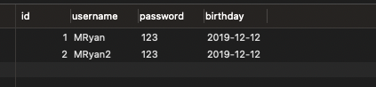
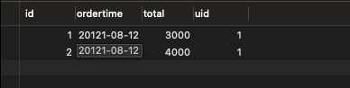
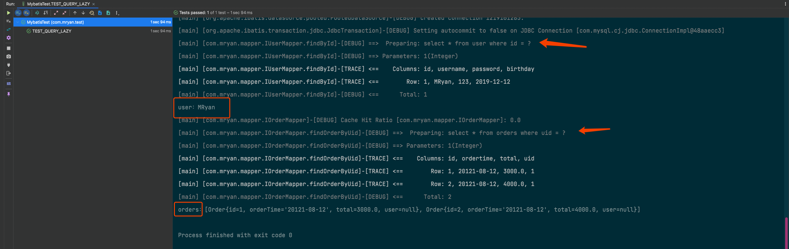
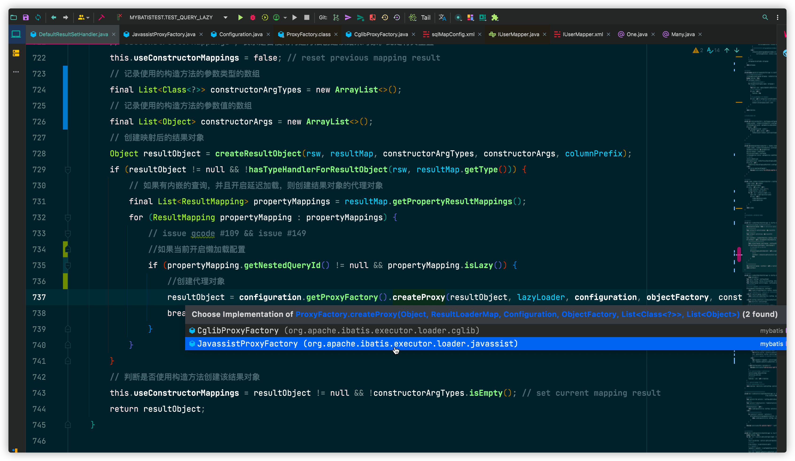

# 🏆延迟加载原理剖析

# 1. 延迟加载的介绍及使用

本文将针对MyBatis提供的延迟加载（懒加载）原理剖析。

## 1.1 延迟加载是什么？

简单的来说延迟加载就是，在需要用到数据的时候进行加载，不需要用到数据就不进行加载。

假设数据库中涉及两张表，用户表AND订单表（一对多的关系），假设一个用户由很多订单，那么在查询用户的时候，需不需要当前用户关联的订单数据查询出来？

通常来说查询用户信息的时候，肯定是需要用到用户订单的时候在查询为好，尤其是一对多的多表查询，通常都建议采用延迟加载，因为单标查询肯定要比多表关联查询速度要快，先从单表查询，接着需要时在关联表进行关联查询，会提高数据库性能。

## 1.2 如何启用延迟加载

MyBatis默认不启用延迟加载，启用延迟加载则需要我们进行一些简单的配置即可。

首先可以MyBatis SqlMapper核心配置文件中设置setting属性 设置全局懒加载

```sml
 <settings>
        <!-- 开启全局延迟加载,默认值是true -->
        <setting name="lazyLoadingEnabled" value="true" />
        <!-- 设置全局积极懒加载,默认值是true -->
        <setting name="aggressiveLazyLoading" value="false"/>
 </settings>
```

或者在mapper配置文件中配置fetchType标签 设置局部懒加载

```xml

<resultMap id="userMap" type="com.mryan.pojo.User">
    <id property="id" column="id"></id>
    <result property="username" column="username"></result>
    <!--fetchType="lazy"  懒加载策略  fetchType="eager"  立即加载策略 -->
    <collection property="orderList" ofType="com.mryan.pojo.Order"
                select="com.mryan.mapper.IOrderMapper.findOrderByUid" column="id" fetchType="lazy">

        <id property="id" column="uid"/>
        <result property="orderTime" column="ordertime"/>
        <result property="total" column="total"/>
    </collection>
</resultMap>


<select id="findOrderByUid" resultType="com.mryan.pojo.Order">
select *
from orders
where uid = #{uid}
</select>
```

注意这里 局部的懒加载策略优先级药高于全局的懒加载策略

## 1.3 测试延迟加载的作用

为测试多表关联，表结构及pojo结构如下：

**User**



```java
public class User implements Serializable {
    private Integer id;
    private String username;
    // 用户关联的订单数据
    private List<Order> orderList;
//省略
```

**Orders**



```java
public class Order implements Serializable {
    private Integer id;
    private String orderTime;
    private Double total;
    // 表明该订单属于哪个用户
    private User user;
//省略
```

在完成上述配置之后，跑一个单元测试，试一下延迟加载是否生效

```java
    /*
    测试 延迟加载查询
   */
@Test
public void TEST_QUERY_LAZY()throws IOException{
        InputStream inputStream=Resources.getResourceAsStream("sqlMapConfig.xml");
        SqlSessionFactory factory=new SqlSessionFactoryBuilder().build(inputStream);
        SqlSession sqlSession=factory.openSession();
        User user=sqlSession.selectOne("com.mryan.mapper.IUserMapper.findById",1);
        //延迟加载生效 下方输出语句 不涉及到orders表 于是不会打印orders相关日志
        System.out.println("user："+user.getUsername());
        //涉及orders表 才会执行相关SQL语句 加载orders执行日志 （延迟加载 什么时候用什么时候查）
        System.out.println("orders："+user.getOrderList());
        }
```



可以发现user.getUsername()的时候只出发了查询用户的sql语句，而user.getOrderList()时才触发了查询订单的sql语句，由此可见延迟加载生效，做到了不用不查，用到在查。

# 2. 延迟加载源码剖析

下面将对源码进行阅读，剖析Mybatis延迟加载的原理。

在MyBatis系列文章第一篇[浅析MyBatis执行SQL流程](/docs/blog/backend_developer/Mybatis/ExecuteSQL.md)
就对SQL的执行流程进行了讲解。简单复习一下大致流程，SQL查询语句的执行是由SqlSession分发交由Executor托管执行，调度StatementHandler负责JDBC
statement操作，之后下发给ParameterHandler负责对用户传递参数进行转化处理SQL参数，再接着执行SQL语句，最后通过ResultSetHandler对返回结果进行封装处理返回。

根据刚刚对延迟加载功能的测试，我们也能大致找到突破入口，通过最后的ResultSetHandler对结果封装处理返回的时候，根据调用的getting方法的实例名称，来相对应的加载目标对象结果，不就实现了延迟加载的功能吗。

MyBatis其实就是这么做的，接下来根据翻看源码来证实我们的猜想

## 2.1 源码剖析

```java

/**
 * MyBatis 配置
 *
 * @author Clinton Begin
 */
public class Configuration {
  
      /**
     * 当开启时，任何方法的调用都会加载该对象的所有属性。否则，每个属性会按需加载（参考lazyLoadTriggerMethods)
     */
    protected boolean aggressiveLazyLoading;

    /**
     * 指定哪个对象的方法触发一次延迟加载。
     */
    protected Set<String> lazyLoadTriggerMethods = new HashSet<>(Arrays.asList("equals", "clone", "hashCode", "toString"));
  
  /**
     * 延迟加载的全局开关。当开启时，所有关联对象都会延迟加载。 特定关联关系中可通过设置fetchType属性来覆盖该项的开关状态。
     */
    protected boolean lazyLoadingEnabled = false;
   
}
```

Configuration的lazyLoadingEnabled对应mapper配置文件中配置fetchType标签

****

因为有了分析SQL执行流程的基础，所以这次直接定位到关键代码处。

DefaultResultSetHandler#handleResultSets()

此方法就是在执行完SQL查询语句后处理封装结果集的核心代码

```java
    // 处理 {@link java.sql.ResultSet} 结果集
    @Override
    public List<Object> handleResultSets(Statement stmt) throws SQLException {
        ErrorContext.instance().activity("handling results").object(mappedStatement.getId());

        // 多ResultSet的结果集合，每个 ResultSet 对应一个Object 对象。而实际上，每个Object 是List<Object> 对象。
        // 在不考虑存储过程的多ResultSet的情况，普通的查询，实际就一个 ResultSet ，也就是说，multipleResults最多就一个元素。
        final List<Object> multipleResults = new ArrayList<>();

        int resultSetCount = 0;
        // 获得首个ResultSet对象，并封装成ResultSetWrapper对象
        ResultSetWrapper rsw = getFirstResultSet(stmt);

        // 获得ResultMap数组
        // 在不考虑存储过程的多ResultSet的情况，普通的查询，实际就一个 ResultSet ，也就是说，resultMaps就一个元素。
        List<ResultMap> resultMaps = mappedStatement.getResultMaps();
        int resultMapCount = resultMaps.size();
        validateResultMapsCount(rsw, resultMapCount); // 校验
        while (rsw != null && resultMapCount > resultSetCount) {
            // 获得ResultMap对象
            ResultMap resultMap = resultMaps.get(resultSetCount);
            // 关键代码！！！处理 ResultSet ，将结果添加到multipleResults中
            handleResultSet(rsw, resultMap, multipleResults, null);
            // 获得下一个 ResultSet 对象，并封装成 ResultSetWrapper 对象
            rsw = getNextResultSet(stmt);
            // 清理
            cleanUpAfterHandlingResultSet();
            // resultSetCount ++
            resultSetCount++;
        }

        // 因为 `mappedStatement.resultSets` 只在存储过程中使用，本系列暂时不考虑，忽略即可
        String[] resultSets = mappedStatement.getResultSets();
        if (resultSets != null) {
            while (rsw != null && resultSetCount < resultSets.length) {
                ResultMapping parentMapping = nextResultMaps.get(resultSets[resultSetCount]);
                if (parentMapping != null) {
                    String nestedResultMapId = parentMapping.getNestedResultMapId();
                    ResultMap resultMap = configuration.getResultMap(nestedResultMapId);
                    handleResultSet(rsw, resultMap, null, parentMapping);
                }
                rsw = getNextResultSet(stmt);
                cleanUpAfterHandlingResultSet();
                resultSetCount++;
            }
        }

        // 如果是 multipleResults 单元素，则取首元素返回
        return collapseSingleResultList(multipleResults);
    }
```

直接看最主要的方法**handleResultSet(rsw, resultMap, multipleResults, null);** 

这个方法主要是为了处理ResultSet，将结果添加到multipleResults中

```java
// 处理 ResultSet ，将结果添加到 multipleResults 中
    private void handleResultSet(ResultSetWrapper rsw, ResultMap resultMap, List<Object> multipleResults, ResultMapping parentMapping) throws SQLException {
        try {
            // 暂时忽略，因为只有存储过程的情况，调用该方法，parentMapping为非空
            if (parentMapping != null) {
                handleRowValues(rsw, resultMap, null, RowBounds.DEFAULT, parentMapping);
            } else {
                // 如果没有自定义的 resultHandler，则创建默认的 DefaultResultHandler
                if (resultHandler == null) {
                    DefaultResultHandler defaultResultHandler = new DefaultResultHandler(objectFactory);
                    // 核心代码！！！ 处理ResultSet返回的每一行Row
                    handleRowValues(rsw, resultMap, defaultResultHandler, rowBounds, null);
                    // 添加defaultResultHandler的处理的结果，到multipleResults中
                    multipleResults.add(defaultResultHandler.getResultList());
                } else {
                    //核心代码！！！ 处理ResultSet返回的每一行 Row
                    handleRowValues(rsw, resultMap, resultHandler, rowBounds, null);
                }
            }
        } finally {
            // issue #228 (close resultsets)
            // 关闭 ResultSet 对象
            closeResultSet(rsw.getResultSet());
        }
    }
```

由handleRowValues方法处理ResultSet返回的每一行Row,调用了createResultObject()方法创建结果对象，就是在这个方法中完成了懒加载相关处理逻辑。

```java
 // 创建映射后的结果对象
    private Object createResultObject(ResultSetWrapper rsw, ResultMap resultMap, ResultLoaderMap lazyLoader, String columnPrefix) throws SQLException {
        // useConstructorMappings ，表示是否使用构造方法创建该结果对象。此处将其重置
        this.useConstructorMappings = false; // reset previous mapping result
        final List<Class<?>> constructorArgTypes = new ArrayList<>(); // 记录使用的构造方法的参数类型的数组
        final List<Object> constructorArgs = new ArrayList<>(); // 记录使用的构造方法的参数值的数组
        // 创建映射后的结果对象
        Object resultObject = createResultObject(rsw, resultMap, constructorArgTypes, constructorArgs, columnPrefix);
        if (resultObject != null && !hasTypeHandlerForResultObject(rsw, resultMap.getType())) {
            // 如果有内嵌的查询，并且开启延迟加载，则创建结果对象的代理对象
            final List<ResultMapping> propertyMappings = resultMap.getPropertyResultMappings();
            for (ResultMapping propertyMapping : propertyMappings) {
                // issue gcode #109 && issue #149
                if (propertyMapping.getNestedQueryId() != null && propertyMapping.isLazy())  {
                    resultObject = configuration.getProxyFactory().createProxy(resultObject, lazyLoader, configuration, objectFactory, constructorArgTypes, constructorArgs);
                    break;
                }
            }
        }
        // 判断是否使用构造方法创建该结果对象
        this.useConstructorMappings = resultObject != null && !constructorArgTypes.isEmpty(); // set current mapping result
        return resultObject;
    }
```

对上述代码做一些精简方便找到重点

```java
  // 创建映射后的结果对象
    private Object createResultObject(ResultSetWrapper rsw, ResultMap resultMap, ResultLoaderMap lazyLoader, String columnPrefix) throws SQLException {
         //省略代码
        if (resultObject != null && !hasTypeHandlerForResultObject(rsw, resultMap.getType())) {
            // 如果有内嵌的查询，并且开启延迟加载，则创建结果对象的代理对象
            final List<ResultMapping> propertyMappings = resultMap.getPropertyResultMappings();
            for (ResultMapping propertyMapping : propertyMappings) {
                // issue gcode #109 && issue #149
                //如果当前开启懒加载配置
                if (propertyMapping.getNestedQueryId() != null && propertyMapping.isLazy()) {
                    //创建代理对象
                    resultObject = configuration.getProxyFactory().createProxy(resultObject, lazyLoader, configuration, objectFactory, constructorArgTypes, constructorArgs);
                    break;
                }
            }
        }
        // 判断是否使用构造方法创建该结果对象
        this.useConstructorMappings = resultObject != null && !constructorArgTypes.isEmpty(); // set current mapping result
        return resultObject;
    }
```

其实定位到这里，就拨开了一些云雾，在创建映射后的结果对象流程中会判断是否开启了延迟加载配置，如果开启了延迟加载配置会创建一个代理对象，将结果返回。

**那么程序如何知道是否开启了延迟加载的配置呢？**

通过ResultMapping#lazy方法

而ResultMapping正是每一个结果字段的映射

**为什么需要创建一个代理对象呢？**

这里我们做一个猜想，在章节1.3中的单元测试中为了验证延迟加载功能。

```java
    /*
    测试 延迟加载查询
   */
@Test
public void TEST_QUERY_LAZY()throws IOException{
        InputStream inputStream=Resources.getResourceAsStream("sqlMapConfig.xml");
        SqlSessionFactory factory=new SqlSessionFactoryBuilder().build(inputStream);
        SqlSession sqlSession=factory.openSession();
        User user=sqlSession.selectOne("com.mryan.mapper.IUserMapper.findById",1);
        //下方输出语句 不涉及到orders表 于是不会打印orders相关日志
        System.out.println("user："+user.getUsername());
        //延迟加载生效 涉及orders表 才会执行相关SQL语句 加载orders执行日志 （延迟加载 什么时候用什么时候查）
        System.out.println("orders："+user.getOrderList());
        }
```

在执行完sqlSession.selectOne语句之后，如果创建了一个代理对象，动态的判断代理对象的getting方法是否是需要延迟加载的局部属性，例如getOrderList被判定延迟加载配置生效进入代理对象拦截器方法，那么就会单独发送实现保存好的查询语句将orderList查询上来，然后通过反射将orderList设置进去，然后完成getorderList的调用，实际上我们猜测的延迟加载的基本原理，

总结一下猜想：延迟加载通过动态代理实现，通过代理拦截指定getting方法，执行数据加载。

>  那么MyBatis是如何处理的呢？如下：



MyBatis代理工厂接口的两种实现，其中默认使用的是Javassits模式，具体实现如下：

```java
/**
 * 代理工厂接口
 *
 * @author Eduardo Macarron
 */
public interface ProxyFactory {

    // 设置属性，目前是空实现, 暂时跳过
    void setProperties(Properties properties);

    // 创建代理对象
    Object createProxy(Object target, ResultLoaderMap lazyLoader, Configuration configuration, ObjectFactory objectFactory, List<Class<?>> constructorArgTypes, List<Object> constructorArgs);

}
```

```java
/**
 * 基于 Javassist 的 ProxyFactory 实现类
 *
 * @author Eduardo Macarron
 */
@SuppressWarnings("Duplicates")
public class JavassistProxyFactory implements org.apache.ibatis.executor.loader.ProxyFactory {

 
@Override
    public Object createProxy(Object target, ResultLoaderMap lazyLoader, Configuration configuration, ObjectFactory objectFactory, List<Class<?>> constructorArgTypes, List<Object> constructorArgs) {
        return EnhancedResultObjectProxyImpl.createProxy(target, lazyLoader, configuration, objectFactory, constructorArgTypes, constructorArgs);
    }

}
```

代理类的拦截方法如下（省略无关代码方便阅读）：

```java
 @Override
        public Object invoke(Object enhanced, Method method, Method methodProxy, Object[] args) throws Throwable {
                        if (lazyLoader.size() > 0 && !FINALIZE_METHOD.equals(methodName)) {
                            // 加载所有延迟加载的属性
                            if (aggressive || lazyLoadTriggerMethods.contains(methodName)) {
                                lazyLoader.loadAll();
                            // 如果调用了 setting 方法，则不在使用延迟加载
                            } else if (PropertyNamer.isSetter(methodName)) {
                                final String property = PropertyNamer.methodToProperty(methodName);
                                lazyLoader.remove(property); // 移除
                            // 如果调用了 getting 方法，则执行延迟加载
                            } else if (PropertyNamer.isGetter(methodName)) {
                                final String property = PropertyNamer.methodToProperty(methodName);
                                if (lazyLoader.hasLoader(property)) {
                                    lazyLoader.load(property);
                                }
                            }
                        }
                    }
                }
                // 继续执行原方法
                return methodProxy.invoke(enhanced, args);
            } catch (Throwable t) {
                throw ExceptionUtil.unwrapThrowable(t);
            }
        }
```

在拦截方法中，判断了当前执行的方法是否拥有延迟加载属性，如果启用了延迟加载并且是getting方法，那么执行load加载方法，如果不是则继续执行原方法逻辑。

而load加载方法其实也就是去执行一次SQL查询方法将结果set到代理对象中

```java
   public void load(final Object userObject) throws SQLException {
            if (this.metaResultObject == null || this.resultLoader == null) {
                //省略代码
                // 获得 Configuration 对象
                final Configuration config = this.getConfiguration();
                // 获得 MappedStatement 对象
                final MappedStatement ms = config.getMappedStatement(this.mappedStatement);
                // 获得对应的 MetaObject 对象
                this.metaResultObject = config.newMetaObject(userObject);
                // 创建 ResultLoader 对象
                this.resultLoader = new ResultLoader(config, new ClosedExecutor(), ms, this.mappedParameter,
                        metaResultObject.getSetterType(this.property), null, null);
            }
					//关键代码！！resultLoader.loadResult();
            this.metaResultObject.setValue(property, this.resultLoader.loadResult());
        }

```

关键代码resultLoader.loadResult() 去主动调用了一次查询方法并将结果进行提取。

```java
    /**
     * 加载结果
     *
     * @return 结果
     */
    public Object loadResult() throws SQLException {
        // 查询结果
        List<Object> list = selectList();
        // 提取结果
        resultObject = resultExtractor.extractObjectFromList(list, targetType);
        // 返回结果
        return resultObject;
    }
```

最终通过setValue方法将加载结果设置到代理对象中。

到此整个延迟加载的流程就完结了。

# 3. 总结

事实上和之前我们的猜想是一致的，

延迟加载主要就是通过动态代理模式实现，通过代理拦截指定方法，从而现用现查，将结果设置到代理对象中返回，执行数据加载。


>撒花🌹🌹🌹🌹但未完结，MyBatis作为一个优秀的框架，用到了相当多的设计模式，相当优美，下一篇文章，让我们走进MyBatis的设计模式。

# 预告

下篇文章：🏆MyBatis设计模式

**本文已收录到CodeWars系列，欢迎各位Star，持续输出高质量技术文章**
[链接点我！](https://gitee.com/effective-java/CodeWars)

**更多技术文章，请关注公众号，让我们一起进步吧！**


