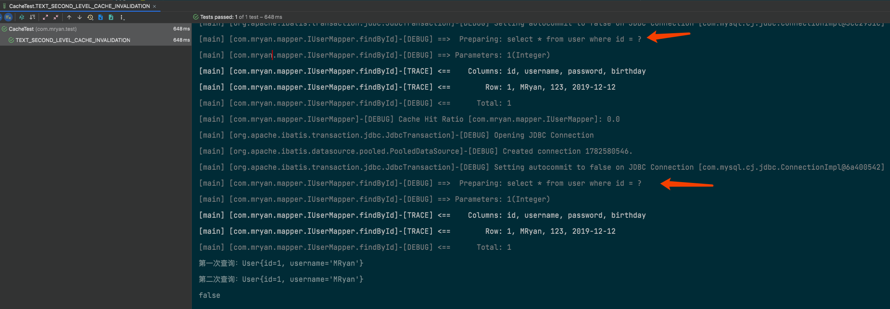
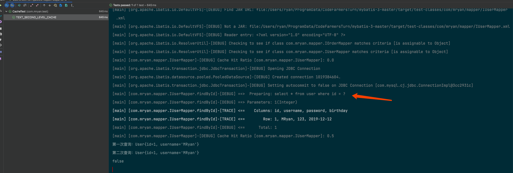

# 🏆深入浅出MyBatis缓存机制


## 1. 缓存的意义

众所周知，和数据库打交道避免不了磁盘IO操作，那如果频繁的IO操作一定会对性能造成影响，所以减少与数据库的交互次数从而降低数据库压力进而提升查询效率是必要的。缓存是其中一种实现方式，简单的理解其实缓存就是内存中专门的一块区域，当从数据库中查询到一些数据将其放入缓存中，下次查询相同的数据时可以直接从缓存中获取数据即可，这样可减少了一步和数据库交互的过程。

MyBatis提供了三级缓存机制，虽然MyBatis的缓存机制有些鸡肋，大部分开发人员多数情况都只会使用MyBatis默认缓存配置，又虽然MyBatis缓存机制有一些不足之处，出于学习还是决定写下此文章。

## 2. 一级缓存

### 2.1 猜想

由一串测试代码引出今天的主角—一级缓存

`````java
    /**
     * 测试一级缓存
     */
    @Test
    public void TEST_QUERY_BY_FIRST_CACHE() {
        //代理模式获取代理类
        IUserMapper userMapper = sqlSession.getMapper(IUserMapper.class);
        //第⼀次sql语句查询 将查询结果放入缓存中
        User user1 = userMapper.findById(1);
        System.out.println("第一次查询：" + user1);
        //第⼆次sql语句查询，由于是同⼀个sqlSession,会去查询缓存 如果缓存中没有则查库 缓存中有则直接取缓存
        User user2 = userMapper.findById(1);
        System.out.println("第二次查询：" + user2);
        System.out.println(user1 == user2);
    }

`````


上述测试代码，在同一个sqlSession中执行2次查询操作并记录操作日志，不过会发现上图sql执行语句只记录了一次查询操作，言外之意其实在同一个session中第一次sql查询会查库，后将查询结果放入缓存中，第二次sql查询，就会直接去查询缓存。不过目前来说也只是猜想，稍后我们翻看源码的时候会验证此猜想。

***

不过话说回来，在同一个sqlSession这个前提下，多次查询走缓存不去查库，那如果库中数据更改了呢，数据被修改，删除，或者新增呢，岂不是数据不一致了，所以我猜想当执行了数据修改，删除，新增操作会重置缓存（重新查一次库），避免脏读，实际上MyBatis就是这么做的。

编写如下测试类，运行代码：

```java
  /**
     * 测试一级缓存 提交 是否重置缓存
     */
    @Test
    public void TEST_QUERY_COMMIT_BY_FIRST_CACHE() {
        //代理模式获取代理类
        IUserMapper userMapper = sqlSession.getMapper(IUserMapper.class);
        //第⼀次sql语句查询 将查询结果放入缓存中
        User user1 = userMapper.findById(1);
        System.out.println("第一次查询：" + user1);
        //更新操作 并提交sqlSession
        user1.setUsername("MRyan666");
        userMapper.updateById(user1);
        sqlSession.commit();
        User user2 = userMapper.findById(1);
        System.out.println("第二次查询：" + user2);
        System.out.println(user1 == user2);
    }
```


根据上述测试代码，初步证实了我的猜想在同一的sqlSession作用范围下，如果中间操作sqlSession执行了commit操作，其实也就是（删除，更新，新增）那么会清除sqlSession的缓存，保障缓存中拿到的数据一定是最新的，避免脏读。

到这里先透一个底，其实上面所提及到的缓存在MyBatis中被命名为一级缓存。

### 2.2 证明

说了这么多猜想，眼见为实，接下来跟随作者一起通过对MyBatis源码解读探究一级缓存的原理及本质，在开始之前，提出几个问题，带入问题分析源码事半功倍。

- 一级缓存是什么 数据结构是怎样的？
- 一级缓存什么时候被构建
- 一级缓存的不足及优化

一起走进源码的世界

上文我们探究了MyBatis执行SQL语句的流程 [原文链接](ExecuteSQL.md)，虽然当时仅仅只是提了一嘴缓存相关，但是却提供了一个入口点，那就是SqlSession#selectList()-》DefaultSqlSession#selectList()-》Executor#query()-》BaseExecutor#query()

```java
    //此方法在SimpleExecutor的父类BaseExecutor中实现
    @Override
    public <E> List<E> query(MappedStatement ms, Object parameter, RowBounds rowBounds, ResultHandler resultHandler) throws SQLException {
        //根据传入的参数动态获得SQL语句，最后返回用BoundSql对象表示
        BoundSql boundSql = ms.getBoundSql(parameter);
        //为本次查询创建缓存的Key
        CacheKey key = createCacheKey(ms, parameter, rowBounds, boundSql);
        // 查询
        return query(ms, parameter, rowBounds, resultHandler, key, boundSql);
    }
```

上述代码就是查询语句的实际执行逻辑，关键代码createCacheKey创建了缓存所需要的key

```java

    @Override
    public CacheKey createCacheKey(MappedStatement ms, Object parameterObject, RowBounds rowBounds, BoundSql boundSql) {
        if (closed) {
            throw new ExecutorException("Executor was closed.");
        }
        // 创建 CacheKey 对象
        CacheKey cacheKey = new CacheKey();
        // 设置 id、offset、limit、sql 到 CacheKey 对象中
        cacheKey.update(ms.getId());
        //offset当前为0
        cacheKey.update(rowBounds.getOffset());
        //limit=Integer.MAXVALUE
        cacheKey.update(rowBounds.getLimit());
        //具体的SQL语句
        cacheKey.update(boundSql.getSql());
        //设置 ParameterMapping 数组的元素对应的每个 value 到 CacheKey 对象中
        List<ParameterMapping> parameterMappings = boundSql.getParameterMappings();
        TypeHandlerRegistry typeHandlerRegistry = ms.getConfiguration().getTypeHandlerRegistry();
        // mimic DefaultParameterHandler logic 这块逻辑，和 DefaultParameterHandler 获取 value 是一致的。
        for (ParameterMapping parameterMapping : parameterMappings) {
            if (parameterMapping.getMode() != ParameterMode.OUT) {
                Object value;
                String propertyName = parameterMapping.getProperty();
                if (boundSql.hasAdditionalParameter(propertyName)) {
                    value = boundSql.getAdditionalParameter(propertyName);
                } else if (parameterObject == null) {
                    value = null;
                } else if (typeHandlerRegistry.hasTypeHandler(parameterObject.getClass())) {
                    value = parameterObject;
                } else {
                    MetaObject metaObject = configuration.newMetaObject(parameterObject);
                    value = metaObject.getValue(propertyName);
                }
                // Sql所携带的参数
                cacheKey.update(value);
            }
        }
        // 设置 Environment.id 到 CacheKey 对象中
        if (configuration.getEnvironment() != null) {
            // issue #176
            cacheKey.update(configuration.getEnvironment().getId());
        }
        return cacheKey;
    }

```

其中ms.getId()就是MappedStatement的id，就是SQL语句所在位置的包名+类名+SQL名称

cacheKey会调用5次update方法将所需要的数据存入updateList中

```java
public void update(Object object) {
        // 方法参数 object 的 hashcode
        int baseHashCode = object == null ? 1 : ArrayUtil.hashCode(object);

        count++;

        // checksum 为 baseHashCode 的求和
        checksum += baseHashCode;

        // 计算新的 hashcode 值
        baseHashCode *= count;
        hashcode = multiplier * hashcode + baseHashCode;

        // 添加 object 到 updateList 中
        updateList.add(object);
    }
```

CacheKey重写了quals()方法

```java
  @Override
    public boolean equals(Object object) {
        if (this == object) {
            return true;
        }
        if (!(object instanceof CacheKey)) {
            return false;
        }

        final CacheKey cacheKey = (CacheKey) object;

        if (hashcode != cacheKey.hashcode) {
            return false;
        }
        if (checksum != cacheKey.checksum) {
            return false;
        }
        if (count != cacheKey.count) {
            return false;
        }

        // 比较 updateList 数组
        //除去hashcode、checksum和count，如果两条SQL的updateList中下列五个值相同，即可以认为是相同的SQL-》Statement Id + Offset + Limmit + Sql + Params
        for (int i = 0; i < updateList.size(); i++) {
            Object thisObject = updateList.get(i);
            Object thatObject = cacheKey.updateList.get(i);
            if (!ArrayUtil.equals(thisObject, thatObject)) {
                return false;
            }
        }
        return true;
    }
```

除去hashcode、checksum和count，如果两条SQL的updateList中下列五个值相同，即可以认为是相同的SQL

如果你还是不理解，那么就看如下图案例


继续往下走，创建完缓存Key进入查询逻辑

```java
@SuppressWarnings("unchecked")
    @Override
    public <E> List<E> query(MappedStatement ms, Object parameter, RowBounds rowBounds, ResultHandler resultHandler, CacheKey key, BoundSql boundSql) throws SQLException {
        ErrorContext.instance().resource(ms.getResource()).activity("executing a query").object(ms.getId());
        // 已经关闭，则抛出 ExecutorException 异常
        if (closed) {
            throw new ExecutorException("Executor was closed.");
        }
        // 清空本地缓存，如果 queryStack 为零，并且要求清空本地缓存。
        if (queryStack == 0 && ms.isFlushCacheRequired()) {
            clearLocalCache();
        }
        List<E> list;
        try {
            // queryStack + 1
            queryStack++;
            // 从一级缓存中，获取查询结果 (关键代码)
            list = resultHandler == null ? (List<E>) localCache.getObject(key) : null;
            // 获取到，则进行处理
            if (list != null) {
                handleLocallyCachedOutputParameters(ms, key, parameter, boundSql);
            // 获得不到，则从数据库中查询
            } else {
                list = queryFromDatabase(ms, parameter, rowBounds, resultHandler, key, boundSql);
            }
        } finally {
            // queryStack - 1
            queryStack--;
        }
        if (queryStack == 0) {
            // 执行延迟加载
            for (DeferredLoad deferredLoad : deferredLoads) {
                deferredLoad.load();
            }
            // issue #601
            // 清空 deferredLoads
            deferredLoads.clear();
            // 如果缓存级别是 LocalCacheScope.STATEMENT ，则进行清理
            if (configuration.getLocalCacheScope() == LocalCacheScope.STATEMENT) {
                // issue #482
                clearLocalCache();
            }
        }
        return list;
    }
```

目光集中到关键代码

```java
list = resultHandler == null ? (List<E>) localCache.getObject(key) : null;
```

上述代码实际意义是从localCache中获取结果，而这localCache从字面上理解就是缓存没跑了，实际上他确实是一级缓存。

```java
		/**
     * 本地缓存，即一级缓存
     */
    protected PerpetualCache localCache;
```

还记得文章开头的代入问题吗，localCache的数据结构是什么呢？实际上他就是一个本地map容器来存储缓存

```java

/**
 * 永不过期的 Cache 实现类，基于 HashMap 实现类
 *
 * @author Clinton Begin
 */
public class PerpetualCache implements Cache {

    /**
     * 标识
     */
    private final String id;
    /**
     * 缓存容器
     */
    private Map<Object, Object> cache = new HashMap<>();
}
```

继续回到刚才查询的逻辑中

从一级缓存(localCache的Map容器中)中获取查询结果，如果能获取到则后处理，如果缓存获取不到的话，则从数据库中查询。

```java
      // 从一级缓存中，获取查询结果
            list = resultHandler == null ? (List<E>) localCache.getObject(key) : null;
            // 获取到，则进行处理
            if (list != null) {
                handleLocallyCachedOutputParameters(ms, key, parameter, boundSql);
            // 获得不到，则从数据库中查询
            } else {
                list = queryFromDatabase(ms, parameter, rowBounds, resultHandler, key, boundSql);
            }
```

详细来看看从数据库查询的处理queryFromDatabase

```java
     // 从数据库中读取操作
    private <E> List<E> queryFromDatabase(MappedStatement ms, Object parameter, RowBounds rowBounds, ResultHandler resultHandler, CacheKey key, BoundSql boundSql) throws SQLException {
        List<E> list;
        // 在缓存中，添加占位对象。此处的占位符，和延迟加载有关，可见 `DeferredLoad#canLoad()` 方法
        localCache.putObject(key, EXECUTION_PLACEHOLDER);
        try {
            // 执行读操作
            list = doQuery(ms, parameter, rowBounds, resultHandler, boundSql);
        } finally {
            // 从缓存中，移除占位对象
            localCache.removeObject(key);
        }
        // 添加到缓存中 （关键代码）
        localCache.putObject(key, list);
        // 暂时忽略，存储过程相关
        if (ms.getStatementType() == StatementType.CALLABLE) {
            localOutputParameterCache.putObject(key, parameter);
        }
        return list;
    }
```

由此可见当缓存中没有触发一次查库后将查到的数据结果存入到一级缓存（localCache的Map容器）中。


****

**一级缓存的生命周期**

缓存的生命周期无非3步，初始化->缓存生成->缓存销毁

上面我们讲到了缓存的生成过程，那么**初始化是怎么处理的呢**？

如下：

`org.apache.ibatis.executor.BaseExecutor#BaseExecutor()`

```java
    protected BaseExecutor(Configuration configuration, Transaction transaction) {
        this.transaction = transaction;
        this.deferredLoads = new ConcurrentLinkedQueue<>();
        //一级缓存初始化
        this.localCache = new PerpetualCache("LocalCache");
        this.localOutputParameterCache = new PerpetualCache("LocalOutputParameterCache");
        this.closed = false;
        this.configuration = configuration;
        this.wrapper = this; // 自己
    }
```

**那缓存销毁的过程是怎么处理的呢？**

定位到如下方法中`org.apache.ibatis.executor.BaseExecutor#query()`

```java
public <E> List<E> query(MappedStatement ms, Object parameter, RowBounds rowBounds, ResultHandler resultHandler, CacheKey key, BoundSql boundSql) throws SQLException {
...
 if (configuration.getLocalCacheScope() == LocalCacheScope.STATEMENT) {
   // issue #482
   clearLocalCache();
 }
...
}
@Override
public void clearLocalCache() {
 if (!closed) {
     localCache.clear();
     localOutputParameterCache.clear();
 }
}
```

如果配置缓存作用域localCacheScope是`STATEMENT`则会每次清空缓存

**localCacheScope缓存的作用域有`SESSION`和`STATEMENT`2个配置选项**，在中可以配置，默认情况下是`SESSION`。

```java
/**
 * 本地( 一级 )缓存范围
 *
 * @author Eduardo Macarron
 */
public enum LocalCacheScope {

    /**
     * 会话级
     */
    SESSION,
    /**
     * SQL 语句级
     */
    STATEMENT
}
```

除此以外，我们再看下调用到`clearLocalCache()`方法的地方，就是清除缓存的

```java
  @Override
  public int update(MappedStatement ms, Object parameter) throws SQLException {
      //省略部分代码
      clearLocalCache();
      //省略部分代码
  }
  @Override
  public void commit(boolean required) throws SQLException {
     //省略部分代码
      clearLocalCache();
     //省略部分代码
  }
   @Override
  public void rollback(boolean required) throws SQLException {
      //省略部分代码
      clearLocalCache();
      .//省略部分代码  
  }
  @Override
public void close(boolean forceRollback) {
    //省略部分代码
  rollback(forceRollback);
    //省略部分代码
    localCache = null;
      
  }

```

由上述的方法可以看出来，**缓存在执行update()、commit()、rollback()、close()都会销毁**。

除此以外，就是在sqlSession被回收时会被销毁。

因为缓存是跟随PerpetualCache localCache这个对象，而localCache是BaseExecutor–> DefaultSqlSession 的属性，也就是缓存的作用域是SqlSession，随着sqlSession消失而消失。

阅读源码进行验证

```java
  @Override
    public void close() {
        try {
            // 关闭执行器
            executor.close(isCommitOrRollbackRequired(false));
            // 关闭所有游标
            closeCursors();
            // 重置 dirty 为 false
            dirty = false;
        } finally {
            ErrorContext.instance().reset();
        }
    }
```

`executor.close(isCommitOrRollbackRequired(false));`关闭执行器会伴随着事务的rollback，刚才提到rollback会销毁一级缓存。

`DefaultSqlSession#close()`

```java
    @Override
    public void close(boolean forceRollback) {
        try {
            // 回滚事务
            try {
                rollback(forceRollback);
            } finally {
                // 关闭事务
                if (transaction != null) {
                    transaction.close();
                }
            }
        } catch (SQLException e) {
            // Ignore.  There's nothing that can be done at this point.
            log.warn("Unexpected exception on closing transaction.  Cause: " + e);
        } finally {
            // 置空变量
            transaction = null;
            deferredLoads = null;
            localCache = null;
            localOutputParameterCache = null;
            closed = true;
        }
    }

```

`BaseExecutor#rollback()`

```java
  @Override
    public void rollback(boolean required) throws SQLException {
        if (!closed) {
            try {
                // 清空本地缓存
                clearLocalCache();
                // 刷入批处理语句
                flushStatements(true);
            } finally {
                if (required) {
                    // 是否要求回滚事务。如果是，则回滚事务。
                    transaction.rollback();
                }
            }
        }
    }
```

**总结翻看完一级缓存的声明周期，其实会发现，一级缓存的生命周期其实和SqlSession声明周期一致。**

来吧，跑一个测试代码来验证刚才所说**一级缓存在执行update()、commit()、rollback()、close() 或者SqlSession回收时都会销毁**。

```java
    /**
     * 测试一级缓存commit()是否重置缓存
     */
    @Test
    public void TEST_QUERY_COMMIT_BY_FIRST_CACHE() {
        //代理模式获取代理类
        IUserMapper userMapper = sqlSession.getMapper(IUserMapper.class);
        //第⼀次sql语句查询 将查询结果放入缓存中
        User user1 = userMapper.findById(1);
        System.out.println("第一次查询：" + user1);
        //更新操作 并提交sqlSession
        user1.setUsername("MRyan666");
        userMapper.updateById(user1);
        sqlSession.commit();
        User user2 = userMapper.findById(1);
        System.out.println("第二次查询：" + user2);
        System.out.println(user1 == user2);
    }
```

运行结果如下 石锤了：

由于中途SqlSession进行了commit操作导致缓存被销毁，于是第二次查询还是会查一次库：


***

到此为止一级缓存已经被揭开了神秘的面纱。

### 2.3 总结：

还记得文章刚开始的带入问题吗，一级缓存有什么不足吗？

1. 使用一级缓存的时候作用在同一个SqlSession下，因为缓存不能跨会话共享，不同的会话之间对于相同的数据可能有不一样的缓存。当在有多个会话或者分布式环境下，可能会存在脏数据的问题。那这种问题如何解决呢？可以将一级缓存级别设置为Statement的级别
2. 一级缓存的数据结构是HashMap，众所周知HashMap是线程不安全的，那一级缓存是否也是线程不安全，但由于一级缓存只存作用在同一个sqlSession中，所以基本上不会出现线程问题。

关于一级缓存作用域为同一个SqlSession下的局限性，MyBatis提供了二级缓存。

## 3. 二级缓存

MyBatis提供了二级缓存，不过二级缓存不是默认开启的，若需开启二级缓存，需要做一些配置操作（可自定义二级缓存）

二级缓存构建在一级缓存之上，一级缓存是和SqlSession绑定，而二级缓存是和Mapper具体的命名空间绑定，二级缓存是全局性的，一个Mapper中有一个Cache，相同的Mapper中多个不同的MappedStatement共用一个Cache。

### 3.1 开启二级缓存

1. 开启全局二级缓存配置

   ```xml
   <settings>
      <setting name="cacheEnabled" value="true"/>
   </settings>
   ```

2. 在需要使用二级缓存的sqlMapConfig Mapper配置文件中配置标签

   ```xml
   <cache></cache>
   ```

3. 在CURDmapper标签中配置useCache=true

   ```xml
   <select id="findById" resultType="com.mryan.pojo.User" useCache="true">
       select * from user where id = #{id}
   </select>
   ```

由此设置二级缓存将被开启，接下来跑个简单测试类来了解下二级缓存的使用

### 3.2 测试二级缓存

刚才也说了二级缓存作用范围在命名空间也就是namepace下的所有操作语句都影响这用一个Cache。

接下来通过几个测试代码，来看一看二级缓存到底是什么吧。

**1）开启二级缓存，进行查询但不进行事务提交**

```java
/**
     * 测试二级缓存 sqlSession不commit 二级缓存不生效
     */
    @Test
    public void TEXT_SECOND_LEVEL_CACHE_INVALIDATION() {
        SqlSession sqlSession1 = sqlSessionFactory.openSession();
        SqlSession sqlSession2 = sqlSessionFactory.openSession();

        IUserMapper mapper1 = sqlSession1.getMapper(IUserMapper.class);
        IUserMapper mapper2 = sqlSession2.getMapper(IUserMapper.class);

        User user1 = mapper1.findById(1);

        User user2 = mapper2.findById(1);

        System.out.println("第一次查询：" + user1);
        System.out.println("第二次查询：" + user2);
        System.out.println(user1 == user2);
    }
```

上述代码执行结果如下：



然而发现二级缓存并没有起到作用，并没有生效，也就是说sqlSession1查询完数据之后，sqlSession2再进行同样的查询时并没有像想象中一样直接从缓存中获取数据，而是重新查库。

**2）上述同样的测试代码，不过将sqlSession1提交事务 这时二级缓存生效吗**?

```java
 /**
     * 测试二级缓存 sqlSession commit 二级缓存生效
     */
    @Test
    public void TEXT_SECOND_LEVEL_CACHE() {
        SqlSession sqlSession1 = sqlSessionFactory.openSession();
        SqlSession sqlSession2 = sqlSessionFactory.openSession();

        IUserMapper mapper1 = sqlSession1.getMapper(IUserMapper.class);
        IUserMapper mapper2 = sqlSession2.getMapper(IUserMapper.class);

        User user1 = mapper1.findById(1);
        //sqlSession提交 二级缓存生效
        sqlSession1.commit();
        User user2 = mapper2.findById(1);

        System.out.println("第一次查询：" + user1);
        System.out.println("第二次查询：" + user2);
        System.out.println(user1 == user2);
    }
```



很明显，当提交事务之后 二级缓存生效了，那这是什么原理呢，稍后阅读源码的时候会详细说明。

### 3.3 源码分析

在上文[原文链接](ExecuteSQL.md)分析SQL语句执行的过程中，我们了解了配置文件的加载和解析，其中缓存相关并没有去做说明，在本文会详细说明。

其中xml解析工作实际上是交给XMLConfigBuilder#parse()方法实现,其中对配置文件中缓存相关的解析逻辑如下XMLConfigBuilder#cacheElement()

```java
  // 解析 <cache /> 标签
    private void cacheElement(XNode context) throws Exception {
        if (context != null) {
            //解析<cache/>标签的type属性，这里我们可以自定义cache的实现类，比如redisCache，如果没有自定义，这里使用和一级缓存相同的PERPETUAL
            String type = context.getStringAttribute("type", "PERPETUAL");
            Class<? extends Cache> typeClass = typeAliasRegistry.resolveAlias(type);
            // 获得负责过期的 Cache 实现类
            String eviction = context.getStringAttribute("eviction", "LRU");
            Class<? extends Cache> evictionClass = typeAliasRegistry.resolveAlias(eviction);
            // 清空缓存的频率。0 代表不清空
            Long flushInterval = context.getLongAttribute("flushInterval");
            // 缓存容器大小
            Integer size = context.getIntAttribute("size");
            // 是否序列化
            boolean readWrite = !context.getBooleanAttribute("readOnly", false);
            // 是否阻塞
            boolean blocking = context.getBooleanAttribute("blocking", false);
            // 获得 Properties 属性
            Properties props = context.getChildrenAsProperties();
            // 创建 Cache 对象
            builderAssistant.useNewCache(typeClass, evictionClass, flushInterval, size, readWrite, blocking, props);
        }
    }
```

构建Cache对象逻辑如下：

```java
/**
     * 创建 Cache 对象
     *
     * @param typeClass 负责存储的 Cache 实现类
     * @param evictionClass 负责过期的 Cache 实现类
     * @param flushInterval 清空缓存的频率。0 代表不清空
     * @param size 缓存容器大小
     * @param readWrite 是否序列化
     * @param blocking 是否阻塞
     * @param props Properties 对象
     * @return Cache 对象
     */
    public Cache useNewCache(Class<? extends Cache> typeClass,
                             Class<? extends Cache> evictionClass,
                             Long flushInterval,
                             Integer size,
                             boolean readWrite,
                             boolean blocking,
                             Properties props) {

        // 1.生成Cache对象
        Cache cache = new CacheBuilder(currentNamespace)
                //这里如果我们定义了<cache/>中的type，就使用自定义的Cache,否则使用和一级缓存相同的PerpetualCache
                .implementation(valueOrDefault(typeClass, PerpetualCache.class))
                .addDecorator(valueOrDefault(evictionClass, LruCache.class))
                .clearInterval(flushInterval)
                .size(size)
                .readWrite(readWrite)
                .blocking(blocking)
                .properties(props)
                .build();
        // 2.添加到Configuration中
        configuration.addCache(cache);
        // 3.并将cache赋值给MapperBuilderAssistant.currentCache
        currentCache = cache;
        return cache;
    }
```

这里会发现每一个Mapper.xml文件都会被解析，创建一次Cache对象（就是二级缓存），存入Configuration中，并且赋值给MapperBuilderAssistant.currentCache

接着在XMLMapperBuilder#configurationElement()解析Mapper节点的时候将生成的Cache包装到MappedStatement中

```java
// 解析 `<mapper />` 节点
    private void configurationElement(XNode context) {
        try {
            //省略上面代码
            // 解析 <select /> <insert /> <update /> <delete /> 节点们
          	// 重点看这里！！！！
            // 这里会将生成的Cache包装到对应的MappedStatement
         buildStatementFromContext(context.evalNodes("select|insert|update|delete"));
        } catch (Exception e) {
            throw new BuilderException("Error parsing Mapper XML. The XML location is '" + resource + "'. Cause: " + e, e);
        }
    }
```

```java
 // 解析 <select /> <insert /> <update /> <delete /> 节点们
    private void buildStatementFromContext(List<XNode> list) {
        if (configuration.getDatabaseId() != null) {
            buildStatementFromContext(list, configuration.getDatabaseId());
        }
        buildStatementFromContext(list, null);
        // 上面两块代码，可以简写成 buildStatementFromContext(list, configuration.getDatabaseId());
    }

    private void buildStatementFromContext(List<XNode> list, String requiredDatabaseId) {
        //遍历 <select /> <insert /> <update /> <delete /> 节点们
        for (XNode context : list) {
            // 创建 XMLStatementBuilder 对象，执行解析
            final XMLStatementBuilder statementParser = new XMLStatementBuilder(configuration, builderAssistant, context, requiredDatabaseId);
            try {

                // 每一条执行语句转换成一个MappedStatement
                statementParser.parseStatementNode();
            } catch (IncompleteElementException e) {
                // 解析失败，添加到 configuration 中
                configuration.addIncompleteStatement(statementParser);
            }
        }
    }
```

省略中间繁琐的过程，列出调用路径，感兴趣的小伙伴可以自行阅读源码、

buildStatementFromContext#buildStatementFromContext()->XMLStatementBuilder#parseStatementNode()->MapperBuilderAssistant#addMappedStatement()

在addMappedStatement方法中会构建MappedStatemet对象并将MappedStatement添加到Configuration对象中。

```java
 // 构建 MappedStatement 对象
    public MappedStatement addMappedStatement(
            String id,
            SqlSource sqlSource,
            StatementType statementType,
            SqlCommandType sqlCommandType,
            Integer fetchSize,
            Integer timeout,
            String parameterMap,
            Class<?> parameterType,
            String resultMap,
            Class<?> resultType,
            ResultSetType resultSetType,
            boolean flushCache,
            boolean useCache,
            boolean resultOrdered,
            KeyGenerator keyGenerator,
            String keyProperty,
            String keyColumn,
            String databaseId,
            LanguageDriver lang,
            String resultSets) {
        //省略代码
        // 创建 MappedStatement 对象
        MappedStatement statement = statementBuilder.build();
        // 添加到 configuration 中
        configuration.addMappedStatement(statement);
        return statement;
    }
```

至此缓存标签的解析任务就结束了

配置文件加载解析之后肯定是要进行查询了，查询实际调用的是Executor执行器，而MyBatis二级缓存实现了Executor->CachingExecutor

```java
 @Override
    public <E> List<E> query(MappedStatement ms, Object parameterObject, RowBounds rowBounds, ResultHandler resultHandler) throws SQLException {
        // 获得 BoundSql 对象
        BoundSql boundSql = ms.getBoundSql(parameterObject);
        // 创建 CacheKey 对象
        CacheKey key = createCacheKey(ms, parameterObject, rowBounds, boundSql);
        // 查询
        return query(ms, parameterObject, rowBounds, resultHandler, key, boundSql);
    }


@Override
    public <E> List<E> query(MappedStatement ms, Object parameterObject, RowBounds rowBounds, ResultHandler resultHandler, CacheKey key, BoundSql boundSql)
            throws SQLException {
        //从mappedStatement中获取Cache（二级缓存是从MappedStatement中获取，MappedStatement存在于全局配置中，会有多个CachingExecutor获取，可能会出现线程安全问题，例如脏读）
        //也就是我们上面解析Mapper中<cache/>标签中创建的，它保存在Configration中
        //我们在初始化解析xml时分析过每一个MappedStatement都有一个Cache对象，就是这里
        Cache cache = ms.getCache();
        // 如果配置文件中没有配置 <cache>，则cache为空
        if (cache != null) {
            //对应配置文件中的flushCache="true" 如果设置了flushCache为true则每次查询都会刷新缓存
            flushCacheIfRequired(ms);
            //对应配置文件中的useCache 如果设置了useCache为true则走二级缓存
            if (ms.isUseCache() && resultHandler == null) {
                // 暂时忽略，存储过程相关
                ensureNoOutParams(ms, boundSql);
                @SuppressWarnings("unchecked")
                // 从二级缓存中，获取结果
                List<E> list = (List<E>) tcm.getObject(cache, key);
                if (list == null) {
                    // 如果没有值，则执行查询，这个查询实际也是先走一级缓存查询，一级缓存也没有的话，则进行DB查询
                    list = delegate.query(ms, parameterObject, rowBounds, resultHandler, key, boundSql);
                    // 缓存查询结果 重点！！！！！
                    tcm.putObject(cache, key, list); // issue #578 and #116
                }
                // 如果存在，则直接返回结果
                return list;
            }
        }
        // 不使用缓存，则从数据库中查询(如果不是第一次查会查一级缓存)
        return delegate.query(ms, parameterObject, rowBounds, resultHandler, key, boundSql);
    }
```

其中的重点逻辑，如果flushCache="true" 则每次都会刷新缓存。

由于二级缓存是从MappedStatement中获取，是存在于全局配置，如果被多个CachingExecutor获取到，则一定会出现线程安全问题导致脏读，所以MyBatis为解决这个问题，在查询的过程中提供了TransactionalCacheManager作为事务缓存管理器

```java

/**
 * {@link TransactionalCache} 事务缓存管理器
 *
 * @author Clinton Begin
 */
public class TransactionalCacheManager {

    /**
     * // Cache 与 TransactionalCache 的映射关系表
     */
    private final Map<Cache, TransactionalCache> transactionalCaches = new HashMap<>();
 
    /**
     * 添加 Cache + KV ，到缓存中
     *
     * @param cache Cache 对象
     * @param key 键
     * @param value 值
     */
    public void putObject(Cache cache, CacheKey key, Object value) {
        // 直接存入TransactionalCache的缓存中
        getTransactionalCache(cache).putObject(key, value);
    }

    /**
     * 提交所有 TransactionalCache
     */
    public void commit() {
        for (TransactionalCache txCache : transactionalCaches.values()) {
            txCache.commit();
        }
    }
}
```

实际上TransactionalCacheManager内部维护了一个Cache实例和TransactionalCache之间的映射，

在CachingExecutor查询时缓存查询结果并事务提交之前会将所有从数据库中查询的结果放到entriesToAddOnCommit缓存集合中而它并不是真正的缓存对象Cache。只有查询的时候会直接从delegate（真正的缓存对象中查询），详细解释请看下述代码

```java
public class TransactionalCache implements Cache {

    /**
     * 委托的 Cache 对象。
     * <p>
     * 实际上，就是二级缓存 Cache 对象。
     */
    private final Cache delegate;

    /**
     * 在事务被提交前，所有从数据库中查询的结果将缓存在此集合中
     */
    private final Map<Object, Object> entriesToAddOnCommit;
    /**
     * 在事务被提交前，当缓存未命中时，CacheKey 将会被存储在此集合中
     */
    private final Set<Object> entriesMissedInCache;

    @Override
    public Object getObject(Object key) {
        // 查询的时候是直接从delegate中去查询的，也就是从真正的缓存对象中查询
        Object object = delegate.getObject(key);
        // 如果不存在，则添加到 entriesMissedInCache 中
        if (object == null) {
            // 缓存未命中，则将 key 存入到 entriesMissedInCache 中
            entriesMissedInCache.add(key);
        }
        // issue #146
        // 如果clearOnCommit为true ，表示处于持续清空状态，则返回 null
        if (clearOnCommit) {
            return null;
            // 返回 value
        } else {
            return object;
        }
    }
  
    @Override
    public void putObject(Object key, Object object) {
        // 将键值对存入到entriesToAddOnCommit这个Map中，而非真实的缓存对象delegate中
        entriesToAddOnCommit.put(key, object);
    }

    public void commit() {
        // 如果clearOnCommit为true ，则清空delegate缓存
        if (clearOnCommit) {
            delegate.clear();
        }
        // 将entriesToAddOnCommit、entriesMissedInCache 刷入delegate(cache) 中
        flushPendingEntries();
        // 重置
        reset();
    }
  
    /**
     * 将entriesToAddOnCommit、entriesMissedInCache刷入delegate(二级缓存)中
     */
    private void flushPendingEntries() {
        // 将entriesToAddOnCommit中的内容转存到delegate中
        for (Map.Entry<Object, Object> entry : entriesToAddOnCommit.entrySet()) {

            //在这里真正的将entriesToAddOnCommit的对象以此添加到delegate中，只有这时，二级缓存才真正的生效
            delegate.putObject(entry.getKey(), entry.getValue());
        }
        // 将entriesMissedInCache刷入delegate中
        for (Object entry : entriesMissedInCache) {
            if (!entriesToAddOnCommit.containsKey(entry)) {
                delegate.putObject(entry, null);
            }
        }
    }

}
```

**总结一下：**

存储二级缓存对象的时候将对象放入了TransactionalCache.entriesToAddOnCommit这个Map中(但是每次查询的时候是直接从TransactionalCache.delegate中查询)，所以我们的测试案例一才会没有生效。

但是当SqlSession提交或者关闭时，二级缓存就会生效，这时为什么呢？

来看一看SqlSession得commit方法做了什么

CahingExecutor#commit()

```java

    @Override
    public void commit(boolean required) throws SQLException {
        // 执行 delegate 对应的方法
        delegate.commit(required);
        // 提交 TransactionalCacheManager
        tcm.commit();
    }
```

TransactionalCacheManger#commit()

```java
    /**
     * 提交所有 TransactionalCache
     */
    public void commit() {
        for (TransactionalCache txCache : transactionalCaches.values()) {
            txCache.commit();
        }
    }
```

TransactionalCache#commit()

```java
public void commit() {
        // 如果clearOnCommit为true ，则清空delegate缓存
        if (clearOnCommit) {
            delegate.clear();
        }
        // 将entriesToAddOnCommit、entriesMissedInCache 刷入delegate(cache) 中
        flushPendingEntries();
        // 重置
        reset();
    }
```

再来看看flushPendingEntries方法

```java
/**
     * 将entriesToAddOnCommit、entriesMissedInCache刷入delegate(二级缓存)中
     */
    private void flushPendingEntries() {
        // 将entriesToAddOnCommit中的内容转存到delegate中
        for (Map.Entry<Object, Object> entry : entriesToAddOnCommit.entrySet()) {

            //在这里真正的将entriesToAddOnCommit的对象以此添加到delegate中，只有这时，二级缓存才真正的生效
            delegate.putObject(entry.getKey(), entry.getValue());
        }
        // 将entriesMissedInCache刷入delegate中
        for (Object entry : entriesMissedInCache) {
            if (!entriesToAddOnCommit.containsKey(entry)) {
                delegate.putObject(entry, null);
            }
        }
    }
```

在本方法中才真正的将entriesToAddOnCommit的对象以此添加到delegate中，只有这时，二级缓存才真正的生效，由此也验证了我们的测试二案例。

SqlSession的更新操作具体做了什么？

CachingExecutor#update

```java
   @Override
    public int update(MappedStatement ms, Object parameterObject) throws SQLException {
        // 如果需要清空缓存，则进行清空
        flushCacheIfRequired(ms);
        // 执行 delegate 对应的方法
        return delegate.update(ms, parameterObject);
    }

    /**
     * 如果需要清空缓存，则进行清空
     *
     * @param ms MappedStatement 对象
     */
    private void flushCacheIfRequired(MappedStatement ms) {
        Cache cache = ms.getCache();
        if (cache != null && ms.isFlushCacheRequired()) { // 是否需要清空缓存
            //重点！！！
            tcm.clear(cache);
        }
    }

```

TransactionalCacheManager#clear()

```java
    /**
     * 清空缓存
     *
     * @param cache Cache 对象
     */
    public void clear(Cache cache) {
        getTransactionalCache(cache).clear();
    }

```

TransactionalCache#clear()

```java
    @Override
    public void clear() {
        // 标记clearOnCommit为true
        clearOnCommit = true;
        // 清空entriesToAddOnCommit 清除缓存
        entriesToAddOnCommit.clear();
    }
```

由此会发现如果数据进行了变更MyBatis会清除缓存


### 3.4 二级缓存和一级缓存谁先被执行呢？

二级缓存-》一级缓存-》数据库

查询逻辑如下：

CachingExecutor#query()

```java
@Override
public <E> List<E> query(MappedStatement ms, Object parameterObject, RowBounds rowBounds, ResultHandler resultHandler, CacheKey key, BoundSql boundSql)
        throws SQLException {
    Cache cache = ms.getCache();
    if (cache != null) {
        flushCacheIfRequired(ms);
        //对应配置文件中的useCache 如果设置了useCache为true则走二级缓存
        if (ms.isUseCache() && resultHandler == null) {
            ensureNoOutParams(ms, boundSql);
            @SuppressWarnings("unchecked")
            // 从二级缓存中，获取结果
            List<E> list = (List<E>) tcm.getObject(cache, key);
            if (list == null) {
                // 如果没有值，则执行查询，这个查询实际也是先走一级缓存查询，一级缓存也没有的话，则进行DB查询
                list = delegate.query(ms, parameterObject, rowBounds, resultHandler, key, boundSql);
                // 缓存查询结果
                tcm.putObject(cache, key, list); // issue #578 and #116
            }
            // 如果存在，则直接返回结果
            return list;
        }
    }
    // 不使用缓存，则从数据库中查询(如果不是第一次查会查一级缓存)
    return delegate.query(ms, parameterObject, rowBounds, resultHandler, key, boundSql);
}
```

如果二级缓存关闭，直接判断一级缓存是否有数据，如果没有就查数据库

如果二级缓存开启，先判断二级缓存有没有数据，如果有就直接返回；如果没有，就查询一级缓存，如果有就返回，没有就查询数据库

### 3.5 总结

1. MyBatis二级缓存并不适用于经常增删改的数据，一旦数据变更二级缓存就会别MyBatis清空销毁。
2. 虽然二级缓存相对于一级缓存SqlSession之间共享缓存数据的粒度更细，可以达到namespace级别，但在二级缓存的作用域下一个Mapper文件，也就是一个namespace下所有的sqlSession都共用二级缓存，虽然可以解决一级缓存的脏读问题，但是并不能解决本身访问两个不同的Mapper存在的脏读问题（因为在二级缓存也是基于本地实现的（数据结构HashMap））。
3. 所以在工作中并不建议开启二级缓存。可以将MyBatis当做一个单纯的ORM框架使用


**不过话又说回来，虽然MyBatis的缓存机制有些鸡肋，但是并不妨碍它是一个优秀的开源框架，设计的相当优美，代码量也是很多，适合阅读学习。**


到此为止，先从缓存存在的意义说起，并从单元测试作为入口点出发，阅读MyBatis源码证明了关于一级缓存和二级缓存的猜想，总结了MyBatis缓存机制的不足。

>撒花🌹🌹🌹🌹但未完结，下一篇文章，让我们对延迟加载原理进行剖析。

## 预告

下篇文章：🏆延迟加载原理剖析

**本文已收录到CodeWars系列，欢迎各位Star，持续输出高质量技术文章**
[链接点我！](https://gitee.com/Ryan_ma/CodeWars)

**更多技术文章，请关注公众号，让我们一起进步吧！**


