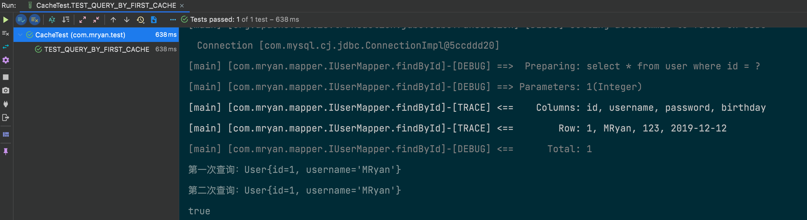
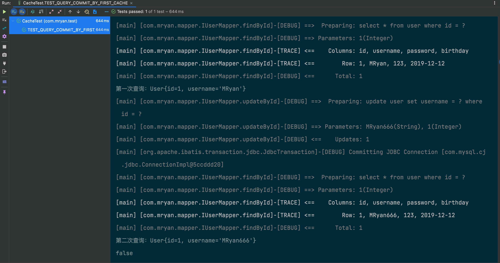
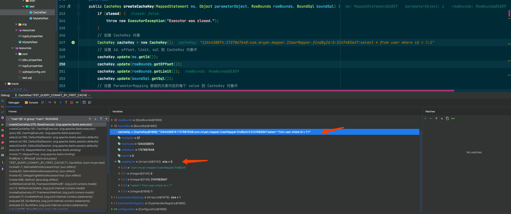
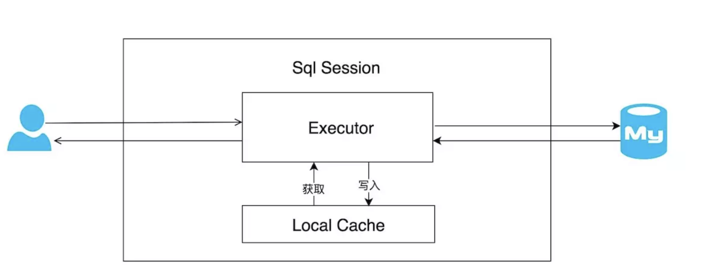
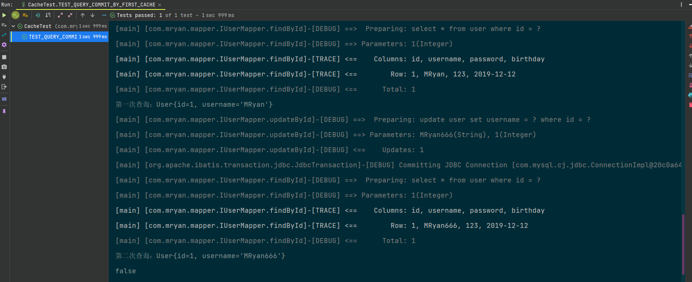

# 🏆深入浅出MyBatis缓存


## 1. 缓存的意义

众所周知，和数据库打交道避免不了磁盘IO操作，那如果频繁的IO操作一定会对性能造成影响，所以减少与数据库的交互次数从而降低数据库压力进而提升查询效率是必要的。缓存是其中一种实现方式，简单的理解其实缓存就是内存中专门的一块区域，当从数据库中查询到一些数据将其放入缓存中，下次查询相同的数据时可以直接从缓存中获取数据即可，这样可减少了一步和数据库交互的过程。


MyBatis提供了三级缓存机制，虽然MyBatis的缓存机制有些鸡肋，大部分开发人员多数情况都只会使用MyBatis默认缓存配置，又虽然MyBatis缓存机制有一些不足之处，出于学习还是决定写下此文章。


## 2. 一级缓存

### 2.1 猜想

由一串测试代码引出今天的主角—一级缓存

`````java
    /**
     * 测试一级缓存
     */
    @Test
    public void TEST_QUERY_BY_FIRST_CACHE() {
        //代理模式获取代理类
        IUserMapper userMapper = sqlSession.getMapper(IUserMapper.class);
        //第⼀次sql语句查询 将查询结果放入缓存中
        User user1 = userMapper.findById(1);
        System.out.println("第一次查询：" + user1);
        //第⼆次sql语句查询，由于是同⼀个sqlSession,会去查询缓存 如果缓存中没有则查库 缓存中有则直接取缓存
        User user2 = userMapper.findById(1);
        System.out.println("第二次查询：" + user2);
        System.out.println(user1 == user2);
    }

`````



上述测试代码，在同一个sqlSession中执行2次查询操作并记录操作日志，不过会发现上图sql执行语句只记录了一次查询操作，言外之意其实在同一个session中第一次sql查询会查库，后将查询结果放入缓存中，第二次sql查询，就会直接去查询缓存。不过目前来说也只是猜想，稍后我们翻看源码的时候会验证此猜想。

***

不过话说回来，在同一个sqlSession这个前提下，多次查询走缓存不去查库，那如果库中数据更改了呢，数据被修改，删除，或者新增呢，岂不是数据不一致了，所以我猜想当执行了数据修改，删除，新增操作会重置缓存（重新查一次库），避免脏读，实际上MyBatis就是这么做的。

编写如下测试类，运行代码：

```java
  /**
     * 测试一级缓存 提交 是否重置缓存
     */
    @Test
    public void TEST_QUERY_COMMIT_BY_FIRST_CACHE() {
        //代理模式获取代理类
        IUserMapper userMapper = sqlSession.getMapper(IUserMapper.class);
        //第⼀次sql语句查询 将查询结果放入缓存中
        User user1 = userMapper.findById(1);
        System.out.println("第一次查询：" + user1);
        //更新操作 并提交sqlSession
        user1.setUsername("MRyan666");
        userMapper.updateById(user1);
        sqlSession.commit();
        User user2 = userMapper.findById(1);
        System.out.println("第二次查询：" + user2);
        System.out.println(user1 == user2);
    }
```



根据上述测试代码，初步证实了我的猜想在同一的sqlSession作用范围下，如果中间操作sqlSession执行了commit操作，其实也就是（删除，更新，新增）那么会清除sqlSession的缓存，保障缓存中拿到的数据一定是最新的，避免脏读。

到这里先透一个底，其实上面所提及到的缓存在MyBatis中被命名为一级缓存。

### 2.2 证明

说了这么多猜想，眼见为实，接下来跟随作者一起通过对MyBatis源码解读探究一级缓存的原理及本质，在开始之前，提出几个问题，带入问题分析源码事半功倍。

- 一级缓存是什么 数据结构是怎样的？
- 一级缓存什么时候被构建
- 一级缓存的不足及优化

一起走进源码的世界

上文我们探究了MyBatis执行SQL语句的流程 [原文链接](ExecuteSQL.md)，虽然当时仅仅只是提了一嘴缓存相关，但是却提供了一个入口点，那就是SqlSession#selectList()-》DefaultSqlSession#selectList()-》Executor#query()-》BaseExecutor#query()

```java
    //此方法在SimpleExecutor的父类BaseExecutor中实现
    @Override
    public <E> List<E> query(MappedStatement ms, Object parameter, RowBounds rowBounds, ResultHandler resultHandler) throws SQLException {
        //根据传入的参数动态获得SQL语句，最后返回用BoundSql对象表示
        BoundSql boundSql = ms.getBoundSql(parameter);
        //为本次查询创建缓存的Key
        CacheKey key = createCacheKey(ms, parameter, rowBounds, boundSql);
        // 查询
        return query(ms, parameter, rowBounds, resultHandler, key, boundSql);
    }
```

上述代码就是查询语句的实际执行逻辑，关键代码createCacheKey创建了缓存所需要的key

```java

    @Override
    public CacheKey createCacheKey(MappedStatement ms, Object parameterObject, RowBounds rowBounds, BoundSql boundSql) {
        if (closed) {
            throw new ExecutorException("Executor was closed.");
        }
        // 创建 CacheKey 对象
        CacheKey cacheKey = new CacheKey();
        // 设置 id、offset、limit、sql 到 CacheKey 对象中
        cacheKey.update(ms.getId());
        //offset当前为0
        cacheKey.update(rowBounds.getOffset());
        //limit=Integer.MAXVALUE
        cacheKey.update(rowBounds.getLimit());
        //具体的SQL语句
        cacheKey.update(boundSql.getSql());
        //设置 ParameterMapping 数组的元素对应的每个 value 到 CacheKey 对象中
        List<ParameterMapping> parameterMappings = boundSql.getParameterMappings();
        TypeHandlerRegistry typeHandlerRegistry = ms.getConfiguration().getTypeHandlerRegistry();
        // mimic DefaultParameterHandler logic 这块逻辑，和 DefaultParameterHandler 获取 value 是一致的。
        for (ParameterMapping parameterMapping : parameterMappings) {
            if (parameterMapping.getMode() != ParameterMode.OUT) {
                Object value;
                String propertyName = parameterMapping.getProperty();
                if (boundSql.hasAdditionalParameter(propertyName)) {
                    value = boundSql.getAdditionalParameter(propertyName);
                } else if (parameterObject == null) {
                    value = null;
                } else if (typeHandlerRegistry.hasTypeHandler(parameterObject.getClass())) {
                    value = parameterObject;
                } else {
                    MetaObject metaObject = configuration.newMetaObject(parameterObject);
                    value = metaObject.getValue(propertyName);
                }
                // Sql所携带的参数
                cacheKey.update(value);
            }
        }
        // 设置 Environment.id 到 CacheKey 对象中
        if (configuration.getEnvironment() != null) {
            // issue #176
            cacheKey.update(configuration.getEnvironment().getId());
        }
        return cacheKey;
    }

```

其中ms.getId()就是MappedStatement的id，就是SQL语句所在位置的包名+类名+SQL名称

cacheKey会调用5次update方法将所需要的数据存入updateList中

```java
public void update(Object object) {
        // 方法参数 object 的 hashcode
        int baseHashCode = object == null ? 1 : ArrayUtil.hashCode(object);

        count++;

        // checksum 为 baseHashCode 的求和
        checksum += baseHashCode;

        // 计算新的 hashcode 值
        baseHashCode *= count;
        hashcode = multiplier * hashcode + baseHashCode;

        // 添加 object 到 updateList 中
        updateList.add(object);
    }
```

如果你还是不理解，那么就看如下图案例



继续往下走，创建完缓存Key进入查询逻辑

```java
@SuppressWarnings("unchecked")
    @Override
    public <E> List<E> query(MappedStatement ms, Object parameter, RowBounds rowBounds, ResultHandler resultHandler, CacheKey key, BoundSql boundSql) throws SQLException {
        ErrorContext.instance().resource(ms.getResource()).activity("executing a query").object(ms.getId());
        // 已经关闭，则抛出 ExecutorException 异常
        if (closed) {
            throw new ExecutorException("Executor was closed.");
        }
        // 清空本地缓存，如果 queryStack 为零，并且要求清空本地缓存。
        if (queryStack == 0 && ms.isFlushCacheRequired()) {
            clearLocalCache();
        }
        List<E> list;
        try {
            // queryStack + 1
            queryStack++;
            // 从一级缓存中，获取查询结果 (关键代码)
            list = resultHandler == null ? (List<E>) localCache.getObject(key) : null;
            // 获取到，则进行处理
            if (list != null) {
                handleLocallyCachedOutputParameters(ms, key, parameter, boundSql);
            // 获得不到，则从数据库中查询
            } else {
                list = queryFromDatabase(ms, parameter, rowBounds, resultHandler, key, boundSql);
            }
        } finally {
            // queryStack - 1
            queryStack--;
        }
        if (queryStack == 0) {
            // 执行延迟加载
            for (DeferredLoad deferredLoad : deferredLoads) {
                deferredLoad.load();
            }
            // issue #601
            // 清空 deferredLoads
            deferredLoads.clear();
            // 如果缓存级别是 LocalCacheScope.STATEMENT ，则进行清理
            if (configuration.getLocalCacheScope() == LocalCacheScope.STATEMENT) {
                // issue #482
                clearLocalCache();
            }
        }
        return list;
    }
```

目光集中到关键代码

```java
list = resultHandler == null ? (List<E>) localCache.getObject(key) : null;
```

上述代码实际意义是从localCache中获取结果，而这localCache从字面上理解就是缓存没跑了，实际上他确实是一级缓存。

```java
		/**
     * 本地缓存，即一级缓存
     */
    protected PerpetualCache localCache;
```

还记得文章开头的代入问题吗，localCache的数据结构是什么呢？实际上他就是一个本地map容器来存储缓存

```java

/**
 * 永不过期的 Cache 实现类，基于 HashMap 实现类
 *
 * @author Clinton Begin
 */
public class PerpetualCache implements Cache {

    /**
     * 标识
     */
    private final String id;
    /**
     * 缓存容器
     */
    private Map<Object, Object> cache = new HashMap<>();
}
```

继续回到刚才查询的逻辑中

从一级缓存(localCache的Map容器中)中获取查询结果，如果能获取到则后处理，如果缓存获取不到的话，则从数据库中查询。

```java
      // 从一级缓存中，获取查询结果
            list = resultHandler == null ? (List<E>) localCache.getObject(key) : null;
            // 获取到，则进行处理
            if (list != null) {
                handleLocallyCachedOutputParameters(ms, key, parameter, boundSql);
            // 获得不到，则从数据库中查询
            } else {
                list = queryFromDatabase(ms, parameter, rowBounds, resultHandler, key, boundSql);
            }
```

详细来看看从数据库查询的处理queryFromDatabase

```java
     // 从数据库中读取操作
    private <E> List<E> queryFromDatabase(MappedStatement ms, Object parameter, RowBounds rowBounds, ResultHandler resultHandler, CacheKey key, BoundSql boundSql) throws SQLException {
        List<E> list;
        // 在缓存中，添加占位对象。此处的占位符，和延迟加载有关，可见 `DeferredLoad#canLoad()` 方法
        localCache.putObject(key, EXECUTION_PLACEHOLDER);
        try {
            // 执行读操作
            list = doQuery(ms, parameter, rowBounds, resultHandler, boundSql);
        } finally {
            // 从缓存中，移除占位对象
            localCache.removeObject(key);
        }
        // 添加到缓存中 （关键代码）
        localCache.putObject(key, list);
        // 暂时忽略，存储过程相关
        if (ms.getStatementType() == StatementType.CALLABLE) {
            localOutputParameterCache.putObject(key, parameter);
        }
        return list;
    }
```

由此可见当缓存中没有触发一次查库后将查到的数据结果存入到一级缓存（localCache的Map容器）中。



****

**一级缓存的生命周期**

缓存的生命周期无非3步，初始化->缓存生成->缓存销毁

上面我们讲到了缓存的生成过程，那么**初始化是怎么处理的呢**？

如下：

`org.apache.ibatis.executor.BaseExecutor#BaseExecutor()`

```java
    protected BaseExecutor(Configuration configuration, Transaction transaction) {
        this.transaction = transaction;
        this.deferredLoads = new ConcurrentLinkedQueue<>();
        //一级缓存初始化
        this.localCache = new PerpetualCache("LocalCache");
        this.localOutputParameterCache = new PerpetualCache("LocalOutputParameterCache");
        this.closed = false;
        this.configuration = configuration;
        this.wrapper = this; // 自己
    }
```

**那缓存销毁的过程是怎么处理的呢？**

定位到如下方法中`org.apache.ibatis.executor.BaseExecutor#query()`

```java
public <E> List<E> query(MappedStatement ms, Object parameter, RowBounds rowBounds, ResultHandler resultHandler, CacheKey key, BoundSql boundSql) throws SQLException {
...
 if (configuration.getLocalCacheScope() == LocalCacheScope.STATEMENT) {
   // issue #482
   clearLocalCache();
 }
...
}
@Override
public void clearLocalCache() {
 if (!closed) {
     localCache.clear();
     localOutputParameterCache.clear();
 }
}
```

如果配置缓存作用域localCacheScope是`STATEMENT`则会每次清空缓存

**localCacheScope缓存的作用域有`SESSION`和`STATEMENT`2个配置选项**，在中可以配置，默认情况下是`SESSION`。

```java
/**
 * 本地( 一级 )缓存范围
 *
 * @author Eduardo Macarron
 */
public enum LocalCacheScope {

    /**
     * 会话级
     */
    SESSION,
    /**
     * SQL 语句级
     */
    STATEMENT
}
```

除此以外，我们再看下调用到`clearLocalCache()`方法的地方，就是清除缓存的

```java
  @Override
  public int update(MappedStatement ms, Object parameter) throws SQLException {
      //省略部分代码
      clearLocalCache();
      //省略部分代码
  }
  @Override
  public void commit(boolean required) throws SQLException {
     //省略部分代码
      clearLocalCache();
     //省略部分代码
  }
   @Override
  public void rollback(boolean required) throws SQLException {
      //省略部分代码
      clearLocalCache();
      .//省略部分代码  
  }
  @Override
public void close(boolean forceRollback) {
    //省略部分代码
  rollback(forceRollback);
    //省略部分代码
    localCache = null;
      
  }

```

由上述的方法可以看出来，**缓存在执行update()、commit()、rollback()、close()都会销毁**。

除此以外，就是在sqlSession被回收时会被销毁。

因为缓存是跟随PerpetualCache localCache这个对象，而localCache是BaseExecutor–> DefaultSqlSession 的属性，也就是缓存的作用域是SqlSession，随着sqlSession消失而消失。

阅读源码进行验证

```java
  @Override
    public void close() {
        try {
            // 关闭执行器
            executor.close(isCommitOrRollbackRequired(false));
            // 关闭所有游标
            closeCursors();
            // 重置 dirty 为 false
            dirty = false;
        } finally {
            ErrorContext.instance().reset();
        }
    }
```

`executor.close(isCommitOrRollbackRequired(false));`关闭执行器会伴随着事务的rollback，刚才提到rollback会销毁一级缓存。

`DefaultSqlSession#close()`

```java
    @Override
    public void close(boolean forceRollback) {
        try {
            // 回滚事务
            try {
                rollback(forceRollback);
            } finally {
                // 关闭事务
                if (transaction != null) {
                    transaction.close();
                }
            }
        } catch (SQLException e) {
            // Ignore.  There's nothing that can be done at this point.
            log.warn("Unexpected exception on closing transaction.  Cause: " + e);
        } finally {
            // 置空变量
            transaction = null;
            deferredLoads = null;
            localCache = null;
            localOutputParameterCache = null;
            closed = true;
        }
    }

```

`BaseExecutor#rollback()`

```java
  @Override
    public void rollback(boolean required) throws SQLException {
        if (!closed) {
            try {
                // 清空本地缓存
                clearLocalCache();
                // 刷入批处理语句
                flushStatements(true);
            } finally {
                if (required) {
                    // 是否要求回滚事务。如果是，则回滚事务。
                    transaction.rollback();
                }
            }
        }
    }
```

来吧，跑一个测试代码来验证刚才所说**一级缓存在执行update()、commit()、rollback()、close() 或者SqlSession回收时都会销毁**。

```java
    /**
     * 测试一级缓存commit()是否重置缓存
     */
    @Test
    public void TEST_QUERY_COMMIT_BY_FIRST_CACHE() {
        //代理模式获取代理类
        IUserMapper userMapper = sqlSession.getMapper(IUserMapper.class);
        //第⼀次sql语句查询 将查询结果放入缓存中
        User user1 = userMapper.findById(1);
        System.out.println("第一次查询：" + user1);
        //更新操作 并提交sqlSession
        user1.setUsername("MRyan666");
        userMapper.updateById(user1);
        sqlSession.commit();
        User user2 = userMapper.findById(1);
        System.out.println("第二次查询：" + user2);
        System.out.println(user1 == user2);
    }
```

运行结果如下 石锤了：

由于中途SqlSession进行了commit操作导致缓存被销毁，于是第二次查询还是会查一次库：



***

到此为止一级缓存已经被揭开了神秘的面纱。

还记得文章刚开始的带入问题吗，一级缓存有什么不足吗？

1. 使用一级缓存的时候作用在同一个SqlSession下，因为缓存不能跨会话共享，不同的会话之间对于相同的数据可能有不一样的缓存。当在有多个会话或者分布式环境下，可能会存在脏数据的问题。那这种问题如何解决呢？
2. 一级缓存的数据结构是HashMap，众所周知HashMap是线程不安全的，那一级缓存是否也是线程不安全，但由于一级缓存只存作用在同一个sqlSession中，所以基本上不会出现线程问题。

关于一级缓存作用域为同一个SqlSession下的局限性，MyBatis提供了二级缓存。

## 3. 二级缓存

> 本文尚未结束，请等待作者更新本文


