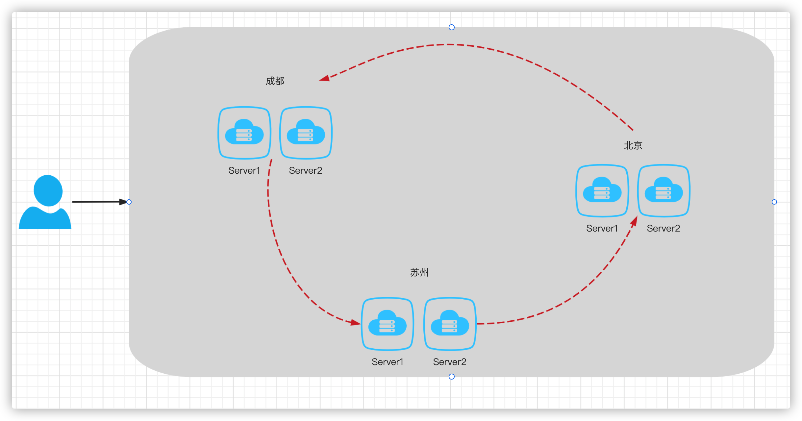
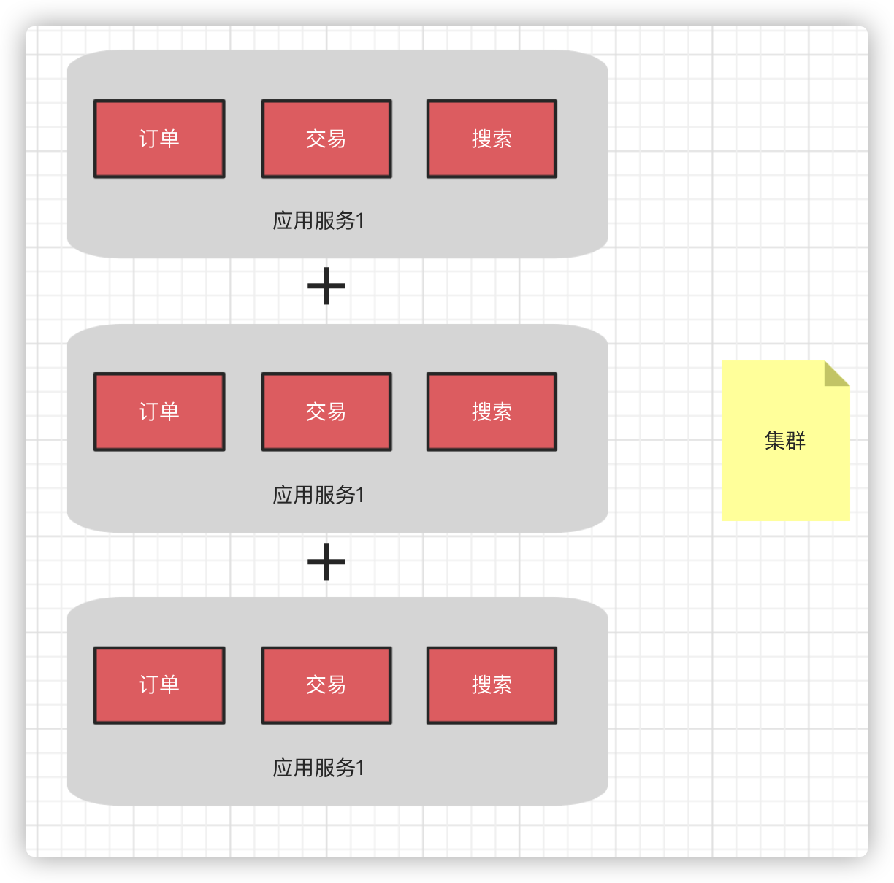
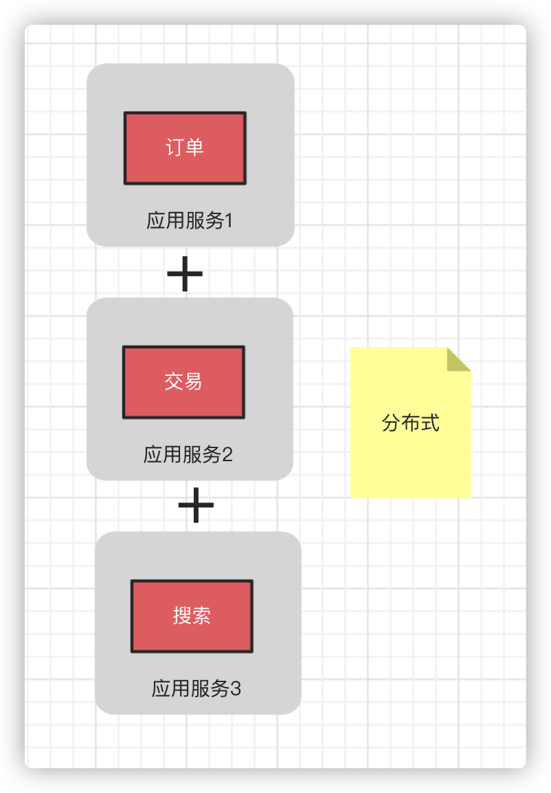
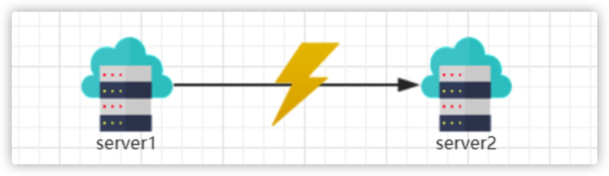
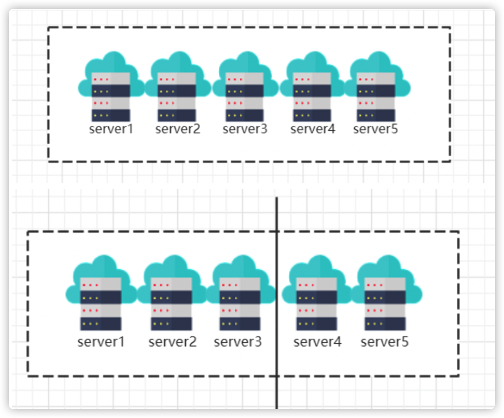
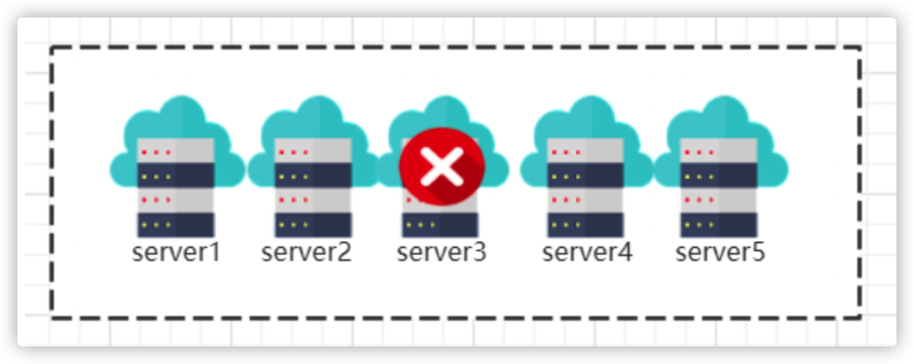
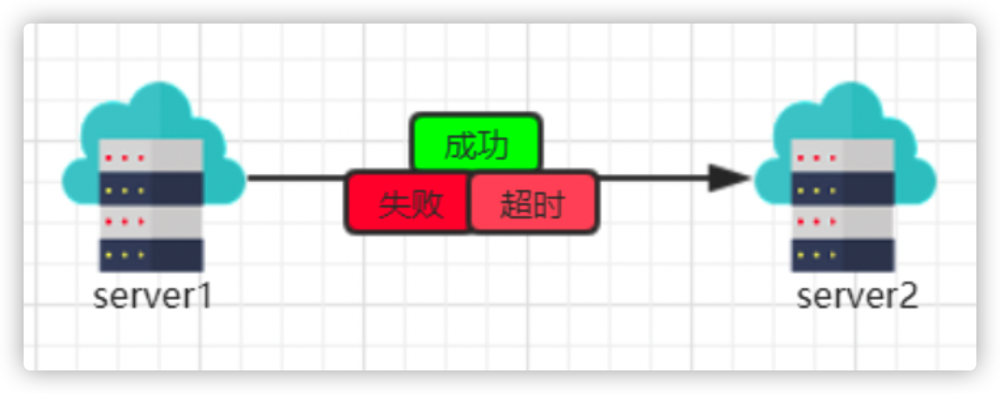
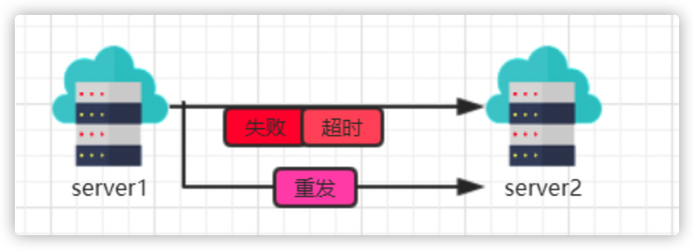

# 😎分布式理论与分布式架构设计理论

# 1. 分布式系统架构介绍

分布式系统涉及到很多的技术、理论与协议，希望通过本文，能让你对分布式系统有一个更全面的认识，至少能把分布式系统中的技术，理论串联起来。

## 1.1 什么是分布式系统

分布式系统是一个硬件或软件组件分布在不同的网络计算机上，彼此之间仅仅通过消息传递进行通信和协调的系统。

通俗的理解，所谓分布式系统，就是一个业务拆分成多个子业务，分布在不同的服务器节点，共同构成的系统称为分布式系统，同一个分布式系统中的服务器节点在空间部署上是可以随意分布的，这些服务器可能放在不同的机柜中，也可能在不同的机房中，甚至分布在不同的城市。

也许你会好奇，为什么分布式这个概念会被提出，那后续会开一篇文章来详细聊聊分层模型的演进。

## 1.2 分布式与集群的区别

网上的相关概念也非常多，这里不再叙述一遍了。

简单的来说我认为**集群**可以理解为多个服务器在做同一件事情，而**分布式**则是用多个服务器做不同的事情达到分工合作的目的。

看下述两幅图或许你应该理解了。

## 1.3 分布式系统特性

**1.分布性**

空间中随机分布。这些计算机可以分布在不同的机房，不同的城市，甚至不同的国家。

**2.对等性**

分布式系统中的计算机没有主/从之分，组成分布式系统的所有节点都是对等的。

**3.并发性**

同一个分布式系统的多个节点，可能会并发地操作一些共享的资源，诸如数据库或分布式存储。

**4.缺乏全局时钟**

既然各个计算机之间是依赖于交换信息来进行相互通信，很难定义两件事件的先后顺序，缺乏全局始终控制序列

**5.故障总会发生**

组成分布式的计算机，都有可能在某一时刻突然间崩掉。分的计算机越多，可能崩掉一个的几率就越大。如果再考虑到设计程序时的异常故障，也会加大故障的概率。

**6.处理单点故障** 

单点SPoF(Single Point of Failure):某个角色或者功能只有某一台计算机在支撑，在这台计算机上出现的故障是单点故障。

## 1.4 分布式系统面临的问题

**1.通信异常**

网络本身的不可靠性，因此每次网络通信都会伴随着网络不可用的风险(光纤、路由、DNS等硬件 设备或系统的不可用)，都会导致最终**分布式系统无法顺利进行一次网络通信**，另外，即使分布式 系统各节点之间的网络通信能够正常执行，其延时也会大于单机操作，存在巨大的延时差别，也会 影响消息的收发过程，因此消息丢失和消息延迟变的非常普遍。

**2.网络分区**

网络之间出现了网络不连通，但各个子网络的内部网络是正常的，从而导致整个系统的网络环境被 切分成了若干个孤立的区域，**分布式系统就会出现局部小集群**，在极端情况下，这些小集群会独立 完成原本需要整个分布式系统才能完成的功能，包括数据的事务处理，这就对分布式一致性提出非 常大的挑战。

**3.节点故障**

节点故障是分布式系统下另一个比较常见的问题，指的是组成分布式系统的服务器节点出现的宕机 或"僵死"现象，根据经验来说，每个节点都有可能出现故障，并且经常发生。

**4.三态**

分布式系统每一次请求与响应存在特有的“三态”概念，即成功、失败和超时。

5.重发

分布式系统在发生调用的时候可能会出现 失败 超时 的情况. 这个时候需要重新发起调用.

**6.幂等**

一次和多次请求某一个资源对于资源本身应该具有同样的结果(网络超时等问题除外)。也就是说，其任意多次执行对资源本身所产生的影响均与一次执行的影响相同

# 2.分布式理论

## 2.1 数据一致性

### 2.1.1 什么是分布式数据一致性

### 2.1.2 副本一致性

### 2.1.3 一致性分类

## 2.2 CAP定理

### 2.2.1 CAP定理介绍

### 2.2.2 CAP三者不可同时存在

### 2.2.3 CAP三者如何权衡

## 2.3 BASE理论

# 3.分布式一致性协议

## 3.1 两阶段提交协议（2PC)

## 3.2 三阶段提交协议（3PC)

## 3.3 NWR协议

## 3.4 Gossip协议

## 3.5 Paxos协议

## 3.6 Raft协议

## 3.7 Lease机制

# 4. 分布式系统设计策略

## 4.1 心跳检测

## 4.2 高可用

## 4.3 容错性

## 4.4 负载均衡

# 5. 分布式架构服务调用

## 5.1 服务调用

## 5.2 实现方式

