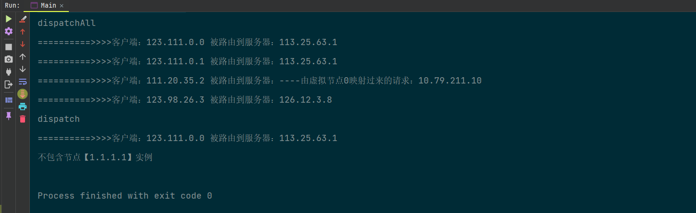

# ✍一致性Hash

> [👈返回本系列目录](/blog/backend_developer/cluster/description.md)


## 1. 前言：什么是分布式和集群

## 2. 普通Hash算法存在的问题

## 3. 什么是一致性Hash

## 4. 一致性Hash算法原理

## 5. 一致性Hash算法+缩容扩容处理+虚拟节点方案

## 6. 手写简易一致性Hash算法

Client

```java
/**
 * @description： Client
 * @Author MRyan
 * @Date 2021/9/29 22:37
 * @Version 1.0
 */
public class Client {

    private List<String> clientIps;

    public List<String> getClientIps() {
        return clientIps;
    }

    public void setClientIps(List<String> clientIps) {
        this.clientIps = clientIps;
    }

    public Client(List<String> clientIps) {
        this.clientIps = clientIps;
    }
}


```

TomcatServer

```java
/**
 * @description： TomcatServer
 * @Author MRyan
 * @Date 2021/9/29 22:38
 * @Version 1.0
 */
public class TomcatServer {

    private List<String> tomcatServerIps;

    public List<String> getTomcatServerIps() {
        return tomcatServerIps;
    }

    public void setTomcatServerIps(List<String> tomcatServerIps) {
        this.tomcatServerIps = tomcatServerIps;
    }

    public TomcatServer(List<String> tomcatServerIps) {
        this.tomcatServerIps = tomcatServerIps;
    }
}
```

ConsistentHashing

```java

/**
 * @description： 实现建议一致性Hash+虚拟节点算法
 * @Author MRyan
 * @Date 2021/9/29 21:17
 * @Version 1.0
 */
public class ConsistentHashing {

    private TomcatServer tomcatServer;

    private Client client;

    private SortedMap<Integer, String> hashServerMap;

    // 定义针对每个真实服务器虚拟出来几个节点
    private int virtualCount;

    public ConsistentHashing(TomcatServer tomcatServer, Client client, int virtualCount) {
        this.tomcatServer = tomcatServer;
        this.client = client;
        this.virtualCount = virtualCount;
        hashServerMap = new TreeMap<>();
        init();
    }

    private void init() {
        //step1 初始化：把服务器节点IP的哈希值对应到哈希环上 ip网段相同路由到同一机房
        // 定义服务器ip
        for (String tomcatServer : tomcatServer.getTomcatServerIps()) {
            // 求出每一个ip的hash值，对应到hash环上，存储hash值与ip的对应关系
            int serverHash = Math.abs(tomcatServer.hashCode());
            // 存储hash值与ip的对应关系
            hashServerMap.put(serverHash, tomcatServer);
            // 处理虚拟节点
            for (int i = 0; i < virtualCount; i++) {
                int virtualHash = Math.abs((tomcatServer + "#" + i).hashCode());
                hashServerMap.put(virtualHash, "----由虚拟节点" + i + "映射过来的请求：" + tomcatServer);
            }
        }
    }

    public List<String> dispatchAll() {
        List<String> route = new ArrayList<>();
        //step2 针对客户端IP求出hash值
        // 定义客户端IP
        for (String client : client.getClientIps()) {
            int clientHash = Math.abs(client.hashCode());
            //step3 针对客户端,找到能够处理当前客户端请求的服务器（哈希环上顺时针最近）
            // 根据客户端ip的哈希值去找出哪一个服务器节点能够处理
            SortedMap<Integer, String> integerStringSortedMap = hashServerMap.tailMap(clientHash);
            if (integerStringSortedMap.isEmpty()) {
                // 取哈希环上的顺时针第一台服务器
                Integer firstKey = hashServerMap.firstKey();
                route.add("==========>>>>客户端：" + client + " 被路由到服务器：" + hashServerMap.get(firstKey));
            } else {
                Integer firstKey = integerStringSortedMap.firstKey();
                route.add("==========>>>>客户端：" + client + " 被路由到服务器：" + hashServerMap.get(firstKey));
            }
        }
        return route;
    }

    public String dispatch(String clientIp) {
        if (!client.getClientIps().contains(clientIp)) {
            return "不包含节点【" + clientIp + "】实例";
        }
        //step2 针对客户端IP求出hash值
        // 定义客户端IP
        int clientHash = Math.abs(clientIp.hashCode());
        //step3 针对客户端,找到能够处理当前客户端请求的服务器（哈希环上顺时针最近）
        // 根据客户端ip的哈希值去找出哪一个服务器节点能够处理
        SortedMap<Integer, String> integerStringSortedMap = hashServerMap.tailMap(clientHash);
        if (integerStringSortedMap.isEmpty()) {
            // 取哈希环上的顺时针第一台服务器
            Integer firstKey = hashServerMap.firstKey();
            return "==========>>>>客户端：" + clientIp + " 被路由到服务器：" + hashServerMap.get(firstKey);
        } else {
            Integer firstKey = integerStringSortedMap.firstKey();
            return "==========>>>>客户端：" + clientIp + " 被路由到服务器：" + hashServerMap.get(firstKey);
        }
    }
}
```

Main

```java

/**
 * @description： 测试类
 * @Author MRyan
 * @Date 2021/9/29 22:41
 * @Version 1.0
 */
public class Main {

    public static void main(String[] args) {
        Client client = new Client(Arrays.asList("123.111.0.0", "123.111.0.1", "111.20.35.2", "123.98.26.3"));
        TomcatServer tomcatServer = new TomcatServer(Arrays.asList("10.78.12.3", "113.25.63.1", "126.12.3.8", "10.79.211.10"));
        ConsistentHashing consistentHashing = new ConsistentHashing(tomcatServer, client, 3);
        System.out.println("dispatchAll");
        for (String ans : consistentHashing.dispatchAll()) {
            System.out.println(ans);
        }
        System.out.println("dispatch");
        System.out.println(consistentHashing.dispatch("123.111.0.0"));
        System.out.println(consistentHashing.dispatch("1.1.1.1"));
    }
}

```

