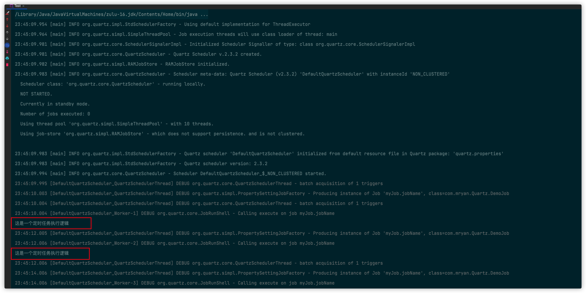

# ✍分布式调度

> [👈返回本系列目录](/blog/backend_developer/cluster/description.md)


## 1. 何为分布式调度

## 2. 分布式调度框架-》Quartz

### 2.1 如何使用Quartz

AbstractQuartz

```java

/**
 * @description： Quartz抽象类
 * @Author MRyan
 * @Date 2021/10/3 22:54
 * @Version 1.0
 */
public abstract class AbstractQuartz {

    /**
     * 创建任务调度器
     *
     * @return
     * @throws SchedulerException
     */
    public abstract Scheduler createScheduler() throws SchedulerException;

    /**
     * 创建一个任务
     *
     * @return
     */
    public abstract JobDetail createJob(Class<?> clazz, String jobName, String jobGroup);

    /**
     * 创建任务的时间触发器
     * <p>
     * cron表达式由七个位置组成，空格分隔
     * 1、Seconds（秒）  0~59
     * 2、Minutes（分）  0~59
     * 3、Hours（小时）  0~23
     * 4、Day of Month（天）1~31,注意有的月份不足31天
     * 5、Month（月） 0~11,或者 JAN,FEB,MAR,APR,MAY,JUN,JUL,AUG,SEP,OCT,NOV,DEC
     * 6、Day of Week(周)  1~7,1=SUN或者  SUN,MON,TUE,WEB,THU,FRI,SAT
     * 7、Year（年）1970~2099  可选项
     * 示例：
     * 0 0 11 * * ? 每天的11点触发执行一次
     * 0 30 10 1 * ? 每月1号上午10点半触发执行一次
     *
     * @return
     */
    public abstract Trigger createTrigger(String name, String group, String cron);


}

```

DemoQuartz

```java

/**
 * @description： DomeJob工具类
 * @Author MRyan
 * @Date 2021/10/3 22:52
 * @Version 1.0
 */
public class DemoQuartz extends AbstractQuartz {

    /**
     * 创建任务调度器
     *
     * @return
     * @throws SchedulerException
     */
    public Scheduler createScheduler() throws SchedulerException {
        SchedulerFactory schedulerFactory = new StdSchedulerFactory();
        return schedulerFactory.getScheduler();
    }

    /**
     * 创建一个任务
     *
     * @return
     */
    public JobDetail createJob(Class<?> clazz, String jobName, String jobGroup) {
        JobBuilder jobBuilder = JobBuilder.newJob((Class<? extends Job>) clazz);
        jobBuilder.withIdentity(jobName, jobGroup);
        return jobBuilder.build();
    }

    /**
     * 创建任务的时间触发器
     * <p>
     * cron表达式由七个位置组成，空格分隔
     * 1、Seconds（秒）  0~59
     * 2、Minutes（分）  0~59
     * 3、Hours（小时）  0~23
     * 4、Day of Month（天）1~31,注意有的月份不足31天
     * 5、Month（月） 0~11,或者 JAN,FEB,MAR,APR,MAY,JUN,JUL,AUG,SEP,OCT,NOV,DEC
     * 6、Day of Week(周)  1~7,1=SUN或者  SUN,MON,TUE,WEB,THU,FRI,SAT
     * 7、Year（年）1970~2099  可选项
     * 示例：
     * 0 0 11 * * ? 每天的11点触发执行一次
     * 0 30 10 1 * ? 每月1号上午10点半触发执行一次
     *
     * @return
     */
    public Trigger createTrigger(String name, String group, String cron) {
        //每隔2秒触发
        return TriggerBuilder.newTrigger()
                .withIdentity(name, group)
                .startNow()
                .withSchedule(CronScheduleBuilder.cronSchedule(cron))
                .build();
    }
}
```

DemoJob

```java
public class DemoJob implements Job {
    @Override
    public void execute(JobExecutionContext jobExecutionContext) {
        System.out.println("这是一个定时任务执行逻辑");
    }
}
```

MyQuartzBuilder

```java

/**
 * @description： Quartz构造器 用于封装Quartz 提供一站式服务
 * 1. 创建任务调度器
 * 2. 创建一个任务
 * 3. 创建任务的时间触发器
 * 4. 使用任务调度器根据事件触发器执行我们的任务
 * @Author MRyan
 * @Date 2021/10/3 22:04
 * @Version 1.0
 */
public class MyQuartzBuilder {

    private Scheduler scheduler;

    private JobDetail jobDetail;

    private Trigger trigger;

    public MyQuartzBuilder() {
    }

    public MyQuartzBuilder(Scheduler scheduler, JobDetail jobDetail, Trigger trigger) {
        this.scheduler = scheduler;
        this.jobDetail = jobDetail;
        this.trigger = trigger;
    }


    public MyQuartzBuilder(Builder builder) {
        this.scheduler = builder.scheduler;
        this.jobDetail = builder.jobDetail;
        this.trigger = builder.trigger;
    }

    public static class Builder {

        private Scheduler scheduler;

        private JobDetail jobDetail;

        private Trigger trigger;

        public Builder() {
        }

        public Builder setScheduler(Scheduler scheduler) {
            this.scheduler = scheduler;
            return this;
        }

        public Builder setJobDetail(JobDetail jobDetail) {
            this.jobDetail = jobDetail;
            return this;
        }

        public Builder setTrigger(Trigger trigger) {
            this.trigger = trigger;
            return this;
        }

        public MyQuartzBuilder build() throws SchedulerException {
            return new MyQuartzBuilder(scheduler, jobDetail, trigger);
        }
    }

    /**
     * 开启定时任务
     *
     * @throws SchedulerException
     */
    public void start() throws SchedulerException {
        scheduler.scheduleJob(jobDetail, trigger);
        scheduler.start();
    }


    public Scheduler getScheduler() {
        return scheduler;
    }

    public void setScheduler(Scheduler scheduler) {
        this.scheduler = scheduler;
    }

    public JobDetail getJobDetail() {
        return jobDetail;
    }

    public void setJobDetail(JobDetail jobDetail) {
        this.jobDetail = jobDetail;
    }

    public Trigger getTrigger() {
        return trigger;
    }

    public void setTrigger(Trigger trigger) {
        this.trigger = trigger;
    }


}
```

Test

```java
/**
 * @description： quartz任务调度 测试
 * @Author MRyan
 * @Date 2021/10/3 19:12
 * @Version 1.0
 */
public class Test {

    public static void main(String[] args) throws SchedulerException {
        DemoQuartz demoQuartz = new DemoQuartz();
        MyQuartzBuilder myQuartzBuilder = new MyQuartzBuilder.Builder()
                .setScheduler(demoQuartz.createScheduler())
                .setJobDetail(demoQuartz.createJob(DemoJob.class, "jobName", "myJob"))
                .setTrigger(demoQuartz.createTrigger("triggerName", "myTrigger", "*/2 * * * * ?"))
                .build();
        myQuartzBuilder.start();
    }
}
```



### 2.2 Quartz实现原理

## 3. 分布式调度框架-》elastic-job

### 3.1 如何使用elastic-job

### 3.2 elastic-job的实现原理

## 4. 总结
