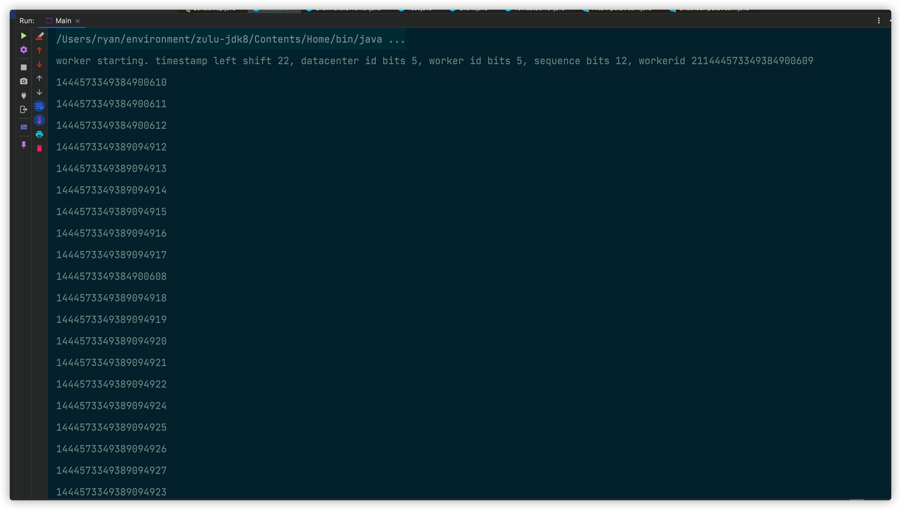

# ✍分布式ID

> [👈返回本系列目录](/blog/backend_developer/cluster/description.md)


## 1. 为什么需要分布式ID

## 2. 分布式ID生成方案对比

### 2.1 方案-》UUID

### 2.2 方案-》数据库方式

### 2.3 方案-》雪花算法

雪花算法实现代码如下：

```java
/**
 * @description： 雪花算法实现
 * @Author MRyan
 * @Date 2021/9/22 22:41
 * @Version 1.0
 */
public class SnowflakeIdWorker {

    //workerId，datacenterId每个5位，加起来就是10位的工作机器id

    /**
     * 工作id
     */
    private long workerId;

    /**
     * 数据id
     */
    private long datacenterId;

    /**
     * 12位的序列号
     */
    private long sequence;

    /**
     * 初始时间戳
     */
    private long twepoch = 1288834974657L;

    /**
     * 工作Id长度为5位
     */
    private long workerIdBits = 5L;

    /**
     * 数据Id长度为5
     */
    private long datacenterIdBits = 5L;

    /**
     * 序列号id长度
     */
    private long sequenceBits = 12L;

    /**
     * 工作Id最大值
     */
    private long MAX_WORKER_ID = -1L ^ (-1L << workerIdBits);

    /**
     * 序列号最大值
     */
    private long SEQUENCE_MASK = -1L ^ (-1L << sequenceBits);

    /**
     * 数据Id最大值
     */
    private long MAX_DATACENTER_ID = -1L ^ (-1L << datacenterIdBits);

    /**
     * 工作id需要左移的位数，12位
     */
    private long workerIdShift = sequenceBits;

    /**
     * 数据id需要左移位数 12+5=17位
     */
    private long datacenterIdShift = sequenceBits + workerIdBits;

    /**
     * 时间戳需要左移位数 12+5+5=22位
     */
    private long timestampLeftShift = sequenceBits + workerIdBits + datacenterIdBits;

    /**
     * 上次时间戳，初始值为负数
     */
    private long lastTimestamp = -1L;

    /**
     * 构造函数
     *
     * @param workerId     工作Id
     * @param datacenterId 数据Id
     * @param sequence     序列号
     */
    public SnowflakeIdWorker(long workerId, long datacenterId, long sequence) {
        // sanity check for workerId
        if (workerId > MAX_WORKER_ID || workerId < 0) {
            throw new IllegalArgumentException(String.format("worker Id can't be greater than %d or less than 0", MAX_WORKER_ID));
        }
        if (datacenterId > MAX_DATACENTER_ID || datacenterId < 0) {
            throw new IllegalArgumentException(String.format("datacenter Id can't be greater than %d or less than 0", MAX_DATACENTER_ID));
        }
        System.out.printf("worker starting. timestamp left shift %d, datacenter id bits %d, worker id bits %d, sequence bits %d, workerid %d",
                timestampLeftShift, datacenterIdBits, workerIdBits, sequenceBits, workerId);

        this.workerId = workerId;
        this.datacenterId = datacenterId;
        this.sequence = sequence;
    }


    public long getWorkerId() {
        return workerId;
    }

    public long getDatacenterId() {
        return datacenterId;
    }

    public long getTimestamp() {
        return System.currentTimeMillis();
    }

    /**
     * 下一个ID生成算法
     *
     * @return
     */
    public synchronized long nextId() {
        long timestamp = timeGen();

        //获取当前时间戳如果小于上次时间戳，则表示时间戳获取出现异常
        if (timestamp < lastTimestamp) {
            System.err.printf("clock is moving backwards.  Rejecting requests until %d.", lastTimestamp);
            throw new RuntimeException(String.format("Clock moved backwards.  Refusing to generate id for %d milliseconds",
                    lastTimestamp - timestamp));
        }

        //如果是同一时间生成的，则进行毫秒内序列
        if (lastTimestamp == timestamp) {  // 0  - 4095
            sequence = (sequence + 1) & SEQUENCE_MASK;
            //毫秒内序列溢出
            if (sequence == 0) {
                //阻塞到下一个毫秒,获得新的时间戳
                timestamp = tilNextMillis(lastTimestamp);
            }
        } else {
            //时间戳改变，毫秒内序列重置
            sequence = 0;
        }

        //上次生成ID的时间截
        lastTimestamp = timestamp;

        /**
         * 移位并通过或运算拼到一起组成64位的ID
         * 返回结果：
         * (timestamp - twepoch) << timestampLeftShift) 表示将时间戳减去初始时间戳，再左移相应位数
         * (datacenterId << datacenterIdShift) 表示将数据id左移相应位数
         * (workerId << workerIdShift) 表示将工作id左移相应位数
         * | 是按位或运算符，例如：x | y，只有当x，y都为0的时候结果才为0，其它情况结果都为1。
         * 因为个部分只有相应位上的值有意义，其它位上都是0，所以将各部分的值进行 | 运算就能得到最终拼接好的id
         */
        return ((timestamp - twepoch) << timestampLeftShift) |
                (datacenterId << datacenterIdShift) |
                (workerId << workerIdShift) |
                sequence;
    }

    /**
     * 阻塞到下一个毫秒，直到获得新的时间戳
     *
     * @param lastTimestamp 上次生成ID的时间截
     * @return 当前时间戳
     */
    private long tilNextMillis(long lastTimestamp) {
        long timestamp = timeGen();
        while (timestamp <= lastTimestamp) {
            timestamp = timeGen();
        }
        return timestamp;
    }

    /**
     * 返回以毫秒为单位的当前时间
     *
     * @return 当前时间(毫秒)
     */
    private long timeGen() {
        return System.currentTimeMillis();
    }

}
```

测试类

```java
/**
 * @description： 测试类
 * @Author MRyan
 * @Date 2021/9/23 21:42
 * @Version 1.0
 */
public class Main {

    public static void main(String[] args) {
        SnowflakeIdWorker worker = new SnowflakeIdWorker(21, 10, 0);
        for (int i = 0; i < 10; i++) {
            new Thread(() -> {
                for (int j = 0; j < 10; j++) {
                    System.out.println(worker.nextId());
                }
            }).start();
        }
    }
}
```



### 2.4 方案-》Redis incr

## 3. 总结