# 💻2021-11

## ⭐11-03

### [⏩ 62. 不同路径](https://leetcode-cn.com/problems/unique-paths/)

**【💡标签：动态规划】**

#### 👉解题思路(一)：

深度优先搜索，机器人每次只能向下或者向右移动一步，实际上可以将机器人走过的路径抽象为一颗二叉树，而叶子节点就是终点。

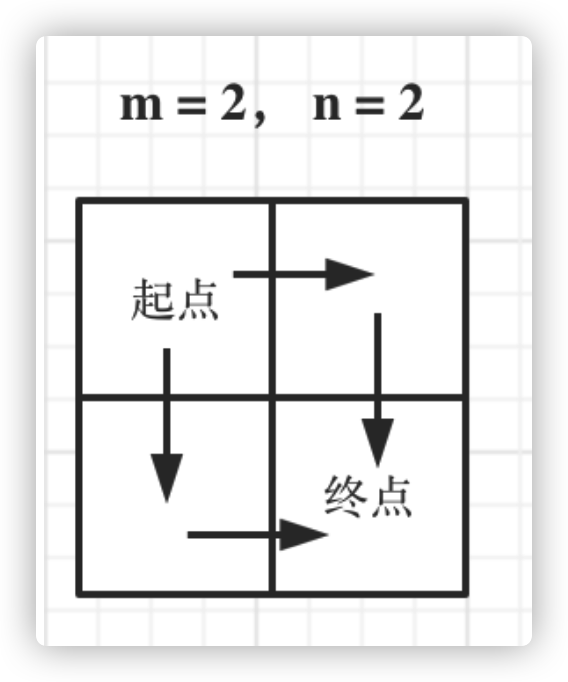

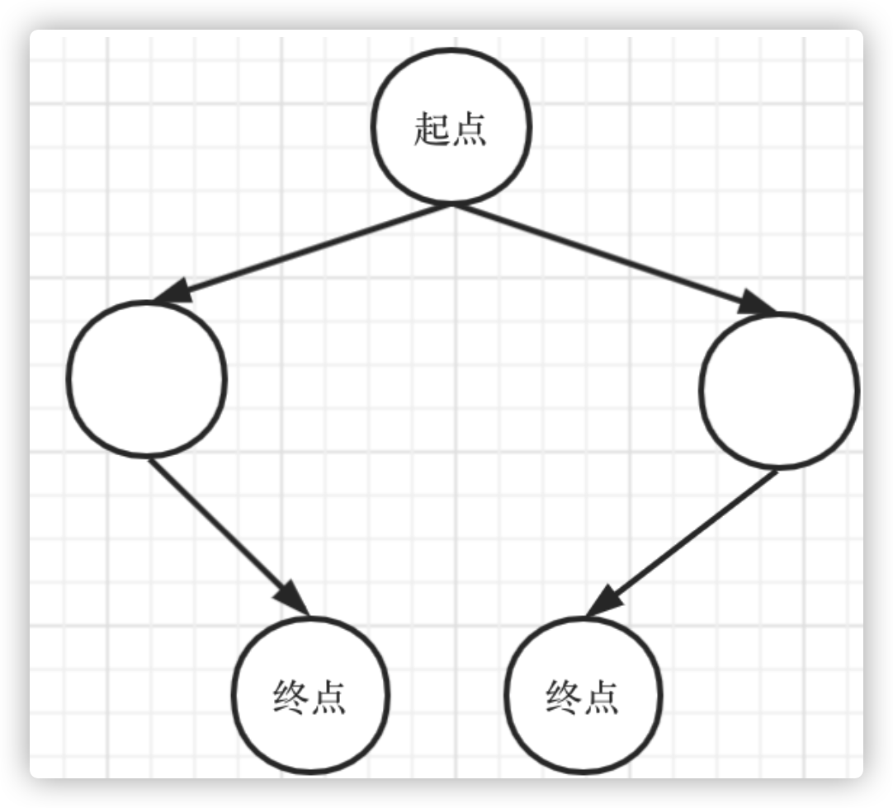

转化为求二叉树叶子节点的个数。

然而超时了，时间复杂度太高。

**代码：**

```java
class Solution {
    public int uniquePaths(int m, int n) {
        return dsf(1, 1, m, n);
    }

    public int dsf(int i, int j, int m, int n) {
        if (i > m || j > n) return 0;
        //找到叶子节点，相当于找到一种符合方案
        if (i == m && j == n) return 1;
        return dsf(i + 1, j, m, n) + dsf(i, j + 1, m, n);
    }
}
```

***

#### 👉解题思路(二)：

**动态规划经典题**

机器人从(0 , 0) 位置触发，到(m - 1, n - 1)终点。

1. 确定dp数组(dp table)以及下标的含义

> dp[i][j] :表示从(0 ，0)出发，到(i, j) 有dp[i][j]条不同的路径。

2. 确定递推公式

> dp[i][j]，只能有两个方向来推导出来，即dp[i - 1][j] 和 dp[i][j - 1]。
>
> dp[i][j] = dp[i - 1][j] + dp[i][j - 1]

3. dp数组的初始化

首先dp[i][0]一定都是1，因为从(0, 0)的位置到(i, 0)的路径只有一条，那么dp[0][j]也同

理。

> for (int i = 0; i < m; i++) dp[i][0] = 1;
>
>for (int j = 0; j < n; j++) dp[0][j] = 1;

4. 确定遍历顺序

从左到右一层一层遍历

**代码：**

```java
class Solution {
    public int uniquePaths(int m, int n) {
        int[][] dp = new int[m + 1][n + 1];
        for (int i = 0; i < m; i++) dp[i][0] = 1;
        for (int j = 0; j < n; j++) dp[0][j] = 1;
        for (int i = 1; i < m; i++) {
            for (int j = 1; j < n; j++) {
                dp[i][j] = dp[i - 1][j] + dp[i][j - 1];
            }
        }
        return dp[m - 1][n - 1];
    }
}
```

***

时间复杂度:O(m * n)

空间复杂度:O(m * n)

## ⭐11-04

### [⏩ 663. 不同路径 II](https://leetcode-cn.com/problems/unique-paths-ii/)

**【💡标签：动态规划】**

#### 👉解题思路(一)：

动态规划基本题，

1. 确定dp数组（dp table）以及下标的含义

> dp[i][j] ：表示从（0 ，0）出发，到(i, j) 有dp[i][j]条不同的路径。

2. 确定递推公式

> dp[i][j] = dp[i - 1][j] + dp[i][j - 1]

3. dp数组如何初始化

> 如果(i, 0) 这条边有了障碍之后，障碍之后（包括障碍）都是走不到的位置了，所以障碍之后的dp[i][0]应该还是初始值0。

```java
for(int i=0;i<m &&obstacleGrid[i][0]==0;i++)dp[i][0]=1;
        for(int j=0;j<n &&obstacleGrid[0][j]==0;j++)dp[0][j]=1;
```

4. 确定遍历顺序

> 从递归公式dp[i][j] = dp[i - 1][j] + dp[i][j - 1] 中可以看出，一定是从左到右一层一层遍历,这样保证推导dp[i][j]的时候，dp[i - 1][j] 和 dp[i][j - 1]一定是有数值。

**代码：**

```java
class Solution {
    public int uniquePathsWithObstacles(int[][] obstacleGrid) {
        int m = obstacleGrid.length;
        int n = obstacleGrid[0].length;
        int[][] dp = new int[m + 1][n + 1];
        for (int i = 0; i < m && obstacleGrid[i][0] == 0; i++) dp[i][0] = 1;
        for (int j = 0; j < n && obstacleGrid[0][j] == 0; j++) dp[0][j] = 1;
        for (int i = 1; i < m; i++) {
            for (int j = 1; j < n; j++) {
                if (obstacleGrid[i][j] == 1) continue;
                dp[i][j] = dp[i - 1][j] + dp[i][j - 1];
            }
        }
        return dp[m - 1][n - 1];
    }
}
```

***

## ⭐11-07

### [⏩ 343. 整数拆分](https://leetcode-cn.com/problems/integer-break/)

**【💡标签：动态规划】**

#### 👉解题思路：

给定一个正整数 n，将其拆分为至少两个正整数的和，并使这些整数的乘积最大化。 返回你可以获得的最大乘积。

**示例 1:**

输入: 2

输出: 1

解释: 2 = 1 + 1, 1 × 1 = 1。

**示例 2:**

输入: 10

输出: 36

解释: 10 = 3 + 3 + 4, 3 × 3 × 4 = 36。

说明: 你可以假设 n 不小于 2 且不大于 58。

就以n=10来举例，我们可以拆成1和9相加，结果当然是1×9=9，然而这显然并不是做优解，因为9也可以拆成1和8相加，结果就是1×1×8，结果是8，这两个结果选择哪个呢，一定是结果最大的才是最优解，后续操作以此类推（n=10
还可以拆成2和8相加。。。）。这个拆和不拆对应的两种状态很是符合动态规划来解决。

**1. 确定dp数组(dp table)以及下标的含义**

dp[i]:分拆数字i，可以得到的最大乘积为dp[i]。

**2. 确定递推公式**

刚才我们也分析了，从1到j遍历i，dp[i]既可以是j×(i-j)，也可以是j×dp[i-j]。

其实对应状态就是一个拆，一个不拆

递推公式：

> dp[i] = max(dp[i], max((i - j) * j, dp[i - j] * j))

**3. dp的初始化**

n=1 n=2 结果一定都是1，所以初始化可以dp[1]=1; dp[2]=1

**4. 确定遍历顺序**

事实上按照我们刚才的分析，10拆分为1和9呢还是拆分为1和1和8呢，实际对9拆分为1到8的这个过程对8的拆分状态是已知的。

简单的来说，dp[i]是依靠dp[i-j]的状态，所以i的遍历是从3开始从前向后，而j的遍历是从1开始直到i-1结束，因为当i=3 j=1时，dp[i-j]=dp[2]=1

**代码：**

```java
class Solution {

    public int integerBreak(int n) {
        int[] dp = new int[1000000];
        dp[2] = 1;
        for (int i = 3; i <= n; i++) {
            for (int j = 1; j < i - 1; j++) {
                dp[i] = Math.max(dp[i], Math.max((i - j) * j, dp[i - j] * j));
            }
        }
        return dp[n];
    }
}
```

***

## ⭐11-08

### [⏩ 396. 不同的二叉搜索树](https://leetcode-cn.com/problems/unique-binary-search-trees/)

**【💡标签：动态规划】**

#### 👉解题思路：

**当n为1的时候，有1种情况（1个搜索树）**

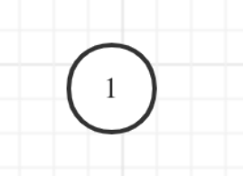

**当n为2的时候，有2种情况（2个搜索树）**

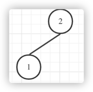
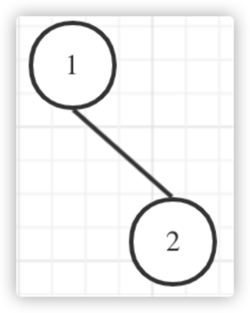

**当n为3时，有5种情况（5个搜索树）**

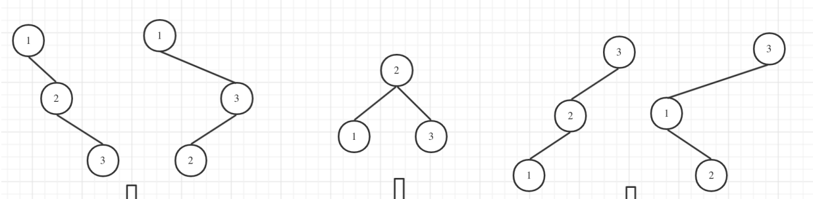

**下面讨论的是当n为3时的情况**

> 其中当1为头结点的时候，其右子树有两个节点，实际上和n为2的时候右子树集 两棵树的结构布局是⼀样的

将圈红的圈圈看成一个整体

**n=2右子树的情况：**

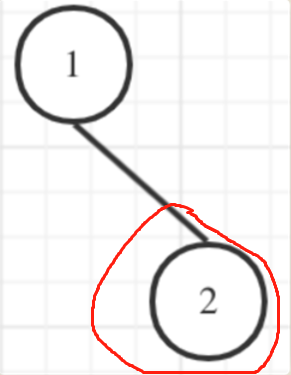

**n=3右子树的情况**

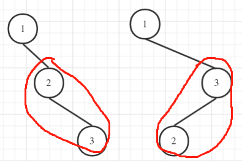


> 当3为头结点的时候，其左子树有两个节点，单看左子树的两个节点，实际上和n为2的时候左子树集 两棵树的结构布局是一样的

**n=2左子树的情况**

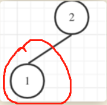

**n的3左子树的情况**

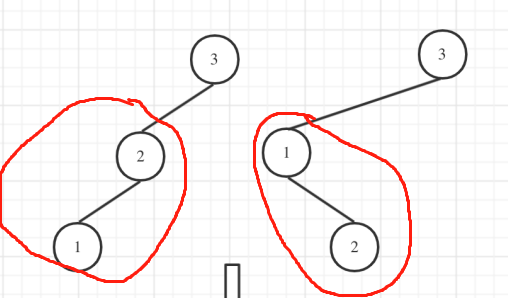

> 当2位头结点的时候，其左右子树都只有⼀个节点，布局和n为1的时候只有⼀棵树的布局是一样的

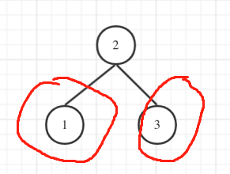

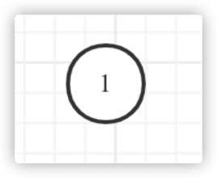

> 总结：

dp[3]，就是 元素1为头结点搜索树的数量 + 元素2为头结点搜索树的数量 + 元素3为头结点搜索树的数量

元素1为头结点搜索树的数量 = 右子树有2个元素的搜索树数量 * 左子树有0个元素的搜索树数量

元素2为头结点搜索树的数量 = 右子树有1个元素的搜索树数量 * 左子树有1个元素的搜索树数量

元素3为头结点搜索树的数量 = 右⼦树有0个元素的搜索树数量 * 左⼦树有2个元素的搜索树数量 有2个元素的搜索树数量就是dp[2]。 有1个元素的搜索树数量就是dp[1]。

有0个元素的搜索树数量就是dp[0]。

所以dp[3] = dp[0] * dp[2] + dp[1] * dp[1] + dp[2] * dp[0]

**下图为当n=3时，构造5颗搜索树的过程**

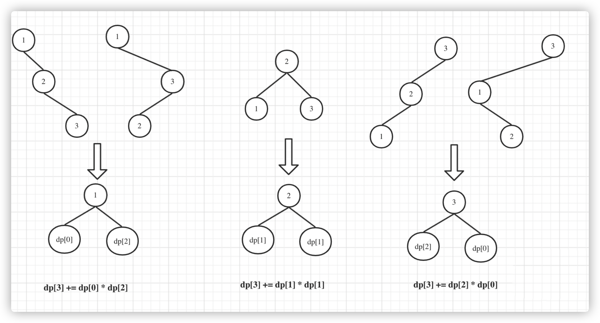

1. 确定dp数组（dp table）以及下标的含义

   dp[i] ： 1到i为节点组成的⼆叉搜索树的个数为dp[i]

2. 确定递推公式

   dp[i] += dp[以j为头结点左⼦树节点数量] * dp[以j为头结点右⼦树节点数量]

   j相当于是头结点的元素，从1遍历到i为⽌。 所以递推公式：dp[i] += dp[j - 1] * dp[i - j]; j-1 为j为头结点左子树节点数量，i-j 为以j为头结点右子树节点数

3. dp数组如何初始化

   空节点也是⼀颗⼆叉树，也是⼀颗⼆叉搜索树，dp[0]=1;

4. 确定遍历顺序

   从递归公式：dp[i] += dp[j - 1] * dp[i - j]可以看出，节点数为i的状态是依靠i之前节点数的状态。

时间复杂度O(n2)  空间复杂度O(n)

**代码：**

```java
class Solution {
    public int numTrees(int n) {
        int[] dp = new int[n + 1];
        dp[0] = 1;
        for (int i = 1; i <= n; i++) {
            for (int j = 1; j <= i; j++) {
                dp[i] += dp[j - 1] * dp[i - j];
            }
        }
        return dp[n];
    }
}
```

***

## ⭐11-09

### [⏩ 199. 二叉树的右视图](https://leetcode-cn.com/problems/binary-tree-right-side-view/)

**【💡标签：二叉树】**

#### 👉解题思路：

简单层序遍历，每一层取最后一个节点，返回结果集即可。

**代码：**

```java
class Solution {
    public List<Integer> rightSideView(TreeNode root) {
        List<Integer> ans = new ArrayList<>();
        if (root == null) return ans;
        Queue<TreeNode> queue = new LinkedList<>();
        queue.offer(root);
        while (!queue.isEmpty()) {
            int size = queue.size();
            for (int i = 0; i < size; i++) {
                TreeNode node = queue.poll();
                if (node.left != null) {
                    queue.offer(node.left);
                }
                if (node.right != null) {
                    queue.offer(node.right);
                }
                if (i == size - 1) {
                    ans.add(node.val);
                }
            }
        }
        return ans;
    }
}
```

***

## ⭐11-20

### [⏩ 234. 回文链表](https://leetcode-cn.com/problems/palindrome-linked-list/)

**【💡标签：链表】**

#### 👉解题思路（一）：

借助栈(先进后出)的数据结构，先将整链表放入栈中，在依次出栈比对链表每一个元素。

时间空间复杂度 O(n)

**代码：**

```java
/**
 * Definition for singly-linked list.
 * public class ListNode {
 *     int val;
 *     ListNode next;
 *     ListNode() {}
 *     ListNode(int val) { this.val = val; }
 *     ListNode(int val, ListNode next) { this.val = val; this.next = next; }
 * }
 */
class Solution {
    public boolean isPalindrome(ListNode head) {
        if (head == null || head.next == null) {
            return true;
        }
        Stack<Integer> stack = new Stack<>();
        ListNode temp = head;
        ListNode temp2 = head;
        while (temp != null) {
            stack.add(temp.val);
            temp = temp.next;
        }
        while (!stack.isEmpty()) {
            if (temp2.val != stack.pop()) {
                return false;
            }
            temp2 = temp2.next;
        }
        return true;
    }
}
```

#### 👉解题思路（二）：

使用快慢两个指针找到链表中点，慢指针每次前进一步，快指针每次前进两步。在慢指针前进的过程中，同时修改其next指针，使得链表前半部分反序。最后比较中点两侧的链表是否相等。

时间复杂度O(n) 空间复杂度O(1)

**代码：**

```java
/**
 * Definition for singly-linked list.
 * public class ListNode {
 *     int val;
 *     ListNode next;
 *     ListNode() {}
 *     ListNode(int val) { this.val = val; }
 *     ListNode(int val, ListNode next) { this.val = val; this.next = next; }
 * }
 */
class Solution {
    public boolean isPalindrome(ListNode head) {
        if (head == null || head.next == null) {
            return true;
        }
        ListNode prev = null;
        ListNode fast = head;
        ListNode slow = head;
        //取中间节点分割，使前半部分链表反序
        while (fast != null && fast.next != null) {
            fast = fast.next.next;
            ListNode next = slow.next;
            slow.next = prev;
            prev = slow;
            slow = next;
        }
        //特殊处理 fast!=null说明链表长度是奇数，这个时候slow正好在中间，但是是需要反转中间往后的链表，所以让slow再往后移一次
        if (fast != null) {
            slow = slow.next;
        }
        //比较中点两次的链表是否相等
        while (slow != null) {
            if (slow.val != prev.val) {
                return false;
            }
            slow = slow.next;
            prev = prev.next;
        }
        return true;
    }
}
```

***

## ⭐11-20

### [⏩ 206. 反转链表](https://leetcode-cn.com/problems/reverse-linked-list/)

**【💡标签：链表】**

**【💡标签：双指针】**

#### 👉解题思路（一）：

双指针

1. 定义两个指针：cur和pre ；pre在前cur在后。
2. 每次让cur的next指向pre，实现一次局部反转
3. 局部反转完成之后，pre和cur同时往前移动一个位置循环上述过程
4. 直至cur到达链表尾部

**代码：**

```java
/**
 * Definition for singly-linked list.
 * public class ListNode {
 *     int val;
 *     ListNode next;
 *     ListNode() {}
 *     ListNode(int val) { this.val = val; }
 *     ListNode(int val, ListNode next) { this.val = val; this.next = next; }
 * }
 */
class Solution {
    public ListNode reverseList(ListNode head) {
        if (head == null || head.next == null) return head;
        ListNode cur = head;
        ListNode pre = null;
        while (cur != null) {
            ListNode temp = cur.next;
            cur.next = pre;
            pre = cur;
            cur = temp;
        }
        return pre;
    }
}

```

#### 👉解题思路（二）：

递归

1. 使用递归函数，一直递归到链表的最后一个结点，该结点就是反转后的头结点，记作p.
2. 此后，每次函数在返回的过程中，让当前结点的下一个结点的next指针指向当前节点。
3. 同时让当前结点的next指针指向NULL ，从而实现从链表尾部开始的局部反转
4. 当递归函数全部出栈后，链表反转完成。

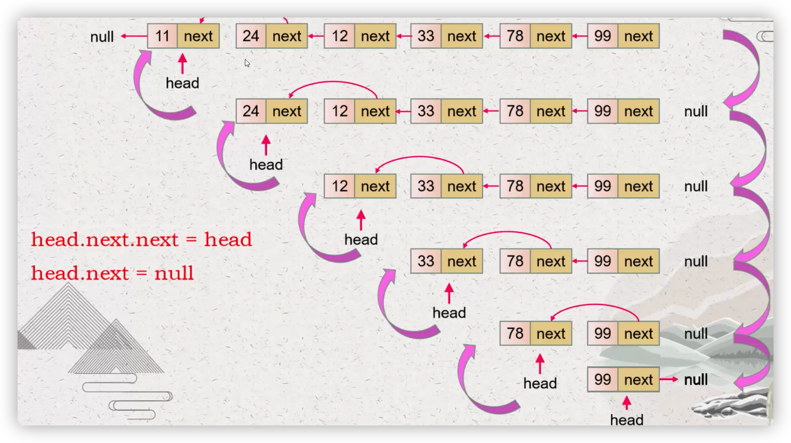

**代码：**

```java
class Solution {
    public ListNode reverseList(ListNode head) {
        // 1. 递归终止条件
        if (head == null || head.next == null) {
            return head;
        }
        ListNode p = reverseList(head.next);
        head.next.next = head;
        head.next = null;
        return p;
    }
}

```

***

## ⭐11-23

### [⏩ 141. 环形链表](https://leetcode-cn.com/problems/linked-list-cycle/)

**【💡标签：链表】**

**【💡标签：双指针】**

#### 👉解题思路：

无脑快慢指针，分别定义fast和low指针，从头结点出发，fast指针每次移动两个节点，low指针每次移动一个节点，如果fast和low指针在途中相遇，说明这个链表有环。

**代码：**

```java
/**
 * Definition for singly-linked list.
 * class ListNode {
 *     int val;
 *     ListNode next;
 *     ListNode(int x) {
 *         val = x;
 *         next = null;
 *     }
 * }
 */
public class Solution {
    public boolean hasCycle(ListNode head) {
        if (head == null || head.next == null) return false;
        ListNode fast = head;
        ListNode low = head;
        while (fast != null && fast.next != null) {
            fast = fast.next.next;
            low = low.next;
            if (fast == low) return true;
        }
        return false;
    }
}

```

### [⏩ 查找第一个值等于给定值的元素]()

**【💡标签：二分查找】**

二分查找变体。

题目如下：数组[1,3,4,5,6,8,8,8,11,18]

例如上述一个有序数组，其中a[5],a[6],a[7]都等于8，我们希望查找第一个等于8的数据，也就是下标为5的元素。

#### 👉解题思路：

a[mid]跟要查找的 value 的大小关系有三种情况：大于、小于、等于。对于 a[mid]>value 的情况，我们需要更新 high= mid-1；

如果我们查找的是任意一个值等于给定值的元素，当 a[mid]等于要查找的值时，a[mid]就是我们要找的元素。但是，如果我们求解的是第一个值等于给定值的元素，当 a[mid]等于要查找的值时，我们就需要确认一下这个 a[mid]
是不是第一个值等于给定值的元素。

如果 mid 等于 0，那这个元素已经是数组的第一个元素，那它肯定是我们要找的；如果 mid 不等于 0，但 a[mid]的前一个元素 a[mid-1]不等于 value，那也说明 a[mid]就是我们要找的第一个值等于给定值的元素。

如果经过检查之后发现 a[mid]前面的一个元素 a[mid-1]也等于 value，那说明此时的 a[mid]肯定不是我们要查找的第一个值等于给定值的元素。那我们就更新
high=mid-1，因为要找的元素肯定出现在[low, mid-1]之间。

**代码：**

```java
public class Solution {
    public int bsearch(int[] a, int n, int value) {
        int low = 0;
        int high = n - 1;
        while (low <= high) {
            int mid = low + ((high - low) >> 1);
            if (a[mid] > value) {
                high = mid - 1;
            } else if (a[mid] < value) {
                low = mid + 1;
            } else {
                if ((mid == 0) || (a[mid - 1] != value)) return mid;
                else high = mid - 1;
            }
        }
        return -1;
    }
}

```

### [⏩ 查找最后一个值等于给定值的元素]()

**【💡标签：二分查找】**

二分查找变体。

题目如下：数组[1,3,4,5,6,8,8,8,11,18]

例如上述一个有序数组，其中a[5],a[6],a[7]都等于8，我们希望查找最后一个等于8的数据，也就是下标为7的元素。

#### 👉解题思路：

a[mid]跟要查找的 value 的大小关系有三种情况：大于、小于、等于。对于 a[mid]>value 的情况，我们需要更新 high= mid-1；

如果我们查找的是任意一个值等于给定值的元素，当 a[mid]等于要查找的值时，a[mid]就是我们要找的元素。

如果 mid 等于 0，那这个元素已经是数组的第一个元素，那它肯定是我们要找的；如果 mid 不等于 0，如果 a[mid]这个元素已经是数组中的最后一个元素了，那它肯定是我们要找的；如果 a[mid]的后一个元素 a[mid+1]不等于
value，那也说明 a[mid]就是我们要找的最后一个值等于给定值的元素。

如果我们经过检查之后，发现 a[mid]后面的一个元素 a[mid+1]也等于 value，那说明当前的这个 a[mid]并不是最后一个值等于给定值的元素。我们就更新 low=mid+1，因为要找的元素肯定出现在[mid+1, high]
之间。

**代码：**

```java
public class Solution {
    public int bsearch(int[] a, int n, int value) {
        int low = 0;
        int high = n - 1;
        while (low <= high) {
            int mid = low + ((high - low) >> 1);
            if (a[mid] > value) {
                high = mid - 1;
            } else if (a[mid] < value) {
                low = mid + 1;
            } else {
                if ((mid == n - 1) || (a[mid + 1] != value)) return mid;
                else low = mid + 1;
            }
        }
        return -1;
    }
}

```

### [⏩ 查找第一个大于等于给定值的元素]()

**【💡标签：二分查找】**

二分查找变体。

题目如下：数组[3，4，6，7，10]

例如上述一个有序数组，如果查找第一个大于等于5的元素，那就是6。

#### 👉解题思路：

如果 a[mid]小于要查找的值value，那要查找的值肯定在[mid+1, high]之间，所以，我们更新low=mid+1。

对于 a[mid]大于等于给定值value的情况，我们要先看下这个a[mid]是不是我们要找的第一个值大于等于给定值的元素。如果 a[mid]前面已经没有元素，或者前面一个元素小于要查找的值 value，那 a[mid]
就是我们要找的元素。

如果 a[mid-1]也大于等于要查找的值value，那说明要查找的元素在[low, mid-1]之间，所以，我们将high更新为mid-1。

**代码：**

```java
public class Solution {
    public int bsearch(int[] a, int n, int value) {
        int low = 0;
        int high = n - 1;
        while (low <= high) {
            int mid = low + ((high - low) >> 1);
            if (a[mid] >= value) {
                if ((mid == 0) || (a[mid - 1] < value)) return mid;
                else high = mid - 1;
            } else {
                low = mid + 1;
            }
        }
        return -1;
    }
}
```

### [⏩ 查找最后一个小于等于给定值的元素]()

**【💡标签：二分查找】**

二分查找变体。

题目如下：数组[3，5，6，8，9，10]

例如上述一个有序数组，最后一个小于等于7的元素就是6

#### 👉解题思路：

**代码：**

```java
public class Solution {
    public int bsearch(int[] a, int n, int value) {
        int low = 0;
        int high = n - 1;
        while (low <= high) {
            int mid = low + ((high - low) >> 1);
            if (a[mid] > value) {
                high = mid - 1;
            } else {
                if ((mid == n - 1) || (a[mid + 1] > value)) return mid;
                else low = mid + 1;
            }
        }
        return -1;
    }
}
```

***

## ⭐11-24

### [⏩ 21. 合并两个有序链表](https://leetcode-cn.com/problems/merge-two-sorted-lists/)

**【💡标签：链表】**

**【💡标签：双指针】**

#### 👉解题思路(一)：

重建链表

**代码：**

```java
class Solution {
    public ListNode mergeTwoLists(ListNode l1, ListNode l2) {
        ListNode ans = new ListNode(0);
        ListNode temp = ans;
        while (l1 != null && l2 != null) {
            if (l1.val <= l2.val) {
                ListNode t = new ListNode(l1.val);
                temp.next = t;
                temp = t;
                l1 = l1.next;
            } else {
                ListNode t = new ListNode(l2.val);
                temp.next = t;
                temp = t;
                l2 = l2.next;
            }
        }
        while (l1 != null) {
            ListNode t = new ListNode(l1.val);
            temp.next = t;
            temp = t;
            l1 = l1.next;
        }
        while (l2 != null) {
            ListNode t = new ListNode(l2.val);
            temp.next = t;
            temp = t;
            l2 = l2.next;
        }
        return ans.next;
    }
}
```

#### 👉解题思路(二)：

双指针

**代码：**

```java
class Solution {
    public ListNode mergeTwoLists(ListNode l1, ListNode l2) {
        //l>r  r++
        //l==r l++
        ///l<r l++
        ListNode l = l1;
        ListNode r = l2;
        ListNode ans = new ListNode(0);
        ListNode temp = ans;
        while (l != null && r != null) {
            if (l.val > r.val) {
                temp.next = r;
                temp = r;
                r = r.next;
            } else if (l.val <= r.val) {
                temp.next = l;
                temp = l;
                l = l.next;
            }
        }
        if (l == null) temp.next = r;
        if (r == null) temp.next = l;
        return ans.next;
    }
}
```

## ⭐11-27

### [⏩ 19. 删除链表的倒数第 N 个结点](https://leetcode-cn.com/problems/remove-nth-node-from-end-of-list/)

**【💡标签：链表】**

**【💡标签：双指针】**

求出链表总长度，计算正向删除链表节点的位置，直接删除

#### 👉解题思路(一)：

***

```java
/**
 * Definition for singly-linked list.
 * public class ListNode {
 *     int val;
 *     ListNode next;
 *     ListNode() {}
 *     ListNode(int val) { this.val = val; }
 *     ListNode(int val, ListNode next) { this.val = val; this.next = next; }
 * }
 */
class Solution {
    public ListNode removeNthFromEnd(ListNode head, int n) {
        ListNode cur = new ListNode(0, head);
        int length = getLength(head);
        ListNode node = cur;
        for (int i = 0; i < length - n; ++i) {
            cur = cur.next;
        }
        cur.next = cur.next.next;
        return node.next;

    }

    public int getLength(ListNode head) {
        int length = 0;
        while (head != null) {
            length++;
            head = head.next;
        }
        return length;
    }
}
```

#### 👉解题思路(二)：

快慢指针，快指针先走n步，然后快慢一起走，直到快指针走到最后，要注意的是可能是要删除第一个节点，这个时候可以直接返回head.next

***

```java
/**
 * Definition for singly-linked list.
 * public class ListNode {
 *     int val;
 *     ListNode next;
 *     ListNode() {}
 *     ListNode(int val) { this.val = val; }
 *     ListNode(int val, ListNode next) { this.val = val; this.next = next; }
 * }
 */
class Solution {
    public ListNode removeNthFromEnd(ListNode head, int n) {
        if (head == null || head.next == null) return null;
        ListNode fast = head;
        ListNode slow = head;
        for (int i = 0; i < n; i++) {
            fast = fast.next;
        }
        if (fast == null) return head.next;
        while (fast.next != null) {
            fast = fast.next;
            slow = slow.next;
        }
        slow.next = slow.next.next;
        return head;
    }
}
```

***