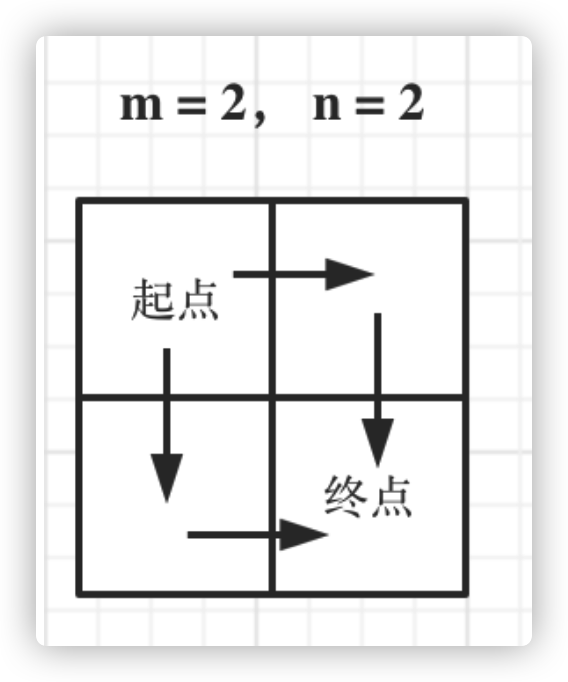
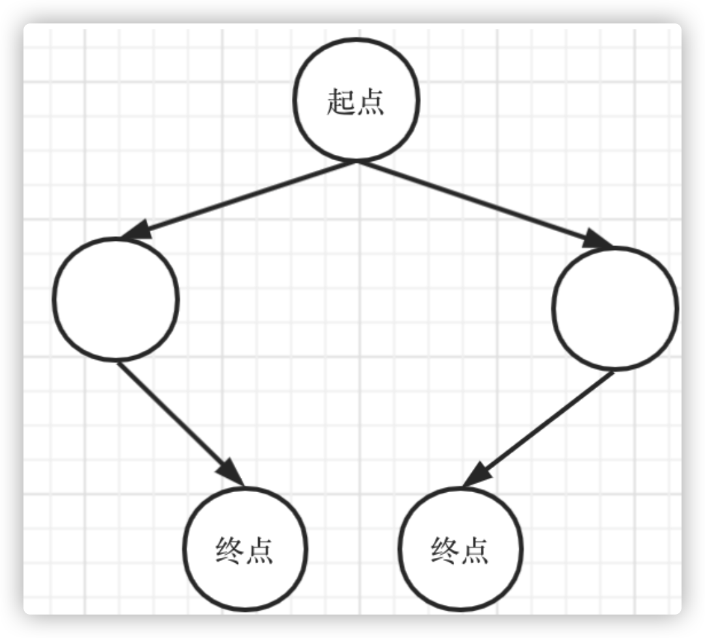
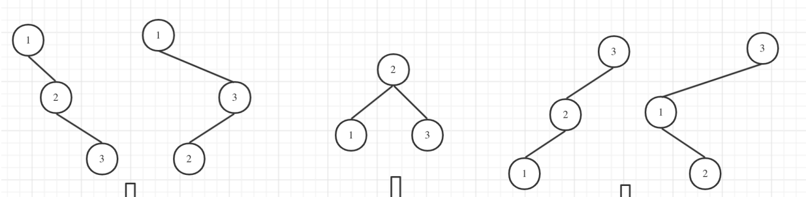
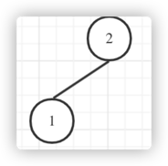
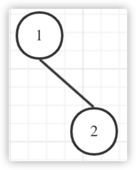
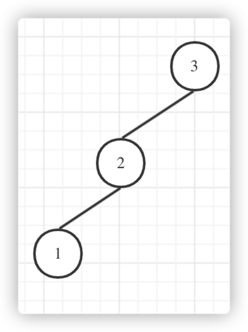
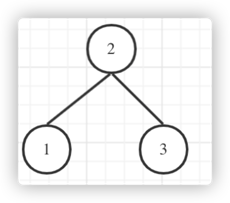
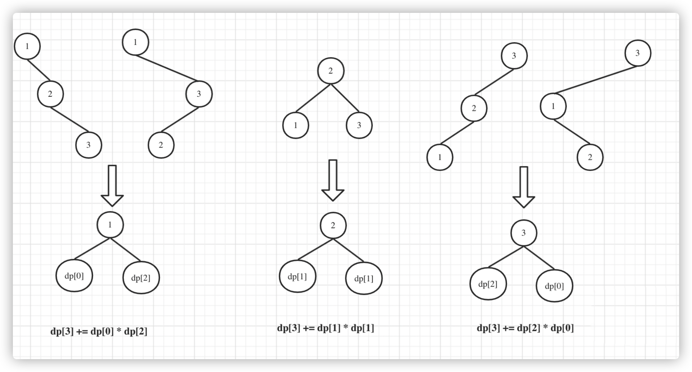

# 💻2021-11

## ⭐11-03

### [🉑62. 不同路径](https://leetcode-cn.com/problems/unique-paths/)

**【💡标签：动态规划】**

#### 👉解题思路(一)：

深度优先搜索，机器人每次只能向下或者向右移动一步，实际上可以将机器人走过的路径抽象为一颗二叉树，而叶子节点就是终点。





转化为求二叉树叶子节点的个数。

然而超时了，时间复杂度太高。

**代码：**

```java
class Solution {
    public int uniquePaths(int m, int n) {
        return dsf(1, 1, m, n);
    }

    public int dsf(int i, int j, int m, int n) {
        if (i > m || j > n) return 0;
        //找到叶子节点，相当于找到一种符合方案
        if (i == m && j == n) return 1;
        return dsf(i + 1, j, m, n) + dsf(i, j + 1, m, n);
    }
}
```

***

#### 👉解题思路(二)：

**动态规划经典题**

机器人从(0 , 0) 位置触发，到(m - 1, n - 1)终点。

1. 确定dp数组(dp table)以及下标的含义

> dp[i][j] :表示从(0 ，0)出发，到(i, j) 有dp[i][j]条不同的路径。

2. 确定递推公式

> dp[i][j]，只能有两个方向来推导出来，即dp[i - 1][j] 和 dp[i][j - 1]。
>
> dp[i][j] = dp[i - 1][j] + dp[i][j - 1]

3. dp数组的初始化

首先dp[i][0]一定都是1，因为从(0, 0)的位置到(i, 0)的路径只有一条，那么dp[0][j]也同

理。

> for (int i = 0; i < m; i++) dp[i][0] = 1;
>
>for (int j = 0; j < n; j++) dp[0][j] = 1;

4. 确定遍历顺序

从左到右一层一层遍历

**代码：**

```java
class Solution {
    public int uniquePaths(int m, int n) {
        int[][] dp = new int[m + 1][n + 1];
        for (int i = 0; i < m; i++) dp[i][0] = 1;
        for (int j = 0; j < n; j++) dp[0][j] = 1;
        for (int i = 1; i < m; i++) {
            for (int j = 1; j < n; j++) {
                dp[i][j] = dp[i - 1][j] + dp[i][j - 1];
            }
        }
        return dp[m - 1][n - 1];
    }
}
```

***

时间复杂度:O(m * n)

空间复杂度:O(m * n)

## ⭐11-04

### [🉑663. 不同路径 II](https://leetcode-cn.com/problems/unique-paths-ii/)

**【💡标签：动态规划】**

#### 👉解题思路(一)：

动态规划基本题，

1. 确定dp数组（dp table）以及下标的含义

> dp[i][j] ：表示从（0 ，0）出发，到(i, j) 有dp[i][j]条不同的路径。

2. 确定递推公式

> dp[i][j] = dp[i - 1][j] + dp[i][j - 1]

3. dp数组如何初始化

> 如果(i, 0) 这条边有了障碍之后，障碍之后（包括障碍）都是走不到的位置了，所以障碍之后的dp[i][0]应该还是初始值0。

```java
for(int i=0;i<m &&obstacleGrid[i][0]==0;i++)dp[i][0]=1;
        for(int j=0;j<n &&obstacleGrid[0][j]==0;j++)dp[0][j]=1;
```

4. 确定遍历顺序

> 从递归公式dp[i][j] = dp[i - 1][j] + dp[i][j - 1] 中可以看出，一定是从左到右一层一层遍历,这样保证推导dp[i][j]的时候，dp[i - 1][j] 和 dp[i][j - 1]一定是有数值。

**代码：**

```java
class Solution {
    public int uniquePathsWithObstacles(int[][] obstacleGrid) {
        int m = obstacleGrid.length;
        int n = obstacleGrid[0].length;
        int[][] dp = new int[m + 1][n + 1];
        for (int i = 0; i < m && obstacleGrid[i][0] == 0; i++) dp[i][0] = 1;
        for (int j = 0; j < n && obstacleGrid[0][j] == 0; j++) dp[0][j] = 1;
        for (int i = 1; i < m; i++) {
            for (int j = 1; j < n; j++) {
                if (obstacleGrid[i][j] == 1) continue;
                dp[i][j] = dp[i - 1][j] + dp[i][j - 1];
            }
        }
        return dp[m - 1][n - 1];
    }
}
```

***

## ⭐11-07

### [🉑343. 整数拆分](https://leetcode-cn.com/problems/integer-break/)

**【💡标签：动态规划】**

#### 👉解题思路：

给定一个正整数 n，将其拆分为至少两个正整数的和，并使这些整数的乘积最大化。 返回你可以获得的最大乘积。

**示例 1:**

输入: 2

输出: 1

解释: 2 = 1 + 1, 1 × 1 = 1。

**示例 2:**

输入: 10

输出: 36

解释: 10 = 3 + 3 + 4, 3 × 3 × 4 = 36。

说明: 你可以假设 n 不小于 2 且不大于 58。

就以n=10来举例，我们可以拆成1和9相加，结果当然是1×9=9，然而这显然并不是做优解，因为9也可以拆成1和8相加，结果就是1×1×8，结果是8，这两个结果选择哪个呢，一定是结果最大的才是最优解，后续操作以此类推（n=10
还可以拆成2和8相加。。。）。这个拆和不拆对应的两种状态很是符合动态规划来解决。

**1. 确定dp数组(dp table)以及下标的含义**

dp[i]:分拆数字i，可以得到的最大乘积为dp[i]。

**2. 确定递推公式**

刚才我们也分析了，从1到j遍历i，dp[i]既可以是j×(i-j)，也可以是j×dp[i-j]。

其实对应状态就是一个拆，一个不拆

递推公式：

> dp[i] = max(dp[i], max((i - j) * j, dp[i - j] * j))

**3. dp的初始化**

n=1 n=2 结果一定都是1，所以初始化可以dp[1]=1; dp[2]=1

**4. 确定遍历顺序**

事实上按照我们刚才的分析，10拆分为1和9呢还是拆分为1和1和8呢，实际对9拆分为1到8的这个过程对8的拆分状态是已知的。

简单的来说，dp[i]是依靠dp[i-j]的状态，所以i的遍历是从3开始从前向后，而j的遍历是从1开始直到i-1结束，因为当i=3 j=1时，dp[i-j]=dp[2]=1

**代码：**

```java
class Solution {

    public int integerBreak(int n) {
        int[] dp = new int[1000000];
        dp[2] = 1;
        for (int i = 3; i <= n; i++) {
            for (int j = 1; j < i - 1; j++) {
                dp[i] = Math.max(dp[i], Math.max((i - j) * j, dp[i - j] * j));
            }
        }
        return dp[n];
    }
}
```

***

## ⭐11-08

### [🉑396. 不同的二叉搜索树](https://leetcode-cn.com/problems/unique-binary-search-trees/)

**【💡标签：动态规划】**

#### 👉解题思路：

当n为3时，有哪几种情况。



当1为头结点的时候，其右子树有两个节点，实际上和n为2的时候以1为节点 两棵树的布局是⼀样的




当3为头结点的时候，其左子树有两个节点，单看左子树的两个节点，实际上和n为2的时候以2为根节点 两棵树的布局是一样的




当2位头结点的时候，其左右子树都只有⼀个节点，布局和n为1的时候只有⼀棵树的布局是一样的




dp[3]，就是 元素1为头结点搜索树的数量 + 元素2为头结点搜索树的数量 + 元素3为头结点搜索树的数量

元素1为头结点搜索树的数量 = 右子树有2个元素的搜索树数量 * 左子树有0个元素的搜索树数量

元素2为头结点搜索树的数量 = 右子树有1个元素的搜索树数量 * 左子树有1个元素的搜索树数量

元素3为头结点搜索树的数量 = 右⼦树有0个元素的搜索树数量 * 左⼦树有2个元素的搜索树数量 有2个元素的搜索树数量就是dp[2]。 有1个元素的搜索树数量就是dp[1]。

有0个元素的搜索树数量就是dp[0]。

所以dp[3] = dp[0] * dp[2] + dp[1] * dp[1] + dp[2] * dp[0]

**下图为当n=3时，构造5颗搜索树的过程**



1. 确定dp数组（dp table）以及下标的含义

   dp[i] ： 1到i为节点组成的⼆叉搜索树的个数为dp[i]

2. 确定递推公式

   dp[i] += dp[以j为头结点左⼦树节点数量] * dp[以j为头结点右⼦树节点数量]

   j相当于是头结点的元素，从1遍历到i为⽌。 所以递推公式：dp[i] += dp[j - 1] * dp[i - j]; j-1 为j为头结点左子树节点数量，i-j 为以j为头结点右子树节点数

3. dp数组如何初始化

   空节点也是⼀颗⼆叉树，也是⼀颗⼆叉搜索树，dp[0]=1;

4. 确定遍历顺序

   从递归公式：dp[i] += dp[j - 1] * dp[i - j]可以看出，节点数为i的状态是依靠i之前节点数的状态。

时间复杂度O(n2)  空间复杂度O(n)

**代码：**

```java
class Solution {
    public int numTrees(int n) {
        int[] dp = new int[n + 1];
        dp[0] = 1;
        for (int i = 1; i <= n; i++) {
            for (int j = 1; j <= i; j++) {
                dp[i] += dp[j - 1] * dp[i - j];
            }
        }
        return dp[n];
    }
}
```

***

## ⭐11-09

### [🉑199. 二叉树的右视图](https://leetcode-cn.com/problems/binary-tree-right-side-view/)

**【💡标签：二叉树】**

#### 👉解题思路：

简单层序遍历，每一层取最后一个节点，返回结果集即可。

**代码：**

```java
class Solution {
    public List<Integer> rightSideView(TreeNode root) {
        List<Integer> ans = new ArrayList<>();
        if (root == null) return ans;
        Queue<TreeNode> queue = new LinkedList<>();
        queue.offer(root);
        while (!queue.isEmpty()) {
            int size = queue.size();
            for (int i = 0; i < size; i++) {
                TreeNode node = queue.poll();
                if (node.left != null) {
                    queue.offer(node.left);
                }
                if (node.right != null) {
                    queue.offer(node.right);
                }
                if (i == size - 1) {
                    ans.add(node.val);
                }
            }
        }
        return ans;
    }
}
```

***

